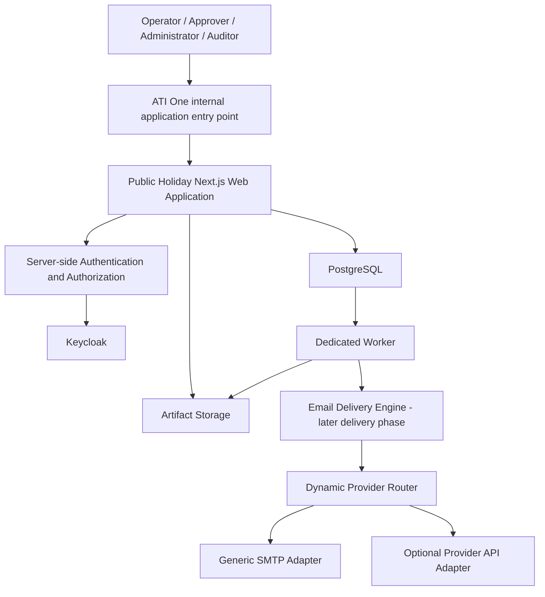
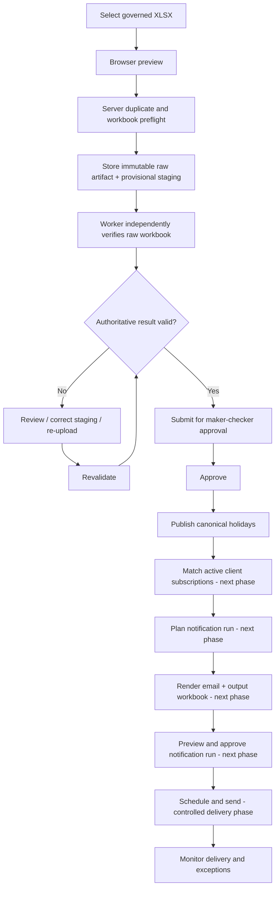
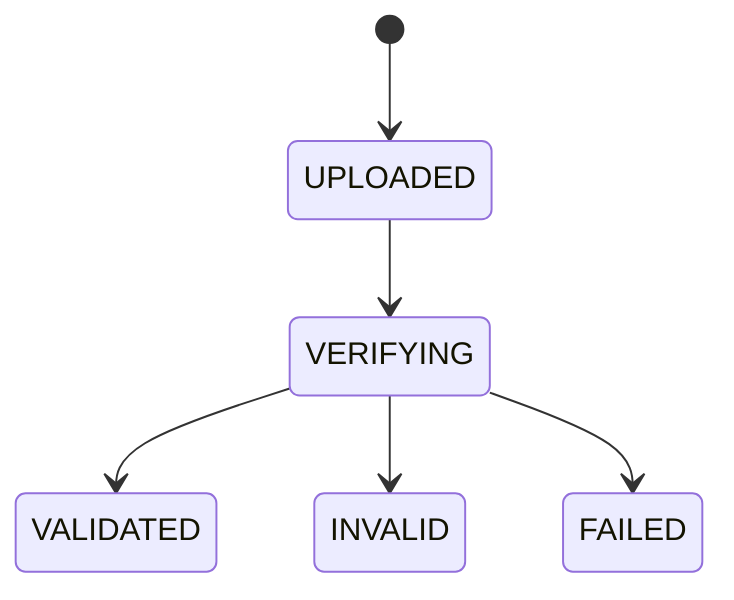
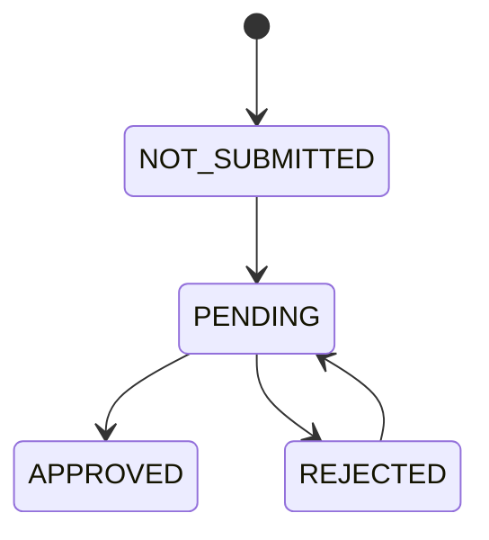
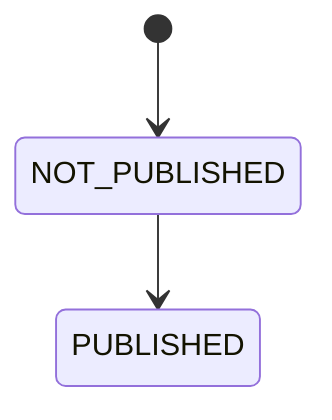
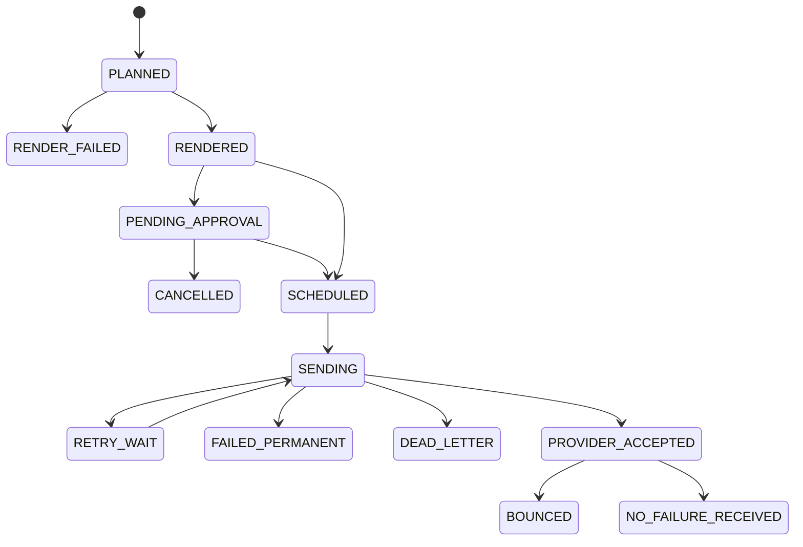
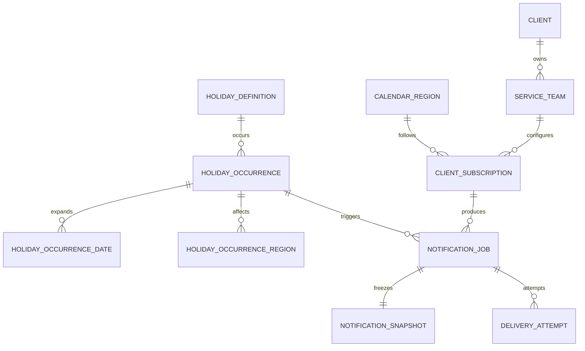

# Solution Proposal: Public Holiday Notification Workflow Application

| Metadata | Value |
| --- | --- |
| Status | Solution proposal for Operations client review |
| Version | 0.2.1 |
| Date | 2026-08-17 |
| Prepared by | DSD Team |
| Scope | Internal Operations Public Holiday Notification Workflow |
| Proposed architecture | Modular monolith with asynchronous worker |
| Canonical data store | PostgreSQL |
| Email integration | Provider-neutral Email Delivery Engine; Generic SMTP first; provider selection and routing are runtime configuration |
| Input and output | Governed XLSX with versioned schema and templates |

## 1. Executive Summary

The Operations client has asked the DSD Team to design a solution for the current Public Holiday Notification process

The DSD Team proposes a **Public Holiday Notification Workflow Application**, not an Excel automation script

The target solution receives a public holiday list, validates and normalizes the data, publishes governed holiday records, determines affected client teams, generates an output workbook using an approved template, and sends notification emails through a controlled and auditable workflow

The solution shall use:

- PostgreSQL as the canonical source of truth
- Governed XLSX as the standard operational input and output contract
- Staging for imported data before canonical publication
- Immutable source and generated artifacts with cryptographic checksums
- Versioned notification policies, email templates, and output workbook templates
- Transactional outbox and idempotent workers for durable asynchronous processing
- Maker-checker approval controls for governed publication and controlled notification delivery
- Provider-neutral Email Delivery Engine with Generic SMTP first and dynamically configured providers
- Delivery attempt, bounce, and audit evidence that is not silently overwritten

The current workbook remains useful as a source for requirements, migration, and acceptance comparison, but it must not remain the runtime database or workflow engine

As part of the solution-design work, the DSD Team has already established the application foundation and the governed holiday import, review, approval, and canonical publication baseline. Client routing, notification planning, output generation, controlled email delivery, and trusted automation remain subsequent solution phases and are not represented as completed capabilities in this proposal

## 2. Current Workbook Assessment

The supplied workbook contains seven functional areas:

| Sheet | Current responsibility |
| --- | --- |
| `Client_Master` | Client, PIC, recipient, region, weekday or weekend filter, status |
| `Holiday_Master` | Holiday name, affected region, date period, derived day and tag, processing remarks |
| `Email Template` | Default and client-specific email templates |
| `Error Email Template` | Error summary email template |
| `Error Data` | Failed delivery information |
| `Glossary` | Day classification and unresolved operational questions |
| `Back Up of Client_Master` | Manual backup of client master data |

Observed data profile:

- 56 client records
- 53 active client records
- 25 holiday records
- 2 active email templates
- 3 sample error records

Observed structural risks:

- Multiple regions are stored in one comma-separated cell
- Multiple recipients are stored in one comma-separated or newline-separated cell
- One client row represents what should be separate client, team, subscription, policy, and recipient concepts
- `Day` and `Tag` are editable although both should be derived
- Process state is mixed into the `Remarks` column
- Some values have shifted into incorrect columns, including `Done` under `Day`
- The backup sheet is manual and can diverge from the active master
- Client-specific template assignments are stored as comma-separated client names
- There is no immutable record of which policy, template, and recipients produced an email
- There is no idempotency contract preventing duplicate email delivery

## 3. Objectives

The proposed solution shall:

- Accept a governed public holiday workbook
- Tolerate approved header aliases and column order differences
- Store the original uploaded file without modification
- Normalize raw input into a canonical data model
- Validate required fields, data types, dates, regions, duplicates, and cross-field rules
- Require review before publishing imported holiday data
- Match holiday occurrences to active client subscriptions deterministically
- Support one client with multiple services, teams, regions, recipients, schedules, and templates
- Calculate notification schedules using explicit calendar-day or business-day policies
- Preview generated workbook and email content before delivery
- Generate output workbooks from a versioned template
- Send email using an organization-controlled mailbox
- Prevent duplicate sends across retries, scheduler restarts, and concurrent workers
- Track provider acceptance separately from confirmed failure or bounce
- Preserve a complete audit trail for imports, approvals, generated content, delivery attempts, and corrections

## 4. Non-Goals

The proposed initial release shall not:

- Use AI to make deterministic holiday, date, region, or recipient decisions
- Scrape public holiday websites without an approved source contract
- Replace enterprise identity or operate as a general-purpose mailbox or marketing platform
- Provide a general-purpose campaign marketing platform
- Use Excel as the application database
- Introduce microservices, Kafka, Kubernetes, or Redis without demonstrated operational need
- Infer unknown mappings silently
- Treat a provider `202 Accepted` response as proof of final delivery

## 5. Design Principles and Invariants

### 5.1 Core principles

- Canonical data lives in PostgreSQL
- Uploaded and generated files are immutable artifacts
- Raw input is never edited
- Normalization happens only in staging
- Published data cannot be silently rewritten
- Sent notifications are historical facts and cannot be mutated
- Corrections create new versions and new jobs
- Business rules are explicit and deterministic
- Every state transition is attributable to a user or system actor
- Excel color, formatting, formula, and cell position are never business rules

### 5.2 Non-negotiable invariants

- One logical notification can be sent at most once for a given idempotency key
- An inactive client subscription cannot produce a new notification job
- A notification job always references immutable policy and template versions
- A notification snapshot is created before approval or sending
- A sent snapshot cannot be regenerated in place
- Recipient changes do not rewrite historical recipient snapshots
- A published import batch always retains the original file, hash, mapping, validation result, and approval decision
- Permanent delivery failures are not retried automatically
- Transient retries reuse the same notification job and snapshot
- Output artifacts have a cryptographic checksum
- Provider selection is infrastructure configuration, not Public Holiday business logic
- Provider adapter implementations are trusted code while provider records and routing are runtime configuration
- Provider fallback never occurs automatically after provider acceptance or an unknown delivery outcome

## 6. Actors and Access Control

The solution separates enterprise authentication from application authorization

| Role | Current baseline and target responsibility |
| --- | --- |
| Administrator | Full current Public Holiday application access, including calendar-region administration and governed import operations; future configuration capabilities follow the same permission model |
| Operator | Upload files, review validation results, correct normalized staging data, acknowledge warnings, and submit eligible imports for approval |
| Approver | Review governed imports, approve or reject a different user's submitted batch, and publish approved canonical holiday data |
| Auditor | Read calendar-region and import evidence without mutation rights |
| System Worker | Independently verify uploaded workbooks now; later phases extend the worker to durable notification planning, output generation, scheduling, delivery, and retry |

Current access-control baseline:

- Authentication uses Keycloak through OIDC Authorization Code Flow with PKCE
- The Public Holiday application creates and owns its own server-side application session
- Keycloak is the identity and authentication authority, not the application authorization authority
- Application roles and permissions are stored in the Public Holiday PostgreSQL database
- A user may hold multiple application roles
- Backend authorization is permission-based
- Menu visibility is presentation only and does not replace server-side authorization
- Maker-checker requires the approval requester and approver to be different users
- No shared human account is required by the proposed operating model
- Unattended email delivery will use an approved service identity when the email-delivery phase is enabled

## 7. Application Architecture

The DSD Team proposes the same architecture currently used by the solution baseline: one independently owned Public Holiday application with a separate long-running worker process from the same codebase



The Public Holiday application owns its business logic, database, worker, local application session, roles, permissions, audit trail, and operational workflow

ATI One is the current browser entry point and delivery gateway. It does not own Public Holiday business authorization or workflow state

Keycloak currently proves user identity. The application resolves its own roles and permissions from PostgreSQL

### 7.1 Modules

| Module | Responsibility | Current position |
| --- | --- | --- |
| Identity and Access | SSO principal mapping, application roles, permissions, authorization | Implemented baseline |
| Governed Import | File upload, duplicate protection, schema mapping, staging, validation, correction | Implemented baseline |
| Holiday Calendar | Canonical regions, aliases, holiday definitions, occurrences, dates, publication | Implemented baseline |
| Approval | Frozen content hash, maker-checker request, approve or reject decision | Implemented baseline |
| Artifact Management | Immutable raw file registration, checksum verification, controlled evidence retrieval | Implemented baseline for import artifacts |
| Audit and Outbox | Audit events and transactional outbox baseline | Implemented baseline |
| Client Configuration | Clients, service teams, contacts, subscriptions, recipients | Proposed next phase |
| Notification Policy | Lead time, timezone, day filter, approval mode, send time | Proposed next phase |
| Template Management | Email and workbook template versioning and activation | Proposed next phase |
| Matching Engine | Deterministic holiday-to-subscription matching | Proposed next phase |
| Notification Orchestration | Run creation, job generation, snapshots, approvals | Proposed next phase |
| Scheduling and Execution | Due work, lease recovery, retry, dead-letter, idempotency | Proposed delivery phase |
| Email Delivery Engine | Generic SMTP, provider registry, dynamic routing, provider adapters, delivery attempts, NDR or bounce evidence | Proposed delivery phase |

### 7.2 Recommended deployment

- One repository and one modular application
- Next.js web runtime and dedicated worker runtime built from the same codebase
- PostgreSQL for canonical data, transactions, locking, authorization records, approval state, audit, and transactional outbox
- Current development artifact adapter uses local storage; production requires durable encrypted mounted storage or an approved replacement adapter
- No Redis in the initial implementation
- Durable scheduling, retry, workbook generation, and email delivery run in the worker rather than as unawaited web-request work
- ATI One remains the internal browser entry point while the Public Holiday application remains independently owned

## 8. End-to-End Flow

The complete proposed workflow is:



The implemented baseline currently covers the workflow through canonical holiday publication. The downstream client-routing, output-generation, email-delivery, and trusted-automation stages remain proposed phases

## 9. Detailed Operational Flow

### 9.1 Step 1 — Upload

1. Operator selects a governed `.xlsx` file
2. Browser preprocessing reads `Holiday_Master` locally and shows a normalized preview before submission
3. The browser does not become the authority for validation or publication
4. On submit, the API validates the XLSX envelope, package safety, required workbook contract, and authoritative holiday content
5. The complete XLSX bytes are hashed as `fileSha256`
6. Byte-identical evidence is hard-blocked as `EXACT_FILE_DUPLICATE`
7. The server computes `businessContentSha256` from canonical region codes, normalized holiday name, start date, and end date
8. Byte-different workbooks containing the same authoritative holiday business content are hard-blocked as `SAME_HOLIDAY_DATA`
9. The normal import path has no operator duplicate-confirmation override
10. Only an accepted new dataset proceeds to immutable raw-artifact and provisional staging persistence

Hard rejection conditions include:

- Encrypted workbook
- Corrupt XLSX or invalid ZIP package
- Macro-enabled or VBA-containing workbook
- Missing required `Holiday_Master` sheet or required authoritative headers
- Contradictory governed metadata
- File larger than the configured maximum
- Blocking authoritative validation errors

### 9.2 Step 2 — Schema detection and mapping

1. The governed contract uses `_ATI_PH_META` for schema metadata when the governed template is used
2. The expected schema name is `ati-public-holiday-import`
3. Governed schema version `1.0` identifies the current template contract
4. The business-data sheet is `Holiday_Master`
5. Metadata-less legacy workbooks may enter the explicitly supported `legacy-1.0` path when the required legacy contract is satisfied
6. Headers are matched against canonical names and approved aliases
7. Column order is ignored
8. Unknown columns remain raw evidence and do not affect canonical holiday logic
9. More than one source column mapping to the same canonical field is an ambiguity error
10. Missing required columns create blocking validation errors

The system never maps an unknown or ambiguous authoritative column silently

### 9.3 Step 3 — Parse into staging

For every source row:

1. Preserve the original source row as immutable raw evidence
2. Create normalized staging data separately from raw evidence
3. Trim supported whitespace and normalize supported values
4. Parse typed Excel dates and ISO `YYYY-MM-DD` date text
5. Split comma, semicolon, or newline-separated region values
6. Resolve only active aliases owned by active canonical calendar regions
7. Collapse duplicate canonical region codes within the same source row
8. Normalize holiday identity for validation and duplicate comparison while preserving display text
9. Preserve Source Row ID, Source Reference, and Remarks as non-authoritative evidence where supplied
10. Preserve legacy `Day` and `Tag` in raw evidence only

Date expansion and weekday/weekend derivation do not occur as authoritative staging input. They are derived during canonical publication

### 9.4 Step 4 — Validation

Validation levels:

| Level | Meaning | Result |
| --- | --- | --- |
| Error | Canonical publication is unsafe | Batch cannot be submitted |
| Warning | Data is usable but requires operator acknowledgement | Batch can be submitted after acknowledgement |
| Info | Normalization or non-blocking observation | Recorded for audit |

Required validations:

- Holiday name is present
- Start date and end date are valid dates
- End date is not earlier than start date
- At least one canonical region is resolved
- No unsupported or ambiguous region remains
- Date period does not exceed the configured maximum
- Duplicate holiday occurrence is detected by normalized identity, date period, and region
- Overlapping occurrences are flagged
- Dates outside the expected import year are flagged
- Sample or test rows are rejected outside non-production environments
- Derived day and day type cannot be overridden by input
- Formula values are read safely and not executed as application logic
- Spreadsheet formula injection characters are escaped in exported user-controlled text

### 9.5 Step 5 — Correction and review

Authorized Operator or Administrator users can:

- Correct normalized holiday name
- Correct start and end dates
- Replace normalized regions using active canonical region codes
- Correct source reference and notes
- Exclude an invalid source row with a reason
- Restore an excluded row
- Acknowledge or reverse acknowledgement of persisted warnings
- Download the complete validation report
- Download the registered immutable raw workbook

Rules:

- Raw workbook bytes and raw row evidence never change
- Correction changes normalized staging only
- Free-form aliases are not persisted as normalized region authority
- Every correction, exclusion, restoration, and warning acknowledgement is audit-recorded
- Every row mutation triggers deterministic full-batch revalidation so duplicate and overlap rules cannot become stale
- Warning acknowledgements survive revalidation only when the warning identity remains unchanged
- Submitted or published batches are frozen against staging mutation
- Calendar-region and alias governance is an Administrator capability separate from ordinary row correction

### 9.6 Step 6 — Submission and approval

The implementation keeps import validation, approval, and publication as separate lifecycle concerns

1. A batch must be worker-verified as `VALIDATED`
2. It must contain at least one valid row, zero invalid rows, zero `ERROR` issues, and all `WARNING` issues must be acknowledged
3. Operator submits the eligible batch for approval
4. The application creates an `approval_requests` with a deterministic SHA-256 content hash
5. `submittedAt` freezes staging and warning acknowledgement
6. A user with approval permission must be different from the requester
7. The approver reviews the frozen evidence and either approves or rejects
8. Decision recomputes the content hash and fails closed if the submitted content no longer matches
9. Rejection requires a reason, clears the frozen submission state, and returns the batch to controlled correction and resubmission
10. Approval keeps the batch frozen for canonical publication
11. Request and decision transitions commit audit and outbox evidence transactionally

### 9.7 Step 7 — Canonical publication

Canonical publication is available only after an approved frozen batch

Publication:

1. Verifies the approved content hash still matches current staging and validation evidence
2. Publishes only `VALID` rows
3. Resolves or upserts the normalized holiday definition
4. Creates one canonical holiday occurrence linked to its immutable source import row and batch
5. Creates one occurrence-to-region relation for every canonical region on the source row
6. Expands start and end dates inclusively into canonical occurrence-date records
7. Derives day of week and `WEEKDAY` or `WEEKEND` from each canonical date
8. Ignores legacy Excel `Day` and `Tag` as publication authority
9. Marks the source import batch as published
10. Writes audit and `HolidayCalendarPublished` outbox evidence in the same serializable transaction

A repeated publish request for an already-published batch is idempotent and does not create duplicate canonical records

Downstream notification planning is a later phase and is not executed by the current publication baseline

### 9.8 Step 8 — Notification planning

For each published occurrence:

1. Select active subscriptions for an affected region
2. Confirm subscription effective dates overlap the holiday period
3. Resolve the active notification policy version
4. Evaluate weekday or weekend filters against occurrence dates
5. Calculate the notification schedule using policy timezone and lead-time mode
6. Resolve template assignment using deterministic precedence
7. Resolve active To and CC recipients effective at planning time
8. Create a notification run if one does not already exist
9. Build a stable idempotency key
10. Create a notification job and recipient snapshot
11. Write an outbox event for rendering

Template precedence:

1. Subscription-specific assignment
2. Service-team-specific assignment
3. Client-specific assignment
4. Default assignment

If two active assignments exist at the same precedence, planning fails with a configuration error rather than selecting one arbitrarily

### 9.9 Step 9 — Schedule calculation

Policy explicitly defines:

- Lead-time value
- Lead-time mode as `CALENDAR_DAY` or `BUSINESS_DAY`
- Send time
- IANA timezone
- Holiday day filter as `WEEKDAY`, `WEEKEND`, or `ALL`
- Weekend schedule adjustment
- Approval requirement
- Automatic send permission

Example:

```text
Holiday start: 2027-01-26
Lead time: 7 calendar days
Send time: 09:00
Timezone: Australia/Sydney
Scheduled local time: 2027-01-19 09:00 Australia/Sydney
```

Business-day calculation must state whether other public holidays are excluded. This must be configuration, not an implicit assumption

### 9.10 Step 10 — Snapshot and rendering

Before preview or approval, the system captures:

- Holiday snapshot
- Region snapshot
- Client and service-team snapshot
- Recipient snapshot
- Policy snapshot
- Template version and template source
- Rendered subject
- Rendered HTML and plain-text body
- Scheduled timestamp in local timezone and UTC
- Input batch identity
- Output template version

Rendering rules:

- Placeholder names are allow-listed
- Missing required placeholders fail rendering
- HTML is sanitized according to the approved template policy
- User-controlled text is HTML escaped
- Rendered content hash is calculated
- The completed snapshot becomes immutable

### 9.11 Step 11 — Workbook generation

1. Copy the approved output template version
2. Populate tables by table or header name, not hardcoded cell coordinate
3. Preserve approved formatting and formulas
4. Write typed dates as typed spreadsheet values
5. Escape values that could produce formula injection
6. Add run metadata and generation timestamp where the template allows
7. Calculate SHA-256 for the generated file
8. Store the file as an immutable artifact
9. Link the artifact to its notification run

The master output template is never modified in place

### 9.12 Step 12 — Preview and send approval

Preview shows:

- Holiday and region
- Client and service team
- Schedule and timezone
- To and CC recipients
- Subject and rendered body
- Template and policy version
- Generated workbook
- Validation warnings

Operator can perform a test-send to an internal allow-listed address

When approval is required:

1. Operator submits notification run
2. Approver reviews the full frozen snapshot
3. Approval moves eligible jobs to `SCHEDULED`
4. Rejection moves jobs to `CANCELLED`
5. Any content-changing edit invalidates the previous approval and creates a new snapshot version

### 9.13 Step 13 — Delivery

1. Scheduler selects due `SCHEDULED` jobs
2. Worker locks one job without blocking other workers
3. Worker verifies idempotency and cancellation state
4. Worker moves the job to `SENDING`
5. Worker creates a `delivery_attempt`
6. Email adapter sends the immutable rendered content
7. Provider acceptance moves the job to `PROVIDER_ACCEPTED`
8. Provider rejection is classified as transient or permanent
9. Attempt response is recorded without storing secrets
10. Outbox event is marked processed only after the job transaction succeeds

### 9.14 Step 14 — Retry

Transient examples:

- Network timeout
- Provider throttling
- Provider service unavailable
- Temporary mailbox condition

Permanent examples:

- Invalid recipient syntax
- Recipient does not exist
- Sender is not authorized
- Template rendering failure
- Policy or configuration conflict

Retry rules:

- Exponential backoff with jitter
- Maximum attempts are configurable
- Same job, snapshot, and idempotency key are reused
- Permanent failures are never retried automatically
- Exhausted transient failures move to `DEAD_LETTER`
- Manual retry requires authorization and a reason

### 9.15 Step 15 — NDR and bounce monitoring

Provider acceptance does not prove final delivery

When supported by the provider:

1. Monitor the sender mailbox or provider event stream
2. Correlate NDR to notification job using provider identifiers and an application notification correlation header
3. Parse recipient and enhanced status code
4. Record a delivery event
5. Move affected job or recipient to `BOUNCED`
6. Classify permanent and transient bounce types
7. Generate an operational alert and error report

When no provider delivery signal exists, the final state remains `PROVIDER_ACCEPTED` or `NO_FAILURE_RECEIVED`, not `DELIVERED`

### 9.16 Step 16 — Correction after publication

If holiday data changes:

- Unsent jobs are cancelled with a reason
- A new holiday occurrence version is published
- New jobs are planned from the new version
- Sent jobs remain unchanged
- A correction notification uses a new notification type and idempotency key
- Historical snapshots and generated files remain accessible

## 10. State Models

### 10.1 Import batch state

Import processing, approval, and publication are intentionally represented as separate state dimensions

#### Import processing



Controlled correction can recompute a verified batch between `VALIDATED` and `INVALID` while the batch is not frozen by submission or publication

#### Approval



#### Publication



A single batch may therefore be simultaneously described as `VALIDATED`, `APPROVED`, and `PUBLISHED`

### 10.2 Notification job state



## 11. Governed Excel Input Contract

### 11.1 Governance position

The internal operational workbook is governed

External source files may be more flexible, but they must pass through explicit mapping, staging, validation, and approval before publication

### 11.2 Workbook metadata

The governed template uses the `_ATI_PH_META` sheet with the current contract values:

| Field | Required | Current value |
| --- | --- | --- |
| `schema_name` | Yes | `ati-public-holiday-import` |
| `schema_version` | Yes | `1.0` |
| `template_type` | Yes | `PUBLIC_HOLIDAY_IMPORT` |
| `data_sheet` | Yes | `Holiday_Master` |

The metadata identifies the expected workbook contract. It is not an authenticity or security mechanism

The explicitly supported metadata-less legacy contract is identified internally as `legacy-1.0`

### 11.3 Canonical holiday columns

The current authoritative `Holiday_Master` mapping is:

| Canonical field | Accepted workbook header examples | Required | Rule |
| --- | --- | --- | --- |
| `regionCode` | `Region`, `Region Code`, `Calendar Region` | Yes | Canonical code or approved active alias |
| `holidayName` | `PH Name`, `Holiday Name`, `Public Holiday` | Yes | Human-readable holiday name |
| `startDate` | `PH Start Date`, `Start Date` | Yes | Typed Excel date or ISO `YYYY-MM-DD` |
| `endDate` | `PH End Date`, `End Date` | Yes | Must be on or after start date |
| `sourceRowId` | `Source Row ID` | No | Stable source identity when available |
| `sourceReference` | `Source Reference` | No | Informational source reference |
| `notes` | `Remarks`, `Notes` | No | Informational only, never workflow state |

The following are not authoritative holiday input:

- Day of week
- Weekday or weekend tag
- Send date
- Processing status
- Delivery status

`Day` and `Tag` may remain present as legacy raw evidence but canonical publication derives date classification from the actual calendar date

### 11.4 Approved flexibility

Importer may accept:

- Different column order
- Approved aliases such as `PH Name` for `holiday_name`
- Excel date values or ISO date strings
- Additional ignored columns
- Multiple regions in one input cell when the schema explicitly permits it
- Whitespace and capitalization differences

Importer shall not accept silently:

- Ambiguous headers
- Unknown regions
- Missing required fields
- Color-coded meaning
- Hidden-column meaning
- Formula-based business decisions
- Merged cells inside the data table

## 12. Snapshot Strategy

The application does not take a full database snapshot for every email

It captures business snapshots at three levels

### 12.1 Raw import snapshot

- Original file
- Original filename
- File size
- MIME type
- SHA-256
- Uploader
- Upload timestamp
- Schema version

### 12.2 Normalized publication snapshot

- Original row JSON
- Normalized row JSON
- Applied column mapping
- Region alias resolution
- Validation errors and warnings
- Staging corrections
- Approval decision
- Published canonical record IDs

### 12.3 Notification execution snapshot

- Holiday and dates
- Regions
- Client and service team
- To and CC recipients
- Notification policy version
- Email template version
- Output template version
- Subject and rendered body
- Schedule in local timezone and UTC
- Generated workbook identity and checksum
- Delivery attempts and events

## 13. Database Design

Sections 13 and 14 describe the solution data model across the complete target workflow. Phase 1 physical persistence already exists for identity/session, authorization, governed import, calendar-region governance, approval, canonical holiday publication, audit, and outbox. Client-routing, template, notification, scheduling, and delivery tables remain proposed for their later phases

### 13.1 Database conventions

- PostgreSQL
- UUID primary keys generated by the application
- `timestamptz` for system timestamps
- `date` for holiday calendar dates
- `time` for configured local send time
- Status values stored as constrained text or reference codes
- All mutable configuration tables use optimistic concurrency through `row_version`
- Canonical business records are archived or deactivated instead of hard-deleted
- Immutable version and snapshot tables do not allow update after activation
- Email addresses are normalized to lowercase for matching while preserving display value when needed
- JSONB is used for raw evidence and provider metadata, not as a replacement for relational business fields

### 13.2 Core relationship model



## 14. Solution Data Model and Current Phase 1 Tables

### 14.1 Identity and authorization

The implemented application-authorization baseline uses these PostgreSQL tables:

```text
users
auth_sessions
roles
permissions
user_roles
role_permissions
menus
```

Key rules:

- `users.externalSubject` stores the verified Keycloak subject and is not the application primary key
- Internal entities use application-owned UUID primary keys
- Roles and permissions belong to the Public Holiday application
- One user may hold multiple roles
- Effective authorization is permission-based
- Menu visibility is permission-filtered presentation only
- Backend page and API access is enforced independently
- Keycloak remains the authentication authority only

Current system roles are:

```text
ADMINISTRATOR
OPERATOR
APPROVER
AUDITOR
```

Current permissions are:

```text
calendar_region.read
calendar_region.manage
import.read
import.create
import.approve
```

Current role-permission mapping:

| Role | Region Read | Region Manage | Import Read | Import Create | Import Approve |
| --- | --- | --- | --- | --- | --- |
| Administrator | Yes | Yes | Yes | Yes | Yes |
| Operator | Yes | No | Yes | Yes | No |
| Approver | Yes | No | Yes | No | Yes |
| Auditor | Yes | No | Yes | No | No |

Notification, template, scheduling, and delivery permissions will be defined when those proposed phases are implemented rather than guessed in advance

### 14.2 Region and calendar reference

The implemented Phase 1 calendar-region baseline uses:

#### `calendar_regions`

| Column | Type | Constraints | Purpose |
| --- | --- | --- | --- |
| `id` | UUID | PK | Internal region identity |
| `code` | VARCHAR(16) | NOT NULL, UNIQUE | Stable canonical region code |
| `display_name` | VARCHAR(120) | NOT NULL | Region display name |
| `is_active` | BOOLEAN | NOT NULL | Runtime availability |
| `created_at` | TIMESTAMPTZ | NOT NULL | Creation timestamp |
| `updated_at` | TIMESTAMPTZ | NOT NULL | Last update timestamp |

#### `calendar_region_aliases`

| Column | Type | Constraints | Purpose |
| --- | --- | --- | --- |
| `id` | UUID | PK | Alias identity |
| `region_id` | UUID | NOT NULL, FK `calendar_regions` | Canonical region |
| `alias` | VARCHAR(120) | NOT NULL | Accepted source value |
| `normalized_alias` | VARCHAR(120) | NOT NULL, UNIQUE | Canonical lookup key |
| `is_active` | BOOLEAN | NOT NULL | Runtime availability |
| `created_at` | TIMESTAMPTZ | NOT NULL | Creation timestamp |
| `updated_at` | TIMESTAMPTZ | NOT NULL | Last update timestamp |

Current invariants:

- Region code is canonical
- Alias lookup uses the globally unique normalized alias
- Inactive aliases or aliases owned by inactive regions cannot resolve import authority
- Administration uses activation and deactivation instead of hard deletion
- Region and alias changes are audit-recorded

### 14.3 Client, team, and recipients

The following is the proposed target model for a later delivery phase and is not part of the current Phase 1 physical implementation

#### `client`

| Column | Type | Constraints | Purpose |
| --- | --- | --- | --- |
| `id` | UUID | PK | Client identity |
| `code` | VARCHAR(80) | NOT NULL, UNIQUE | Stable client code |
| `name` | VARCHAR(200) | NOT NULL | Client display name |
| `status` | VARCHAR(20) | NOT NULL | ACTIVE or INACTIVE |
| `effective_from` | DATE | NOT NULL | Start of validity |
| `effective_to` | DATE | NULL | End of validity |
| `row_version` | BIGINT | NOT NULL, default 1 | Optimistic concurrency |
| `created_by` | UUID | FK `app_principal` | Creator |
| `created_at` | TIMESTAMPTZ | NOT NULL | Creation timestamp |
| `updated_by` | UUID | FK `app_principal` | Last updater |
| `updated_at` | TIMESTAMPTZ | NOT NULL | Last update timestamp |

#### `service_team`

| Column | Type | Constraints | Purpose |
| --- | --- | --- | --- |
| `id` | UUID | PK | Team identity |
| `client_id` | UUID | NOT NULL, FK `client` | Owning client |
| `code` | VARCHAR(80) | NOT NULL | Stable team or service code |
| `name` | VARCHAR(200) | NOT NULL | Operational team name |
| `service_type` | VARCHAR(100) | NULL | Ticketing, Refund, Fare Filing, Finance, and others |
| `status` | VARCHAR(20) | NOT NULL | ACTIVE or INACTIVE |
| `effective_from` | DATE | NOT NULL | Start of validity |
| `effective_to` | DATE | NULL | End of validity |
| `row_version` | BIGINT | NOT NULL, default 1 | Optimistic concurrency |
| `created_at` | TIMESTAMPTZ | NOT NULL | Creation timestamp |
| `updated_at` | TIMESTAMPTZ | NOT NULL | Update timestamp |

Unique constraint:

- `client_id, code`

#### `contact`

| Column | Type | Constraints | Purpose |
| --- | --- | --- | --- |
| `id` | UUID | PK | Contact identity |
| `client_id` | UUID | NULL, FK `client` | Optional client ownership |
| `display_name` | VARCHAR(200) | NULL | Recipient display name |
| `email` | VARCHAR(320) | NOT NULL | Preserved email value |
| `normalized_email` | VARCHAR(320) | NOT NULL | Lowercase normalized value |
| `contact_type` | VARCHAR(30) | NOT NULL | CLIENT, ATI_INTERNAL, DISTRIBUTION_LIST |
| `status` | VARCHAR(20) | NOT NULL | ACTIVE, INACTIVE, or BOUNCED |
| `effective_from` | DATE | NOT NULL | Start of validity |
| `effective_to` | DATE | NULL | End of validity |
| `last_bounce_at` | TIMESTAMPTZ | NULL | Most recent permanent bounce |
| `row_version` | BIGINT | NOT NULL, default 1 | Optimistic concurrency |
| `created_at` | TIMESTAMPTZ | NOT NULL | Creation timestamp |
| `updated_at` | TIMESTAMPTZ | NOT NULL | Update timestamp |

Indexes:

- Index on `normalized_email`
- Index on `client_id, status`

#### `client_subscription`

Represents one service team following one holiday calendar under one operational notification configuration

| Column | Type | Constraints | Purpose |
| --- | --- | --- | --- |
| `id` | UUID | PK | Subscription identity |
| `service_team_id` | UUID | NOT NULL, FK `service_team` | Subscribed team |
| `calendar_region_id` | UUID | NOT NULL, FK `calendar_regions` | Followed holiday calendar |
| `notification_policy_id` | UUID | NOT NULL, FK `notification_policy` | Policy identity |
| `status` | VARCHAR(20) | NOT NULL | ACTIVE or INACTIVE |
| `effective_from` | DATE | NOT NULL | Start of validity |
| `effective_to` | DATE | NULL | End of validity |
| `row_version` | BIGINT | NOT NULL, default 1 | Optimistic concurrency |
| `created_by` | UUID | FK `app_principal` | Creator |
| `created_at` | TIMESTAMPTZ | NOT NULL | Creation timestamp |
| `updated_by` | UUID | FK `app_principal` | Last updater |
| `updated_at` | TIMESTAMPTZ | NOT NULL | Update timestamp |

Recommended exclusion rule:

- Prevent overlapping active validity ranges for the same `service_team_id` and `calendar_region_id`

#### `subscription_recipient`

| Column | Type | Constraints | Purpose |
| --- | --- | --- | --- |
| `id` | UUID | PK | Assignment identity |
| `subscription_id` | UUID | NOT NULL, FK `client_subscription` | Parent subscription |
| `contact_id` | UUID | NOT NULL, FK `contact` | Assigned contact |
| `recipient_type` | VARCHAR(10) | NOT NULL | TO or CC |
| `sort_order` | INTEGER | NOT NULL, default 0 | Stable presentation order |
| `effective_from` | DATE | NOT NULL | Start of assignment |
| `effective_to` | DATE | NULL | End of assignment |
| `created_at` | TIMESTAMPTZ | NOT NULL | Creation timestamp |

Recommended exclusion rule:

- Prevent overlapping assignment ranges for the same subscription, contact, and recipient type

### 14.4 Notification policy

The following is the proposed target model for a later delivery phase and is not part of the current Phase 1 physical implementation

#### `notification_policy`

| Column | Type | Constraints | Purpose |
| --- | --- | --- | --- |
| `id` | UUID | PK | Stable policy identity |
| `code` | VARCHAR(80) | NOT NULL, UNIQUE | Stable policy code |
| `name` | VARCHAR(200) | NOT NULL | Display name |
| `status` | VARCHAR(20) | NOT NULL | DRAFT, ACTIVE, or RETIRED |
| `current_version_id` | UUID | NULL | Current active immutable version |
| `created_by` | UUID | FK `app_principal` | Creator |
| `created_at` | TIMESTAMPTZ | NOT NULL | Creation timestamp |
| `updated_at` | TIMESTAMPTZ | NOT NULL | Update timestamp |

#### `notification_policy_version`

| Column | Type | Constraints | Purpose |
| --- | --- | --- | --- |
| `id` | UUID | PK | Version identity |
| `notification_policy_id` | UUID | NOT NULL, FK `notification_policy` | Parent policy |
| `version_number` | INTEGER | NOT NULL | Monotonic version |
| `lead_time_value` | INTEGER | NOT NULL, CHECK >= 0 | Days before holiday |
| `lead_time_mode` | VARCHAR(20) | NOT NULL | CALENDAR_DAY or BUSINESS_DAY |
| `business_day_exclusion` | VARCHAR(30) | NOT NULL | WEEKEND_ONLY or WEEKEND_AND_HOLIDAY |
| `send_local_time` | TIME | NOT NULL | Local send time |
| `timezone` | VARCHAR(100) | NOT NULL | IANA timezone |
| `holiday_day_filter` | VARCHAR(20) | NOT NULL | WEEKDAY, WEEKEND, or ALL |
| `weekend_adjustment` | VARCHAR(30) | NOT NULL | NONE, PREVIOUS_BUSINESS_DAY, NEXT_BUSINESS_DAY |
| `approval_mode` | VARCHAR(30) | NOT NULL | ALWAYS, MASS_SEND_ONLY, or NONE |
| `auto_send_enabled` | BOOLEAN | NOT NULL | Allows unattended send after approval rules |
| `max_retry_attempts` | SMALLINT | NOT NULL | Delivery retry ceiling |
| `effective_from` | TIMESTAMPTZ | NOT NULL | Version activation time |
| `effective_to` | TIMESTAMPTZ | NULL | Version retirement time |
| `change_reason` | TEXT | NOT NULL | Reason for new version |
| `created_by` | UUID | FK `app_principal` | Creator |
| `created_at` | TIMESTAMPTZ | NOT NULL | Creation timestamp |

Unique constraint:

- `notification_policy_id, version_number`

### 14.5 Email and workbook templates

The following is the proposed target model for a later delivery phase and is not part of the current Phase 1 physical implementation

#### `email_template`

| Column | Type | Constraints | Purpose |
| --- | --- | --- | --- |
| `id` | UUID | PK | Stable template identity |
| `code` | VARCHAR(80) | NOT NULL, UNIQUE | Template code |
| `name` | VARCHAR(200) | NOT NULL | Display name |
| `template_type` | VARCHAR(30) | NOT NULL | HOLIDAY_NOTICE, REMINDER, CORRECTION, ERROR_SUMMARY |
| `status` | VARCHAR(20) | NOT NULL | DRAFT, ACTIVE, or RETIRED |
| `current_version_id` | UUID | NULL | Current active version |
| `created_by` | UUID | FK `app_principal` | Creator |
| `created_at` | TIMESTAMPTZ | NOT NULL | Creation timestamp |
| `updated_at` | TIMESTAMPTZ | NOT NULL | Update timestamp |

#### `email_template_version`

| Column | Type | Constraints | Purpose |
| --- | --- | --- | --- |
| `id` | UUID | PK | Version identity |
| `email_template_id` | UUID | NOT NULL, FK `email_template` | Parent template |
| `version_number` | INTEGER | NOT NULL | Monotonic version |
| `subject_template` | TEXT | NOT NULL | Subject with approved placeholders |
| `body_html_template` | TEXT | NOT NULL | HTML template |
| `body_text_template` | TEXT | NULL | Plain-text fallback |
| `required_placeholders` | JSONB | NOT NULL | Required placeholder allow-list |
| `content_sha256` | CHAR(64) | NOT NULL | Content checksum |
| `status` | VARCHAR(20) | NOT NULL | DRAFT, ACTIVE, or RETIRED |
| `effective_from` | TIMESTAMPTZ | NOT NULL | Activation time |
| `effective_to` | TIMESTAMPTZ | NULL | Retirement time |
| `change_reason` | TEXT | NOT NULL | Reason for version |
| `created_by` | UUID | FK `app_principal` | Creator |
| `created_at` | TIMESTAMPTZ | NOT NULL | Creation timestamp |

Unique constraint:

- `email_template_id, version_number`

#### `template_assignment`

One and only one scope column may be populated, or all may be empty for the default assignment

| Column | Type | Constraints | Purpose |
| --- | --- | --- | --- |
| `id` | UUID | PK | Assignment identity |
| `email_template_id` | UUID | NOT NULL, FK `email_template` | Assigned template |
| `client_id` | UUID | NULL, FK `client` | Client scope |
| `service_team_id` | UUID | NULL, FK `service_team` | Team scope |
| `subscription_id` | UUID | NULL, FK `client_subscription` | Subscription scope |
| `notification_type` | VARCHAR(30) | NOT NULL | HOLIDAY_NOTICE, REMINDER, CORRECTION |
| `status` | VARCHAR(20) | NOT NULL | ACTIVE or INACTIVE |
| `effective_from` | TIMESTAMPTZ | NOT NULL | Assignment start |
| `effective_to` | TIMESTAMPTZ | NULL | Assignment end |
| `created_by` | UUID | FK `app_principal` | Creator |
| `created_at` | TIMESTAMPTZ | NOT NULL | Creation timestamp |

Check constraint:

- No more than one of `client_id, service_team_id, subscription_id` is non-null

Recommended exclusion constraints:

- No overlapping active assignment for the same scope and notification type

#### `export_template`

| Column | Type | Constraints | Purpose |
| --- | --- | --- | --- |
| `id` | UUID | PK | Stable workbook template identity |
| `code` | VARCHAR(80) | NOT NULL, UNIQUE | Template code |
| `name` | VARCHAR(200) | NOT NULL | Display name |
| `status` | VARCHAR(20) | NOT NULL | DRAFT, ACTIVE, or RETIRED |
| `current_version_id` | UUID | NULL | Current active version |
| `created_at` | TIMESTAMPTZ | NOT NULL | Creation timestamp |

#### `export_template_version`

| Column | Type | Constraints | Purpose |
| --- | --- | --- | --- |
| `id` | UUID | PK | Version identity |
| `export_template_id` | UUID | NOT NULL, FK `export_template` | Parent template |
| `version_number` | INTEGER | NOT NULL | Monotonic version |
| `schema_version` | VARCHAR(30) | NOT NULL | Output schema contract |
| `artifact_id` | UUID | NOT NULL, FK `file_artifacts` | Template workbook file |
| `mapping_definition` | JSONB | NOT NULL | Sheet, table, header, and field mapping |
| `content_sha256` | CHAR(64) | NOT NULL | Workbook checksum |
| `status` | VARCHAR(20) | NOT NULL | DRAFT, ACTIVE, or RETIRED |
| `effective_from` | TIMESTAMPTZ | NOT NULL | Activation time |
| `effective_to` | TIMESTAMPTZ | NULL | Retirement time |
| `created_by` | UUID | FK `app_principal` | Creator |
| `created_at` | TIMESTAMPTZ | NOT NULL | Creation timestamp |

Unique constraint:

- `export_template_id, version_number`

### 14.6 Import staging

The implemented Phase 1 import baseline uses:

#### `import_batches`

| Column | Type | Purpose |
| --- | --- | --- |
| `id` | UUID | Batch identity |
| `batch_number` | VARCHAR(50) | Human-readable unique batch reference |
| `source_name` | VARCHAR(200) | Source workbook name or source identity |
| `schema_name` | VARCHAR(100) | Import contract name |
| `schema_version` | VARCHAR(30) | Import contract version |
| `raw_artifact_id` | UUID | Immutable raw workbook artifact |
| `file_sha256` | CHAR(64) | Exact XLSX byte identity |
| `business_content_sha256` | CHAR(64), nullable | Authoritative `Holiday_Master` business identity |
| `client_preview_sha256` | CHAR(64), nullable | Browser-preview integrity fingerprint |
| `column_mapping` | JSONB | Applied header mapping |
| `status` | Enum | `UPLOADED`, `VERIFYING`, `VALIDATED`, `INVALID`, or `FAILED` |
| `total_rows` | INTEGER | Parsed row count |
| `valid_rows` | INTEGER | Valid row count |
| `invalid_rows` | INTEGER | Invalid row count |
| `warning_count` | INTEGER | Warning count |
| `uploaded_by_id` | UUID | Uploader |
| `uploaded_at` | TIMESTAMPTZ | Upload timestamp |
| `submitted_at` | TIMESTAMPTZ, nullable | Approval freeze timestamp |
| `published_at` | TIMESTAMPTZ, nullable | Canonical publication timestamp |
| `verification_started_at` | TIMESTAMPTZ, nullable | Worker verification claim |
| `verified_at` | TIMESTAMPTZ, nullable | Worker verification completion |
| `failure_reason` | TEXT, nullable | Failure summary |

Current indexes include exact-file identity, business-content identity, processing state, upload time, and verification-claim lookup

#### `import_rows`

| Column | Type | Purpose |
| --- | --- | --- |
| `id` | UUID | Staging row identity |
| `import_batch_id` | UUID | Parent batch |
| `source_sheet` | VARCHAR(150) | Source sheet |
| `source_row_number` | INTEGER | Original row number |
| `source_row_id` | VARCHAR(200), nullable | Optional source-provided identity |
| `raw_data` | JSONB | Immutable raw row evidence |
| `normalized_data` | JSONB | Governed normalized staging data |
| `status` | Enum | `VALID`, `INVALID`, or `EXCLUDED` |
| `warning_acknowledged` | BOOLEAN | Legacy aggregate acknowledgement field |
| `excluded_reason` | TEXT, nullable | Controlled exclusion reason |
| `edited_by_id` | UUID, nullable | Last staging editor |
| `edited_at` | TIMESTAMPTZ, nullable | Last staging edit time |
| `created_at` | TIMESTAMPTZ | Parse timestamp |

The source sheet and source row number are unique within one batch

#### `import_validation_issues`

| Column | Type | Purpose |
| --- | --- | --- |
| `id` | UUID | Issue identity |
| `import_batch_id` | UUID | Parent batch |
| `import_row_id` | UUID, nullable | Optional affected row |
| `severity` | Enum | `ERROR`, `WARNING`, or `INFO` |
| `error_code` | VARCHAR(80) | Stable machine-readable code |
| `field_name` | VARCHAR(100), nullable | Affected normalized field |
| `rejected_value` | TEXT, nullable | Rejected value where appropriate |
| `message` | TEXT | Human-readable explanation |
| `acknowledged_by_id` | UUID, nullable | Warning acknowledger |
| `acknowledged_at` | TIMESTAMPTZ, nullable | Acknowledgement time |
| `created_at` | TIMESTAMPTZ | Detection time |

The persisted issue acknowledgement fields, not spreadsheet content, are the approval control evidence

### 14.7 Canonical holiday data

The implemented Phase 1 canonical holiday baseline uses:

#### `holiday_definitions`

| Column | Type | Purpose |
| --- | --- | --- |
| `id` | UUID | Holiday-definition identity |
| `canonical_name` | VARCHAR(200) | Canonical display name |
| `normalized_name` | VARCHAR(200), UNIQUE | Current normalized holiday identity |
| `created_at` | TIMESTAMPTZ | Creation timestamp |
| `updated_at` | TIMESTAMPTZ | Last update timestamp |

#### `holiday_occurrences`

| Column | Type | Purpose |
| --- | --- | --- |
| `id` | UUID | Canonical occurrence identity |
| `holiday_definition_id` | UUID | Parent holiday definition |
| `source_import_row_id` | UUID, UNIQUE | Immutable source-row lineage and idempotency barrier |
| `source_import_batch_id` | UUID | Source import batch |
| `start_date` | DATE | First holiday date |
| `end_date` | DATE | Last holiday date |
| `calendar_year` | INTEGER | Calendar year |
| `published_by_id` | UUID | Publishing user |
| `published_at` | TIMESTAMPTZ | Publication timestamp |

#### `holiday_occurrence_regions`

| Column | Type | Purpose |
| --- | --- | --- |
| `holiday_occurrence_id` | UUID | Occurrence |
| `calendar_region_id` | UUID | Affected canonical region |

The occurrence and region pair form the primary key

#### `holiday_occurrence_dates`

| Column | Type | Purpose |
| --- | --- | --- |
| `id` | UUID | Occurrence-date identity |
| `holiday_occurrence_id` | UUID | Parent occurrence |
| `occurrence_date` | DATE | One inclusive date within the occurrence |
| `day_of_week` | VARCHAR(9) | Derived weekday name |
| `day_type` | VARCHAR(8) | Derived `WEEKDAY` or `WEEKEND` |

One occurrence cannot contain the same canonical date twice

The current implementation does not claim a generalized holiday-revision or supersession model. Post-publication correction behavior remains part of the later controlled-workflow design

### 14.8 Approval

The implemented reusable maker-checker baseline uses `approval_requests`

| Column | Type | Purpose |
| --- | --- | --- |
| `id` | UUID | Approval identity |
| `resource_type` | VARCHAR(100) | Resource category such as `ImportBatch` |
| `resource_id` | VARCHAR(191) | Resource identifier represented as text for reusable resource types |
| `content_hash` | CHAR(64) | Frozen content identity |
| `status` | Enum | `PENDING`, `APPROVED`, `REJECTED`, or `CANCELLED` |
| `active_resource_key` | VARCHAR(320), nullable, UNIQUE | Ensures at most one active request for the governed resource |
| `requested_by_id` | UUID | Requester |
| `requested_at` | TIMESTAMPTZ | Request time |
| `decided_by_id` | UUID, nullable | Approver |
| `decided_at` | TIMESTAMPTZ, nullable | Decision time |
| `decision_reason` | TEXT, nullable | Approval note or rejection reason |
| `created_at` | TIMESTAMPTZ | Creation timestamp |
| `updated_at` | TIMESTAMPTZ | Last update timestamp |

The approval engine is reusable by resource identity, but only the import-approval use case is implemented in the current baseline

The requester and approver must be different users

### 14.9 Notification orchestration

The following is the proposed target model for a later delivery phase and is not part of the current Phase 1 physical implementation

#### `notification_run`

Groups notification jobs planned and approved together

| Column | Type | Constraints | Purpose |
| --- | --- | --- | --- |
| `id` | UUID | PK | Run identity |
| `run_number` | VARCHAR(50) | NOT NULL, UNIQUE | Human-readable reference |
| `source_import_batch_id` | UUID | NOT NULL, FK `import_batches` | Source publication |
| `notification_type` | VARCHAR(30) | NOT NULL | HOLIDAY_NOTICE, REMINDER, CORRECTION |
| `export_template_version_id` | UUID | NOT NULL, FK `export_template_version` | Output version |
| `status` | VARCHAR(30) | NOT NULL | PLANNING, PREVIEW_READY, PENDING_APPROVAL, APPROVED, PROCESSING, COMPLETED, PARTIAL_FAILURE, FAILED, CANCELLED |
| `planned_job_count` | INTEGER | NOT NULL, default 0 | Planned jobs |
| `accepted_job_count` | INTEGER | NOT NULL, default 0 | Provider-accepted jobs |
| `failed_job_count` | INTEGER | NOT NULL, default 0 | Failed jobs |
| `created_by` | UUID | NULL, FK `app_principal` | User or null for system |
| `created_at` | TIMESTAMPTZ | NOT NULL | Run creation |
| `approved_at` | TIMESTAMPTZ | NULL | Approval time |
| `completed_at` | TIMESTAMPTZ | NULL | Completion time |

#### `notification_job`

| Column | Type | Constraints | Purpose |
| --- | --- | --- | --- |
| `id` | UUID | PK | Job identity |
| `notification_run_id` | UUID | NOT NULL, FK `notification_run` | Parent run |
| `holiday_occurrence_id` | UUID | NOT NULL, FK `holiday_occurrences` | Triggering holiday |
| `client_subscription_id` | UUID | NOT NULL, FK `client_subscription` | Target subscription |
| `policy_version_id` | UUID | NOT NULL, FK `notification_policy_version` | Frozen policy version |
| `template_version_id` | UUID | NOT NULL, FK `email_template_version` | Frozen template version |
| `notification_type` | VARCHAR(30) | NOT NULL | HOLIDAY_NOTICE, REMINDER, CORRECTION |
| `scheduled_local_at` | TIMESTAMP | NOT NULL | Local schedule without timezone |
| `schedule_timezone` | VARCHAR(100) | NOT NULL | IANA timezone |
| `scheduled_at` | TIMESTAMPTZ | NOT NULL | Canonical UTC schedule |
| `idempotency_key` | CHAR(64) | NOT NULL, UNIQUE | Duplicate-send protection |
| `status` | VARCHAR(30) | NOT NULL | Notification job state |
| `attempt_count` | SMALLINT | NOT NULL, default 0 | Delivery attempts |
| `next_attempt_at` | TIMESTAMPTZ | NULL | Retry eligibility |
| `locked_at` | TIMESTAMPTZ | NULL | Worker lease timestamp |
| `locked_by` | VARCHAR(120) | NULL | Worker identity |
| `cancelled_reason` | TEXT | NULL | Cancellation rationale |
| `created_at` | TIMESTAMPTZ | NOT NULL | Job creation |
| `updated_at` | TIMESTAMPTZ | NOT NULL | Last state change |

Required indexes:

- Unique index on `idempotency_key`
- Partial index on `scheduled_at` for `SCHEDULED`
- Partial index on `next_attempt_at` for `RETRY_WAIT`
- Index on `notification_run_id, status`
- Index on `holiday_occurrence_id`

Idempotency input:

```text
holiday_occurrence_id
+ client_subscription_id
+ notification_type
+ scheduled_at
+ template_version_id
+ policy_version_id
```

#### `notification_snapshot`

One immutable snapshot per rendered job

| Column | Type | Constraints | Purpose |
| --- | --- | --- | --- |
| `notification_job_id` | UUID | PK, FK `notification_job` | Parent job |
| `holiday_snapshot` | JSONB | NOT NULL | Holiday and occurrence data |
| `region_snapshot` | JSONB | NOT NULL | Affected region data |
| `client_snapshot` | JSONB | NOT NULL | Client and team data |
| `policy_snapshot` | JSONB | NOT NULL | Policy version data |
| `template_snapshot` | JSONB | NOT NULL | Template version metadata |
| `subject_rendered` | TEXT | NOT NULL | Final subject |
| `body_html_rendered` | TEXT | NOT NULL | Final HTML body |
| `body_text_rendered` | TEXT | NULL | Final plain-text body |
| `content_sha256` | CHAR(64) | NOT NULL | Frozen content checksum |
| `rendered_at` | TIMESTAMPTZ | NOT NULL | Render timestamp |

Updates are prohibited after creation except through a controlled pre-send invalidation and replacement that also invalidates approval

#### `notification_recipient`

Recipient snapshot is relational for querying while still included in the full notification snapshot

| Column | Type | Constraints | Purpose |
| --- | --- | --- | --- |
| `id` | UUID | PK | Recipient snapshot identity |
| `notification_job_id` | UUID | NOT NULL, FK `notification_job` | Parent job |
| `recipient_type` | VARCHAR(10) | NOT NULL | TO or CC |
| `display_name` | VARCHAR(200) | NULL | Frozen display name |
| `email` | VARCHAR(320) | NOT NULL | Frozen email |
| `normalized_email` | VARCHAR(320) | NOT NULL | Correlation value |
| `delivery_status` | VARCHAR(30) | NOT NULL | PENDING, ACCEPTED, BOUNCED, FAILED |
| `bounce_code` | VARCHAR(50) | NULL | Enhanced status code |
| `bounce_at` | TIMESTAMPTZ | NULL | Bounce timestamp |
| `created_at` | TIMESTAMPTZ | NOT NULL | Snapshot timestamp |

Unique constraint:

- `notification_job_id, recipient_type, normalized_email`

### 14.10 Delivery

The following is the proposed target model for a later delivery phase and is not part of the current Phase 1 physical implementation

#### `email_provider`

Conceptual provider configuration. Physical column details are finalized during Phase 3 detailed design

| Column | Purpose |
| --- | --- |
| `id` | Provider identity |
| `code` | Stable provider code |
| `adapter_type` | Trusted adapter implementation such as SMTP or MICROSOFT_GRAPH |
| `status` | Active or inactive routing state |
| `priority` | Default routing priority where applicable |
| `secret_ref` | Reference to approved secret storage |
| `configuration` | Non-secret provider configuration |
| `capabilities` | Supported delivery capabilities |

#### `email_route`

Conceptual runtime routing configuration

| Column | Purpose |
| --- | --- |
| `id` | Route identity |
| `consumer_code` | Consumer such as PUBLIC_HOLIDAY |
| `notification_type` | Message class |
| `provider_id` | Configured provider |
| `priority` | Ordered route priority |
| `status` | Active or inactive |
| `effective_from` | Optional route activation |
| `effective_to` | Optional route retirement |

#### `delivery_attempt`

| Column | Type | Purpose |
| --- | --- | --- |
| `id` | UUID | Attempt identity |
| `notification_job_id` | UUID | Parent logical notification job |
| `provider_id` | UUID | Provider selected by the Email Delivery Engine |
| `attempt_number` | SMALLINT | Monotonic attempt number |
| `provider_request_id` | VARCHAR(255), nullable | Provider request correlation |
| `provider_message_id` | VARCHAR(500), nullable | Provider message identifier where available |
| `status` | VARCHAR(40) | STARTED, ACCEPTED, FAILED_BEFORE_ACCEPTANCE, FAILED_PERMANENT, UNKNOWN_OUTCOME |
| `error_category` | VARCHAR(50), nullable | Sanitized error classification |
| `error_code` | VARCHAR(100), nullable | Machine-readable provider error |
| `error_message` | TEXT, nullable | Sanitized diagnostic text |
| `retry_after_at` | TIMESTAMPTZ, nullable | Provider-directed retry time |
| `response_metadata` | JSONB, nullable | Sanitized provider metadata |
| `started_at` | TIMESTAMPTZ | Attempt start |
| `finished_at` | TIMESTAMPTZ, nullable | Attempt completion |

The same logical notification and idempotency key are reused when an approved fallback provider is attempted

#### `delivery_event`

| Column | Type | Purpose |
| --- | --- | --- |
| `id` | UUID | Event identity |
| `notification_job_id` | UUID, nullable | Correlated logical message |
| `delivery_attempt_id` | UUID, nullable | Correlated attempt |
| `provider_event_id` | VARCHAR(255), nullable | Provider event deduplication |
| `event_type` | VARCHAR(40) | NDR, BOUNCE, NO_FAILURE_RECEIVED, ADMIN_TRACE, or provider-supported event |
| `recipient_email` | VARCHAR(320), nullable | Affected recipient |
| `classification` | VARCHAR(30) | TRANSIENT, PERMANENT, INFORMATIONAL, or UNKNOWN |
| `raw_artifact_id` | UUID, nullable | Raw provider evidence when retained |
| `metadata` | JSONB, nullable | Sanitized parsed evidence |
| `occurred_at` | TIMESTAMPTZ | Provider event time |
| `received_at` | TIMESTAMPTZ | Application receipt time |

Provider configuration is dynamic, but adapter source code is not loaded dynamically from the database

Generic SMTP is the initial adapter target. SMTP2GO, corporate SMTP, MailerSend, Elastic Email, Postal, or another approved SMTP-compatible relay can use that same adapter contract

Microsoft Graph remains an optional provider-specific adapter rather than a required dependency

### 14.11 File artifacts

The implemented artifact baseline uses `file_artifacts`

| Column | Type | Purpose |
| --- | --- | --- |
| `id` | UUID | Artifact identity |
| `artifact_type` | Enum | `RAW_IMPORT`, `IMPORT_REPORT`, `OUTPUT_XLSX`, `EMAIL_PREVIEW`, `ERROR_REPORT`, or `PROVIDER_EVENT` |
| `file_name` | VARCHAR(255) | User-visible filename |
| `mime_type` | VARCHAR(150) | Media type |
| `size_bytes` | BIGINT | File size |
| `sha256` | CHAR(64) | Content checksum |
| `storage_provider` | VARCHAR(40) | Storage adapter identity |
| `storage_key` | VARCHAR(1000), UNIQUE | Immutable storage location |
| `retention_class` | VARCHAR(50) | Retention classification |
| `created_by_id` | UUID, nullable | Creating user |
| `created_at` | TIMESTAMPTZ | Creation timestamp |

The current Phase 1 use case registers immutable raw import evidence and verifies raw bytes against the registered SHA-256 before controlled download

Output XLSX, email preview, error report, and provider-event artifact types are reserved by the model for their proposed later phases and are not represented as completed delivery capabilities

### 14.12 Transactional outbox and audit

The implemented reliability baseline uses `outbox_events` and `audit_events`

#### `outbox_events`

| Column | Type | Purpose |
| --- | --- | --- |
| `id` | UUID | Event identity |
| `topic` | VARCHAR(150) | Business event topic |
| `aggregate_type` | VARCHAR(100) | Aggregate category |
| `aggregate_id` | VARCHAR(191) | Aggregate identifier |
| `payload` | JSONB | Event data |
| `status` | Enum | `PENDING`, `PROCESSING`, `COMPLETED`, or `FAILED` |
| `attempt_count` | INTEGER | Processing attempts |
| `available_at` | TIMESTAMPTZ | Earliest processing time |
| `processed_at` | TIMESTAMPTZ, nullable | Completion time |
| `last_error` | TEXT, nullable | Last processing error |
| `created_at` | TIMESTAMPTZ | Creation timestamp |
| `updated_at` | TIMESTAMPTZ | Last update timestamp |

#### `audit_events`

| Column | Type | Purpose |
| --- | --- | --- |
| `id` | BIGINT | Append-only audit identity |
| `user_id` | UUID, nullable | Acting application user when applicable |
| `action` | VARCHAR(100) | Stable action code |
| `entity_type` | VARCHAR(100) | Affected entity type |
| `entity_id` | VARCHAR(191), nullable | Affected entity identity |
| `metadata` | JSONB, nullable | Supporting audit context |
| `occurred_at` | TIMESTAMPTZ | Event time |

The current baseline commits relevant audit or outbox evidence in the same transaction as the protected business transition where that invariant is required

## 15. Transaction Boundaries

### 15.1 Import publication transaction

One transaction includes:

- Holiday definition resolution
- Occurrence creation
- Region mapping creation
- Occurrence-date expansion
- Batch state transition to `PUBLISHED`
- Outbox event creation

### 15.2 Notification planning transaction

One transaction per planned job includes:

- Idempotency check
- Job creation
- Recipient snapshot creation
- Outbox event creation

### 15.3 Delivery state transaction

One transaction includes:

- Attempt completion
- Job state update
- Recipient state update where known
- Retry schedule or final failure classification
- Audit event creation

The external provider call cannot participate in the database transaction. Idempotency and attempt records control the resulting uncertainty

## 16. User Interface

### 16.1 Pages

| Page | Purpose |
| --- | --- |
| Dashboard | Upcoming holidays, due notifications, failures, approval queue |
| Imports | Upload, schema mapping, validation, diff, staging correction |
| Holiday Calendar | Published occurrences by region and year |
| Clients and Teams | Client, service team, status, effective dates |
| Subscriptions | Region, recipients, policy, template assignment |
| Contacts | Recipient directory and bounce status |
| Policies | Versioned notification scheduling rules |
| Email Templates | Versioned editor, placeholder validation, preview, test-send |
| Workbook Templates | Versioned output template and mapping |
| Notification Runs | Planned jobs, preview, approval, results |
| Delivery Errors | Retries, permanent failures, NDR details, manual resolution |
| Audit | Searchable immutable history |
| Settings | Integration, limits, retention, and feature flags |

### 16.2 Dashboard indicators

- Upcoming holidays by region
- Jobs scheduled in the next 7 and 30 days
- Jobs awaiting approval
- Provider-accepted emails
- Permanent failures
- Bounces by recipient and domain
- Dead-letter jobs
- Import validation failure rate
- Scheduler lag
- Oldest unprocessed outbox event

## 17. API Surface

Illustrative endpoints:

### Imports

- `POST /api/imports`
- `GET /api/imports/{id}`
- `POST /api/imports/{id}/parse`
- `POST /api/imports/{id}/validate`
- `PATCH /api/imports/{id}/rows/{rowId}`
- `POST /api/imports/{id}/submit`
- `POST /api/imports/{id}/approve`
- `POST /api/imports/{id}/reject`
- `POST /api/imports/{id}/publish`

### Holiday and configuration

- `GET /api/holidays`
- `GET /api/regions`
- `POST /api/clients`
- `POST /api/service-teams`
- `POST /api/subscriptions`
- `POST /api/policies/{id}/versions`
- `POST /api/email-templates/{id}/versions`
- `POST /api/export-templates/{id}/versions`

### Notification operations

- `POST /api/notification-runs/plan`
- `GET /api/notification-runs/{id}`
- `POST /api/notification-runs/{id}/render`
- `POST /api/notification-runs/{id}/submit`
- `POST /api/notification-runs/{id}/approve`
- `POST /api/notification-runs/{id}/cancel`
- `POST /api/notification-jobs/{id}/test-send`
- `POST /api/notification-jobs/{id}/retry`
- `GET /api/notification-runs/{id}/artifacts`

Every mutation endpoint requires:

- Authenticated principal
- Authorization check
- Request correlation ID
- Idempotency key where the operation may be retried
- Optimistic concurrency version for mutable configuration

## 18. Email Delivery Engine

### 18.1 Architectural position

The proposed solution does not require Microsoft Graph, SMTP2GO, or any other paid provider as a fixed architecture dependency

The DSD Team proposes a provider-neutral **Email Delivery Engine** with:

- Generic SMTP as the first transport adapter
- Runtime-configured provider registry
- Runtime-configured provider routing
- Provider capability metadata
- Provider-specific API adapters only when required
- Platform-owned idempotency
- Safe fallback rules that prevent duplicate delivery

The Public Holiday workflow remains independent of the selected provider

The detailed contract is maintained in `docs/EMAIL-DELIVERY-PLATFORM.md`

### 18.2 Adapter model

Adapter implementations are trusted application code

Provider configuration is dynamic runtime data

The solution must not load arbitrary adapter code from the database

Conceptual interface:

```text
Send(message, provider_context) -> delivery_result
ClassifyError(provider_error) -> delivery_classification
CheckHealth(provider_context) -> health_evidence
ConsumeDeliveryEvent(event) -> correlated_delivery_event
```

The initial adapter should be generic SMTP

SMTP-compatible providers can therefore be changed through configuration without changing Public Holiday business code, provided the selected provider satisfies the required capabilities and operational controls

Possible SMTP-compatible targets include:

- Existing corporate SMTP relay
- SMTP2GO
- MailerSend
- Elastic Email
- Self-hosted Postal
- Another approved SMTP relay

These are provider examples, not commercial commitments

### 18.3 Dynamic provider registry and routing

The proposed delivery model separates:

```text
Provider adapter implementation
→ trusted code and deployment

Provider configuration
→ runtime configuration

Provider routing policy
→ runtime configuration

Provider credentials
→ approved secret store
```

Conceptual provider records include:

```text
provider code
adapter type
status
priority
secret reference
configuration
capabilities
```

Conceptual routing records can select an ordered provider route by consumer and notification type

The first implementation does not require complex routing rules beyond the real Public Holiday use case

### 18.4 Provider switching

A provider can be switched without redeployment when the replacement uses an adapter type already implemented by the system

For example, two SMTP-compatible providers can both use the Generic SMTP Adapter while their host, port, TLS, secret reference, and routing priority remain configuration

A new transport protocol or provider-specific API still requires an explicit trusted adapter, tests, security review, and deployment

### 18.5 Safe fallback

Provider fallback is not a blind retry against another provider

A timeout can leave the delivery outcome uncertain

Required delivery classifications include:

```text
FAILED_BEFORE_ACCEPTANCE
DEFINITIVE_PROVIDER_REJECTION
RECIPIENT_PERMANENT_FAILURE
ACCEPTED
UNKNOWN_OUTCOME
```

Rules:

- A proven pre-acceptance provider failure may use an approved fallback route
- A provider-specific rejection may use a fallback when the recipient itself is not the failure
- A permanent recipient failure does not switch provider automatically
- An accepted message never switches provider
- An unknown outcome never switches provider automatically

The platform must reconcile an unknown outcome before another provider attempt is permitted

### 18.6 Platform evolution

The Email Delivery Engine begins as a reusable module inside the Public Holiday modular monolith

It is intentionally designed so the provider-neutral contract can later serve additional internal applications

A standalone Email Delivery Platform is created only after a second real production consumer proves the contract and independent ownership or deployment is justified

This preserves the current architecture principle of proving reuse before extracting a platform service

## 19. Security Controls

### 19.1 Authentication and authorization

- Enterprise SSO through OIDC
- Server-side RBAC enforcement
- No authorization decisions based only on hidden UI controls
- Separate user and service identities
- Maker-checker separation for controlled workflows

### 19.2 Data and secrets

- TLS for all network communication
- Encryption at rest using approved platform controls
- Secrets stored in an approved secret manager
- No secrets in source code, database JSON, logs, or generated files
- Email access restricted to the designated mailbox
- Sensitive fields redacted from logs

### 19.3 File security

- Validate file signature in addition to extension
- Reject unsupported macro-enabled workbooks
- Enforce file and row limits
- Scan uploaded files according to enterprise policy
- Escape spreadsheet formula injection characters
- Sanitize rendered HTML
- Never execute workbook macros

### 19.4 Audit

- Append-only audit events
- Approval decision includes content hash
- Every generated artifact has checksum and source lineage
- Manual retry and override require reason
- Historical sent content cannot be overwritten

## 20. Observability and Operations

### 20.1 Metrics

- Import batches by state
- Validation errors by code
- Publication duration
- Jobs planned by holiday and region
- Scheduler lag
- Outbox age
- Send attempts by outcome
- Provider throttling count
- Permanent failure rate
- Bounce rate
- Dead-letter count
- Time from upload to publication
- Time from scheduled time to provider acceptance

### 20.2 Alerts

- Scheduler has not executed within expected interval
- Oldest pending outbox event exceeds threshold
- Notification job remains in `SENDING` beyond lease timeout
- Permanent failure rate exceeds threshold
- Bounce rate exceeds threshold
- Mailbox authorization failure
- Upcoming holiday has zero matching subscriptions unexpectedly
- Notification run has zero recipients
- Output generation fails

### 20.3 Operational actions

- Requeue expired worker lease
- Retry eligible transient failures
- Resolve dead-letter with reason
- Disable affected subscription
- Replace bounced contact
- Cancel unsent run
- Generate correction run
- Download audit package

## 21. Retention and Data Lifecycle

Retention periods require confirmation from legal, compliance, and operations

Retention classes should distinguish:

- Raw input files
- Validation reports
- Canonical holiday records
- Notification snapshots
- Generated output workbooks
- Delivery attempts and NDR evidence
- Audit events

Recommended behavior:

- Configuration is retired, not deleted, while referenced
- Sent notification snapshots remain immutable for the approved retention period
- Artifact deletion requires retention eligibility and an audited system job
- PII minimization is applied to reports and logs

## 22. Testing Strategy

### 22.1 Unit tests

- Header alias mapping
- Region normalization
- Date period expansion
- Weekday and weekend derivation
- Calendar-day scheduling
- Business-day scheduling
- Template precedence
- Placeholder validation
- Idempotency key generation
- Error classification

### 22.2 Integration tests

- XLSX import and artifact storage
- PostgreSQL publication transaction
- Concurrent job planning
- Outbox processing
- Worker lock recovery
- Provider adapter response handling
- NDR correlation
- Workbook generation against signed-off template

### 22.3 Contract tests

- Governed input schema versions
- Output template versions
- Email provider adapter
- Identity provider claims
- Object storage adapter

### 22.4 End-to-end scenarios

- Valid one-day holiday for one region
- Multi-day holiday spanning weekday and weekend
- One holiday affecting multiple regions
- One client with multiple teams and regions
- Client-specific template fallback
- Duplicate upload
- Duplicate scheduler execution
- Approval invalidated after edit
- Temporary provider failure followed by success
- Permanent invalid recipient
- NDR after provider acceptance
- Holiday correction before send
- Holiday correction after send

## 23. Delivery Phases

The delivery sequence follows the current implementation plan and separates completed foundation work from proposed downstream capabilities

### Phase 0 — Application and control foundation

Current position: **implemented baseline**

- Next.js application foundation
- PostgreSQL and Prisma persistence baseline
- Dedicated worker entry point
- ATI One internal-app mount model
- Keycloak OIDC authentication boundary
- Application-owned server-side session
- Local roles and permissions
- Audit and transactional outbox baseline
- Initial governed workbook contract

### Phase 1 — Governed import and canonical holiday calendar

Current position: **implemented baseline with final acceptance gates still open**

- Calendar-region registry and alias governance
- Governed XLSX browser preview
- Exact-file duplicate hard block
- Authoritative holiday business-content duplicate hard block
- Immutable raw artifact evidence
- Server-side workbook preflight
- Independent worker verification
- Raw and normalized staging
- Validation issues and reports
- Controlled staging correction, exclusion, and restoration
- Warning acknowledgement
- Maker-checker approval
- Canonical holiday publication
- Multi-region publication
- Inclusive multi-day date expansion
- Derived weekday/weekend classification
- Source-to-canonical lineage
- Audit and outbox evidence

Remaining Phase 1 gates:

- Complete worker-running end-to-end smoke for the agreed acceptance cases
- Mounted ATI One acceptance
- Operations business-owner verification of canonical publication evidence

### Phase 2 — Client routing, preview, and governed output

Current position: **proposed next phase**

- Client and service-team configuration
- Contact and recipient configuration
- Calendar-region subscriptions
- Effective-dated recipient assignment
- Notification policy versioning
- Deterministic holiday-to-subscription matching
- Explainable recipient result
- Email template versioning and precedence
- Notification run planning
- Frozen recipient and configuration snapshot
- Email preview
- Governed workbook output generation
- Immutable generated output artifact
- Shadow-mode reconciliation against the approved manual result
- No uncontrolled external email delivery

Exit criteria:

- Every planned recipient is explainable
- Client and recipient result matches approved representative manual cases
- Template precedence is deterministic
- Generated workbook matches the approved output contract
- Repeated planning does not create duplicate logical work

### Phase 3 — Controlled email delivery

Current position: **proposed**

- Provider-neutral Email Delivery Engine
- Generic SMTP adapter as the initial transport adapter
- Dynamic provider registry
- Dynamic provider route configuration
- Provider capability metadata
- Approved sender identity
- Test-send
- Notification-run approval
- Durable scheduled job execution
- Transactional outbox processing
- Atomic worker claims and lease recovery
- Platform-owned idempotency across provider attempts
- Safe fallback only for proven pre-acceptance or provider-specific failures
- Unknown-outcome reconciliation before any provider switch
- Transient retry and permanent failure handling
- Dead-letter handling
- NDR or bounce monitoring where supported
- Error dashboard and delivery evidence
- Manual cancellation and authorized retry
- Optional provider-specific API adapters when Generic SMTP is insufficient

No paid provider is a mandatory dependency of the solution architecture

SMTP2GO, an existing corporate SMTP relay, MailerSend, Elastic Email, Postal, or another approved SMTP-compatible provider can use the same Generic SMTP Adapter when they satisfy the agreed operational and security requirements

Exit criteria:

- Controlled pilot completes without duplicate sends
- Delivery evidence is traceable to source batch and frozen notification snapshot
- Provider changes within an implemented adapter type do not require Public Holiday business-code changes
- Accepted or unknown-outcome messages are not automatically resent through another provider
- Permanent recipient failures do not retry automatically or fail over to another provider
- Cancellation and recovery procedures are tested

### Phase 4 — Trusted automation

Current position: **proposed after controlled delivery acceptance**

- Scheduled planning for published holidays
- Policy-controlled automatic sending
- Approval focused on exceptions, thresholds, or higher-risk runs
- Operational dashboards and alerts
- Correction workflow
- Retention jobs
- Runbook, kill switch, monitoring, and recovery ownership

Automation is increased only after Operations and IT accept the previous control gates

## 24. Acceptance Criteria

The application is ready for production when:

- Governed input schema is approved and versioned
- Every imported file has an immutable raw artifact and checksum
- Invalid batches cannot be published
- Published holidays can be traced to source rows
- Multi-day occurrences derive each calendar date correctly
- Client, team, region, recipient, policy, and template are normalized
- Every notification job has a unique idempotency key
- Concurrent workers cannot send the same job twice under the tested failure model
- Every approved job references a frozen snapshot hash
- Generated workbooks match the signed-off output template
- Provider acceptance is not labeled as confirmed delivery
- Permanent errors are not retried automatically
- All privileged mutations produce audit events
- Backup and restore procedures are tested
- Security review approves mailbox permissions and file handling
- Provider selection is runtime configuration rather than Public Holiday business logic
- Switching between providers that use the same implemented adapter type does not require Public Holiday business-code changes
- Accepted messages are never automatically resent through another provider
- Unknown delivery outcomes are never automatically failed over

## 25. Decisions Required Before Implementation

The following decisions are still required before their dependent phases can be finalized. They are not treated as guessed requirements

| Decision | Why it matters |
| --- | --- |
| Authoritative source public-holiday file and its true variants | Finalizes the governed import acceptance contract |
| Signed-off successful output workbook | Finalizes Phase 2 export template and reconciliation |
| Client, service-team, and subscription semantics | Finalizes routing data ownership and matching |
| Recipient ownership and maintenance process | Finalizes TO and CC governance |
| Calendar day or business day for H-X | Finalizes scheduling behavior |
| Whether business days exclude other public holidays | Finalizes business-day calculation |
| Initial outbound email route and approved sender identity | Finalizes the first configured provider while preserving provider-neutral delivery |
| Provider routing and fallback policy | Defines whether and when another provider can be selected without duplicate-send risk |
| Sender mailbox ownership and permissions | Finalizes unattended delivery identity |
| Notification-run approval mode and approver responsibility | Finalizes controlled delivery workflow |
| Mass-send or exception approval threshold | Finalizes risk control |
| Correction email behavior | Finalizes post-send correction workflow |
| Retention period | Finalizes artifact, notification snapshot, and audit lifecycle |
| Whether client replies require workflow handling | Determines whether reply ingestion is in scope |

## 26. Current Workbook Migration Mapping

| Current workbook area | Canonical destination | Migration rule |
| --- | --- | --- |
| `Client_Master.Client Name` | `client` and `service_team` | Confirm whether each value is a legal client or an operational team before migration |
| `Client_Master.Client PIC` | `contact.display_name` | Split names and map them explicitly to email addresses |
| `Client_Master.Client PIC Email` | `contact` and `subscription_recipient` | Split comma and newline values into individual contacts assigned as TO |
| `Client_Master.Region` | `calendar_regions`, alias, and `client_subscription` | Resolve every value to one canonical calendar region |
| `Client_Master.Tag` | `notification_policy_version.holiday_day_filter` | Convert Weekdays, Weekend, or Weekends into canonical enum values |
| `Client_Master.CC` | `contact` and `subscription_recipient` | Split values into individual contacts assigned as CC |
| `Client_Master.Client Status` | Client, team, or subscription status | Confirm which business object the status actually governs |
| `Holiday_Master.Region` | `holiday_occurrence_regions` | Split multi-region values into relational mappings |
| `Holiday_Master.PH Name` | `holiday_definitions` and `holiday_occurrence.display_name` | Normalize identity while preserving display value |
| `Holiday_Master.PH Start Date` | `holiday_occurrence.start_date` | Store as typed date |
| `Holiday_Master.PH End Date` | `holiday_occurrence.end_date` | Store as typed date and expand occurrence dates |
| `Holiday_Master.Remarks` | Import note or ignored legacy workflow value | Never migrate `Done` as canonical holiday data |
| `Holiday_Master.Day` | `holiday_occurrence_date.day_code` | Recompute from date and ignore legacy input |
| `Holiday_Master.Tag` | `holiday_occurrence_date.day_type` | Recompute from date and ignore legacy input |
| `Email Template` | Email template, version, and assignment | Create immutable versions and normalized assignment scopes |
| `Error Email Template` | Error-summary template version | Migrate only after placeholder validation |
| `Error Data` | Delivery attempt and delivery event evidence | Migrate as legacy historical records with source marker |
| `Glossary` | Region aliases, import aliases, and policy documentation | Day classification becomes code, not table-maintained input |
| `Back Up of Client_Master` | No canonical runtime table | Preserve only as a migration evidence artifact |

Migration procedure:

1. Load workbook into a dedicated migration batch
2. Flag sample, dummy, and malformed records
3. Resolve whether each current row represents a client, service team, or subscription
4. Split names and recipient addresses
5. Resolve canonical regions and aliases
6. Create policy versions from weekday or weekend behavior
7. Create template versions and assignments
8. Recompute all derived holiday dates and classifications
9. Reconcile migrated record counts with the source workbook
10. Obtain business-owner sign-off before enabling planning

## 27. Deterministic Matching Algorithm

Conceptual matching rules:

```text
for each published holiday occurrence
  for each affected calendar region
    select active subscriptions for that region
    require client, team, subscription, policy, and recipients to be effective
    evaluate occurrence dates against policy day filter
    resolve exactly one template through precedence
    calculate schedule through policy version
    construct idempotency key
    create job only when the idempotency key does not exist
```

The matching engine shall return an exception instead of a job when:

- No active policy version exists
- No TO recipient exists
- Two template assignments compete at the same precedence
- Region timezone is missing and policy has no timezone
- Schedule calculation is ambiguous
- Holiday occurrence has no date matching the configured day filter

Zero matching subscriptions may be valid, but it must be visible in the planning report and acknowledged when unexpected

## 28. Cutover and Rollback

### 28.1 Cutover

1. Freeze changes to the legacy workbook
2. Calculate and record the final workbook checksum
3. Execute migration into staging
4. Resolve validation issues and obtain master-data approval
5. Run shadow planning for at least one representative holiday cycle
6. Compare legacy and application recipient, subject, body, and output workbook results
7. Enable controlled delivery for a pilot set of internal or low-risk recipients
8. Confirm NDR, retry, cancellation, and audit procedures
9. Enable production scheduling
10. Mark the legacy workbook read-only

### 28.2 Rollback

Rollback never deletes sent history

If a production issue occurs:

- Disable automatic planning and sending through a controlled feature flag
- Cancel only unsent jobs
- Preserve jobs already accepted by the provider
- Continue collecting provider errors and NDRs
- Export the current canonical client, holiday, recipient, and notification data for manual continuity
- Record the incident and rollback decision in audit history
- Resume only after reconciliation and approval

## 29. Recommended Final Decision

The DSD Team recommends proceeding with the proposed modular application and PostgreSQL-backed workflow

The current implemented baseline already validates the foundation, governed import, calendar-region governance, worker verification model, maker-checker approval, and canonical holiday publication approach

The next implementation focus should follow the existing delivery sequence:

```text
Client routing and policy
→ deterministic matching
→ email and workbook preview
→ governed output
→ controlled email delivery
→ trusted automation
```

The DSD Team recommends keeping the governed XLSX as the operational source contract while PostgreSQL remains canonical application state

The DSD Team recommends immutable source and execution evidence rather than using Excel as workflow state

The DSD Team recommends shadow-mode reconciliation before external email delivery and controlled delivery before trusted automation

The DSD Team recommends implementing email delivery as a provider-neutral reusable engine with Generic SMTP as the first adapter, runtime provider configuration, and safe fallback semantics. This avoids making Microsoft Graph or any paid provider a mandatory dependency while preserving a clear path to a shared Email Delivery Platform after a second production consumer validates the contract

The workbook should not be migrated sheet-by-sheet as a database copy. Its overloaded rows should be normalized into the business concepts already identified in this proposal: clients, service teams, subscriptions, recipients, policies, templates, canonical holidays, notification snapshots, and delivery evidence

The supplied workbook is sufficient to establish the problem and solution direction, while the remaining client-routing, output, scheduling, email, and retention decisions must be confirmed before those dependent phases are finalized
