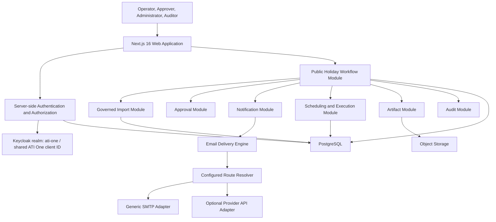
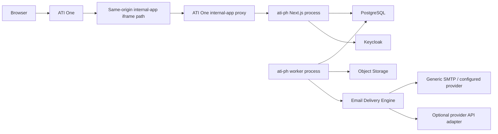
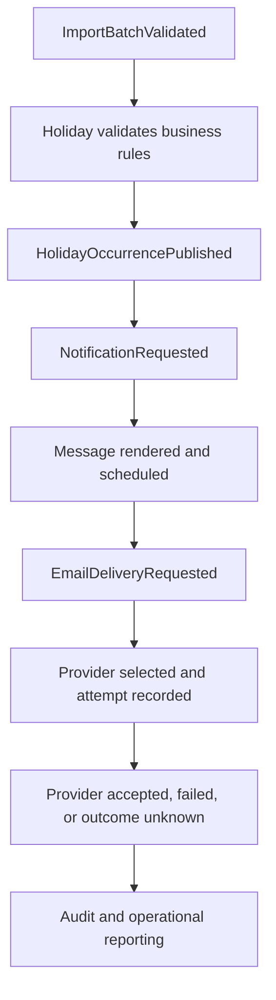
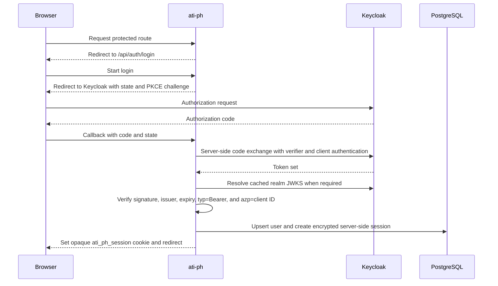

# Architecture: Public Holiday Workflow and Reusable Operational Engines

| Metadata | Value |
| --- | --- |
| Status | Governed import, routing, notification planning/approval, durable scheduling, retry/lease recovery, governed email snapshots, STREAM delivery, manual SMTP connectivity, and controlled NotificationJob SMTP pilot implemented; automatic SMTP remains gated |
| Version | 0.5.0 |
| Date | 2026-08-20 |
| Architecture style | Modular monolith with explicit module contracts |
| Repository | `D:\ATI-Projects\ati-ph` |
| Web platform | Next.js 16.3.1 App Router, React 19, TypeScript |
| Initial deployment model | Independently deployed web application and worker, mounted by ATI One as an internal iframe application |
| Canonical production browser URL | `https://one.atibusinessgroup.com/apps/ph-notification/app` |
| Canonical store | PostgreSQL |
| Identity provider | Keycloak realm `ati-one`, temporarily reusing the ATI One Keycloak client ID |

## 1. Architectural Decision

Build Public Holiday Notification as the first vertical slice of an operational workflow platform

It consumes reusable modules for import, approval, notification, email delivery, scheduling, artifacts, and audit. Those modules remain in one deployable until a second real consumer and stable contract justify extraction

This is deliberately not a microservice architecture and not a generic workflow platform

The Email Delivery capability is designed as a provider-neutral reusable engine from its first implementation because provider selection and routing are infrastructure concerns rather than Public Holiday business rules

Generic SMTP is the initial transport adapter. Sender identity and transport routing are explicit configuration. The current implementation uses an environment-backed static route resolver; a database-backed dynamic provider registry remains a future capability. Provider-specific adapters are trusted code added only when required capabilities cannot be satisfied by an existing adapter

No paid email provider is a mandatory architecture dependency

The Public Holiday codebase, database, worker, authorization rules, and business operations remain independently owned. Its initial browser delivery is through ATI One's internal same-origin proxy and iframe path. ATI One does not participate in Public Holiday business logic, but it is the initial browser entry point and delivery gateway

As an explicit temporary exception, `ati-ph` uses the same Keycloak client ID and client credential configuration as ATI One. It still creates its own namespaced application session. Keycloak is the identity and authentication authority only: ATI PH does not derive business authorization from Keycloak realm roles. Application roles, permissions, and menu visibility are resolved from ATI PH-owned PostgreSQL records. The role-permission catalog, maker-checker rules, and application access-control invariants are documented in [docs/ACCESS-CONTROL.md](docs/ACCESS-CONTROL.md). This exception is documented for later separation and must not be interpreted as permission to reuse ATI One cookies or application authorization state

## 1.1 Implementation snapshot — 2026-08-20

The executable system has advanced into Phase 3 controlled delivery.

Implemented boundaries now include:

- governed client/service-team/subscription/contact/TO/CC routing
- versioned notification policy plus global/client schedule resolution
- explainable plan preview and durable commit
- maker-checker notification approval
- immutable NotificationJob recipient, rule, schedule, and governed rendered-content snapshots
- content SHA-256 integrity verification
- due scheduler
- worker lease claim and recovery
- retry ceiling and exponential retry backoff
- explicit RETRYABLE, TERMINAL, and OUTCOME_UNKNOWN failure classes
- provider-neutral Email Delivery Engine
- STREAM adapter
- generic SMTP adapter
- manual same-domain SMTP connectivity test behind explicit gates
- controlled same-domain NotificationJob SMTP business-content pilot
- real SMTP inbox validation of frozen governed content
- provider-neutral recipient acceptance classification and durable accepted/rejected evidence

Current safety boundary:

```text
STREAM
→ worker can execute eligible jobs and mutate durable delivery state

SMTP connectivity test
→ explicit manual command
→ no Prisma / no NotificationJob
→ same-domain internal recipient

SMTP NotificationJob pilot
→ explicit manual command
→ reads one PLANNED/DUE frozen job
→ verifies content SHA-256
→ overrides recipients to one same-domain internal address
→ no claim / no DeliveryAttempt / no durable job mutation

Automatic SMTP worker
→ still gated
→ worker does not claim NotificationJobs in SMTP mode
```

The active default Public Holiday email content is grounded in the supplied workbook and is frozen at notification-plan commit time.

The 2026-08-20 inbox pilot confirmed the governed subject/body rendering. A corporate confidentiality footer was observed after the governed application body; that footer is not present in the application template source and is treated as downstream mail-system decoration outside the frozen ATI PH content hash.

Automatic production/client-recipient SMTP, provider fallback, bounce/NDR ingestion, production monitoring/runbook, and platform extraction remain future gates.

See `docs/EMAIL-DELIVERY-PLATFORM.md` and `docs/LOCAL-EMAIL-TESTING.md`.

## 2. Context

The workflow must ingest governed public-holiday Excel, validate and publish holiday data, select affected client teams, produce governed output artifacts only when an approved output contract exists, send email, and retain evidence

The same control primitives are also useful for fare imports, SLA alerts, expiry reminders, finance exceptions, and master-data changes

The holiday calendar, holiday matching, and holiday correction rules are not reusable platform capabilities

## 3. Logical Architecture



### 3.1 Technology baseline

| Concern | Initial choice |
| --- | --- |
| Web UI and HTTP boundary | Next.js 16.3.1 App Router with React Server Components and Route Handlers |
| UI design contract | ATI One PH Notification mockup and locally owned ATI design-system tokens/primitives; no runtime import from `ai-portal` |
| Language | TypeScript in strict mode |
| Persistence | One PostgreSQL database with bounded-context schemas (`access`, `approval`, `governance`, `holiday`, `import`, `notification`, `routing`) managed by Prisma migrations |
| Background execution | Separate long-running worker process built from the same repository and domain packages |
| Identity protocol | OpenID Connect Authorization Code Flow with PKCE S256 using `openid-client` |
| Browser session | Opaque host-only cookie referencing an encrypted server-side database session |
| Input and output | Governed XLSX with immutable source and generated artifacts |
| Deployment | Self-hosted standalone Node.js output behind the ATI One internal-app proxy |

Next.js owns the browser-facing UI, Route Handlers, and server-rendered application boundary. The authenticated ATI PH application shell reads active menu records from PostgreSQL, filters them by the user's ATI PH permissions, and renders only compact in-app route navigation from that governed catalog. ATI One owns the surrounding global rail, top bar, app tabs, product header, and user menu, so ATI PH must not duplicate that portal chrome inside its internal-app frame. Menu visibility is presentation only and never replaces server-side page or API permission enforcement. Durable scheduling, retries, outbox relay, workbook generation, and email delivery do not execute as unawaited work inside a web request. They run in the dedicated worker process

### 3.2 Initial deployment boundary



The canonical production browser address is `https://one.atibusinessgroup.com/apps/ph-notification/app`. Its origin is the ATI One public domain and `/apps/ph-notification/app` is the mount path used by the same-origin iframe and internal-app proxy. The Next.js build uses that path as its explicit `basePath`, and every link, asset, Route Handler, callback URI, and logout URI is tested through the complete public mounted address rather than the private upstream address

The upstream deployment remains independently operable as a web and worker workload, but browser access is expected to arrive through the ATI One internal-app proxy. If the upstream is reachable outside the portal network, every non-health request must validate the configured portal proxy proof before processing

## 4. Module Ownership

| Module | Owns | Must not own |
| --- | --- | --- |
| Public Holiday Workflow | Holiday lifecycle, occurrence matching, holiday policy use, correction logic, operational views | Generic import mechanics, generic email transport, generic artifact storage |
| Governed Import | Raw file registration, parsing contract, staging rows, validation issues, schema mapping | Holiday business rules or canonical holiday publication |
| Approval | Approval request, frozen content hash, maker-checker decision | Resource-specific validation or side effects |
| Notification | Template version, message rendering, recipient snapshot, provider-neutral message envelope | Holiday selection, client subscription policy, provider credentials, provider routing |
| Email Delivery | Provider registry, routing, adapter selection, provider capabilities, delivery attempts and events | Holiday eligibility, template selection, business recipient policy |
| Scheduling and Execution | Due work selection, worker lease, retry, dead-letter, idempotency mechanics | Email template rendering or holiday rules |
| Artifact | Immutable file identity, checksum, object storage, controlled retrieval, retention class | Business interpretation of a file |
| Audit | Append-only event history and trace correlation | Business state mutation |

## 5. Public Holiday Domain Boundary

### 5.1 Domain responsibilities

- Govern canonical calendar-region codes and approved source aliases
- Publish validated holiday occurrences
- Expand a holiday period into individual dates
- Classify each occurrence date as weekday or weekend
- Match occurrences to effective client subscriptions
- Resolve which notification policy applies to a subscription
- Request notification creation
- Interpret correction behavior before and after send
- Present holiday-specific operational screens and reports

### 5.2 Domain-owned tables

```text
calendar_region
calendar_region_alias
calendar_exception
client
service_team
contact
client_subscription
subscription_recipient
notification_policy
notification_policy_version
holiday_definition
holiday_occurrence
holiday_occurrence_region
holiday_occurrence_date
notification_run
```

`client`, `service_team`, and `contact` remain local in the first release. They can later integrate with Organization Platform or CRM, but they are not moved until an authoritative upstream ownership model exists

### 5.3 Calendar-region governance

- A calendar-region code is canonical and immutable after creation
- Source aliases use one normalized lookup-key rule and are globally unique across regions
- Administration uses activation and deactivation rather than hard delete
- Runtime import resolution accepts only an active alias whose owning region is also active
- Every active region retains an active canonical alias equal to its region code
- Region and alias mutations commit their audit event in the same database transaction
- Seed data provides bootstrap reference values only; it is not schema migration logic
- The legacy acceptance workbook continues to exercise Australia, Indonesia, New Zealand, North America, South Africa, and United Kingdom source values, including multi-region rows

## 6. Reusable Engine Boundaries

### 6.1 Governed Import Engine

#### Purpose

Turn an uploaded external file into validated staging data without allowing unvalidated input into canonical records

#### Implemented ingestion baseline (2026-08-17)

`POST /api/imports` now implements the first safe vertical slice:

- Operator or Administrator authorization is checked server-side
- `.xlsx` extension, size, ZIP signature, CRC readability, macro/VBA absence, required sheet, and required headers are validated
- The complete raw XLSX is hashed as `fileSha256`; an existing identical hash hard-blocks `EXACT_FILE_DUPLICATE` before preview validation or persistence
- The server validates XLSX package safety and the workbook contract, treats `Holiday_Master` as the only business-data sheet, resolves active calendar-region aliases, and computes `businessContentSha256` from canonical region codes, normalized holiday name, start date, and end date
- An existing `UPLOADED`, `VERIFYING`, or `VALIDATED` batch with the same `businessContentSha256` hard-blocks `SAME_HOLIDAY_DATA`, even when XLSX bytes differ
- Business duplicate identity ignores workbook metadata, filename, formatting, row order, unrelated sheets, source row ID, source reference, remarks, and legacy `Day`/`Tag` values
- Exact and business duplicate identities are rechecked under a transaction-scoped PostgreSQL advisory lock before persistence, preventing concurrent duplicate batches
- Accepted raw bytes are stored once under an immutable local-storage key; database failure removes only the unregistered file
- `Holiday_Master` headers are mapped by approved aliases and column order is ignored
- Raw rows and normalized staging rows are stored separately
- Multiple legacy regions are split and resolved to canonical region codes
- Region resolution reads active aliases from the Public Holiday calendar-region registry; inactive aliases and inactive regions fail resolution
- Typed Excel dates and ISO dates are accepted; formula cells cannot provide authoritative fields
- `Day` and `Tag` remain raw evidence and are recomputed only during canonical publication
- Accepted batches persist `fileSha256`, `businessContentSha256`, and `clientPreviewSha256`; batch, row, issue, and upload-audit records commit atomically as provisional `UPLOADED` state
- The worker independently reparses immutable raw evidence, recomputes the business-content and preview fingerprints, and emits `ImportBatchValidated` only after authoritative verification succeeds
- Invalid batches remain reviewable but cannot emit the validated event

The current storage adapter is appropriate for local development. Production must mount `ARTIFACT_STORAGE_DIR` on durable encrypted storage or replace the adapter without changing the import contract. Calendar-region and alias administration is database-managed and Administrator-only. Users with `import.read` can download a deterministic complete CSV validation report and the registered immutable raw workbook for a batch. Raw download re-hashes the stored bytes and refuses release when SHA-256 does not match the registered artifact evidence; both report and raw-workbook releases create audit events before bytes are returned. Warning acknowledgement is persisted against the validation issue with actor/time and a same-transaction audit event; ERROR issues cannot be acknowledged. Controlled staging correction now mutates normalized staging only, never raw evidence. Correction, exclusion, and restoration run a deterministic full-batch revalidation against the active canonical region registry; unchanged warning acknowledgements are preserved by stable issue identity, changed warnings require acknowledgement again, row and batch validation states are recomputed transactionally, and validation-state changes emit an outbox event. Maker-checker approval is now implemented through a reusable approval-request record containing the resource identity and a deterministic SHA-256 content hash. Submission freezes staging and warning acknowledgement; the requester cannot decide the same request; decision recomputes the hash before commit; rejection unfreezes the import for correction and resubmission; approval stays frozen for canonical publication. Request and decision transitions commit their audit and outbox events transactionally. Canonical holiday publication is now implemented after approved frozen content. Each valid staging row creates exactly one canonical occurrence linked to its source import row and batch, one relation per canonical region, and one derived record per inclusive calendar date. Weekday/weekend classification is recomputed from the canonical date. Publication executes in a serializable transaction, verifies the approved content hash and active region registry, marks the batch published, and commits audit/outbox evidence atomically. `sourceImportRowId` uniqueness plus `publishedAt` replay handling makes repeated publication idempotent. The batch review UI exposes source-to-canonical lineage and expanded dates.

The supplied legacy workbook was used as an executable fixture: 25 holiday rows were detected, 22 production-like rows passed, and the three `(SAMPLE)` rows with `xxx` regions were blocked. See `docs/GOVERNED-IMPORT-CONTRACT.md`.

#### Owns

```text
file_artifact for raw import files
import_batch
import_row
import_validation_issue
schema registry and mapping definition
```

#### Interface

```text
createImport(source, file, schema)
parseImport(batchId)
validateImport(batchId)
getValidationReport(batchId)
submitImport(batchId)
```

#### Emitted events

```text
ImportBatchUploaded
ImportBatchValidated
ImportBatchSubmitted
```

#### Reuse examples

- Fare data spreadsheet intake
- Bulk rate upload
- Employee document register import
- Finance reconciliation exception import

### 6.2 Approval Engine

#### Purpose

Provide controlled maker-checker decisions over a frozen resource snapshot

#### Owns

```text
approval_request
approval decision history
approval policy reference
```

#### Interface

```text
requestApproval(resourceType, resourceId, snapshotHash)
approve(requestId, decisionReason)
reject(requestId, decisionReason)
invalidate(requestId, reason)
```

#### Invariant

An approval decision applies only to the exact snapshot hash submitted. Any content change invalidates the approval

#### Reuse examples

- Holiday import publication
- Fare exception approval
- Master-data modification
- Refund exception approval

### 6.3 Notification Engine

#### Purpose

Render a business notification into an immutable provider-neutral message without allowing the business domain to depend on email transport implementation

#### Owns

```text
email_template
email_template_version
template_assignment when assignment is generic
notification_snapshot
notification_recipient
```

#### Interface

```text
renderMessage(request)
previewMessage(messageId)
testSend(messageId, recipient)
scheduleMessage(messageId, scheduledAt)
requestDelivery(messageId)
```

#### Required request data

```text
business_reference
notification_type
template_version
recipient snapshot
placeholder values
schedule
correlation ID
```

#### Invariants

- Rendering is immutable once approved or sent
- Notification does not select provider credentials
- Notification produces a provider-neutral frozen message
- Retry never regenerates the approved content

#### Reuse examples

- SLA breach email
- Contract expiry reminder
- Fare filing exception notification
- Approval notification

### 6.4 Email Delivery Engine

#### Purpose

Deliver a frozen provider-neutral message through dynamically configured providers without coupling consumer applications to one vendor

#### Owns

```text
email_provider
email_route
provider capability metadata
delivery_attempt
delivery_event
provider adapter contract
provider routing policy
```

#### Initial adapter strategy

```text
Generic SMTP Adapter
    ├── Corporate SMTP relay
    ├── SMTP2GO
    ├── MailerSend
    ├── Elastic Email
    └── Postal SMTP

Optional provider-specific adapters
    └── Microsoft Graph or another required provider API
```

Provider names are examples, not procurement commitments

No paid provider is a mandatory dependency

#### Interface

```text
deliver(message, routeContext)
classifyProviderError(error)
resolveProvider(routeContext)
checkProviderHealth(providerId)
recordDeliveryEvent(providerEvent)
```

#### Dynamic configuration

Adapter implementations are trusted code

Provider records and routing policy are runtime configuration

Secrets are represented by secret references and resolved only inside this module

Changing between providers that use an already implemented adapter type must not require Public Holiday business-code changes

#### Fallback invariants

- The logical idempotency key belongs to the platform, not the provider
- `FAILED_BEFORE_ACCEPTANCE` may use an approved fallback route
- Provider-specific rejection may fall back only when the recipient itself is not the failure
- Permanent recipient failure does not fall back automatically
- `ACCEPTED` never falls back
- `UNKNOWN_OUTCOME` never falls back automatically
- A second provider attempt reuses the same logical message and frozen snapshot

#### Platform maturity

The engine begins as Stage 1 inside `ati-ph`

It becomes a shared internal capability only after a second production consumer validates the same contract

It becomes an independently deployed Email Delivery Platform only when extraction criteria in this architecture are satisfied

See `docs/EMAIL-DELIVERY-PLATFORM.md` for the detailed contract

### 6.5 Scheduling and Execution Engine

#### Purpose

Execute due work safely and predictably

#### Owns

```text
outbox_event
worker lease state
retry policy primitives
dead-letter operational state
```

#### Interface

```text
enqueue(event)
claimDueWork(workerId)
completeWork(workId)
rescheduleWork(workId, nextAttemptAt)
deadLetterWork(workId, reason)
```

#### Invariants

- Work is claimed atomically
- Workers use leases and recover expired leases
- Delivery or handler side effects are idempotent
- Outbox publication happens in the same transaction as business-state change

#### Reuse examples

- Scheduled reconciliation
- Deferred report generation
- Retry of external integrations
- Periodic compliance checks

### 6.6 Artifact Engine

#### Purpose

Provide immutable, traceable evidence files

#### Owns

```text
file_artifact
checksum calculation
object storage reference
retention class
artifact access authorization
```

#### Interface

```text
storeArtifact(type, file, metadata)
getArtifact(artifactId)
linkArtifact(resourceType, resourceId, artifactId)
verifyArtifact(artifactId)
```

#### Invariants

- Every artifact has a SHA-256 checksum
- Uploaded source files are immutable
- Generated output is stored as a distinct artifact
- Business modules cannot overwrite artifact bytes in place

#### Reuse examples

- Source Excel
- Generated output XLSX
- PDF report
- CSV reconciliation report
- Provider NDR evidence

### 6.7 Audit Engine

#### Purpose

Record who changed what, when, through which request, and from which prior state

#### Owns

```text
audit_event
request correlation
actor attribution
append-only audit retention
```

#### Interface

```text
recordAudit(action, resource, actor, before, after, metadata)
searchAudit(filter)
getResourceHistory(resourceType, resourceId)
```

#### Invariants

- Audit writes are append-only
- Audit writes cannot block the primary business transaction without an explicit compliance requirement
- Sensitive values are redacted before audit persistence when required

## 7. Data Ownership and Access

### 7.1 Ownership rule

Each table has one owner module. Other modules access it only through a module interface, query projection, or emitted event

### 7.2 Physical PostgreSQL layout

ATI PH uses one PostgreSQL database and one physical PostgreSQL schema: `public`. PostgreSQL schemas are not used as module namespaces in this modular monolith

Logical ownership remains explicit even though the tables are physically colocated:

| Table family | Logical owner |
| --- | --- |
| `users`, `auth_sessions` | Application Identity and Session |
| `roles`, `permissions`, `user_roles`, `role_permissions`, `menus` | Authorization |
| `calendar_regions`, `calendar_region_aliases` and future holiday canonical tables | Public Holiday Workflow |
| `import_batches`, `import_rows`, `import_validation_issues` | Governed Import |
| `file_artifacts` | Artifact |
| `audit_events` | Audit |
| `outbox_events` | Scheduling and Execution |
| future `email_providers`, `email_routes`, `delivery_attempts`, `delivery_events` | Email Delivery |

Module boundaries are code-ownership and contract boundaries, not nested database schemas. Cross-module mutation rules below still apply

Internal domain/entity PK/FK columns use native PostgreSQL `uuid`. The application-local `users.id` is a UUID generated by ATI PH. The verified Keycloak OIDC `sub` is stored separately as unique `users.externalSubject`

The deliberate identifier exceptions are non-domain identifiers: the opaque 256-bit application session handle remains a string bearer token, audit `entityId` and outbox `aggregateId` remain polymorphic strings, and business/source codes remain strings

### 7.3 Identity and authorization boundary

- Keycloak authenticates the user and supplies the verified OIDC subject and identity claims
- `public.users` is an application-local projection with its own UUID primary key; the verified Keycloak subject is stored in unique `externalSubject`; it stores no password, MFA secret, or authentication credential
- `public.user_roles` assigns one or more ATI PH roles to that local user
- Roles aggregate permissions through `public.role_permissions`
- Protected backend operations authorize on permission codes, never on menu visibility
- `public.menus` may hide or expose navigation entries based on a required permission, but a menu record never grants backend access
- Login synchronizes identity profile fields only and does not overwrite local authorization
- The bootstrap CLI may grant the first application role only after that user has authenticated once and therefore exists in `public.users`

### 7.4 Cross-module access rule

Allowed:

- Read-only projection for UI reporting
- Explicit application service call
- Transactional outbox event
- Foreign key reference where lifecycle is stable and ownership remains clear

Not allowed:

- One module updating another module's table directly
- Domain or Notification module reading raw provider secrets
- Notification module deciding holiday eligibility
- Import module publishing domain records without domain authorization

## 8. Internal Contracts

### 8.1 Event flow



### 8.2 Contract rules

- Events carry stable resource IDs, event version, occurred time, and correlation ID
- Events do not carry unbounded raw files or secrets
- Consumer behavior must be idempotent
- Event schema changes are backward compatible or versioned
- A failed consumer does not roll back the completed producer transaction

### 8.3 Required events

| Event | Producer | Required consumer behavior |
| --- | --- | --- |
| `ImportBatchValidated` | Import | Public Holiday evaluates domain rules |
| `ImportBatchApproved` | Approval | Public Holiday publishes canonical occurrence data |
| `HolidayOccurrencePublished` | Public Holiday | Planner evaluates affected subscriptions |
| `NotificationRequested` | Public Holiday | Notification renders message and stores snapshot |
| `NotificationScheduled` | Notification | Execution selects it when due |
| `EmailDeliveryRequested` | Scheduling and Execution | Email Delivery resolves provider route and creates an attempt |
| `EmailAcceptedByProvider` | Email Delivery | Update reporting and audit without claiming final recipient delivery |
| `EmailDeliveryFailed` | Email Delivery | Classify failure, retry eligibility, fallback eligibility, and operations alert |
| `EmailDeliveryOutcomeUnknown` | Email Delivery | Block automatic fallback until reconciliation |
| `ArtifactCreated` | Artifact | Link evidence to source resource |

## 9. Reuse Maturity Model

### Stage 1 — Module

- One application uses the capability
- One codebase and database
- Explicit package and module ownership boundary
- No external API commitment

### Stage 2 — Shared internal capability

- Second real application uses the capability
- Contract is versioned
- Named owner and support responsibility exist
- Shared observability and authorization rules exist

### Stage 3 — Platform service

- Independent deployment is justified by scale, reliability, security, or release independence
- Consumers integrate through a stable API or event contract
- Data ownership is separate
- SLO, operational ownership, and migration strategy are approved

The default is Stage 1. Advancing stages requires evidence, not architectural preference

## 10. Extraction Criteria

Extract a module only when all conditions are true:

- At least two production consumers exist
- The interface has survived a complete operational lifecycle
- The owner can define an explicit contract and versioning policy
- Access control can be scoped independently
- Data lifecycle can be owned independently
- Release coordination materially harms delivery
- The reliability benefit exceeds the operational cost

## 11. Explicitly Domain-Specific Logic

The following must remain in Public Holiday even after engine reuse:

```text
Holiday name normalization policy
Holiday occurrence correction policy
Holiday date expansion
Weekday or weekend selection rule
Calendar-region match to client subscription
Holiday reminder timing semantics
Holiday-specific recipient routing
```

Do not place these inside a generic workflow or rule engine

## 12. Integration Dependencies

| Dependency | Boundary | Initial requirement |
| --- | --- | --- |
| Enterprise IdP | Keycloak OIDC authentication | Realm `ati-one`; shared ATI One client ID as a temporary exception; exact mounted callback and logout URIs |
| ATI One internal-app proxy | Browser delivery and upstream proof | Same-origin iframe mount, `/apps/ph-notification/app` base path, and validated proxy header on every non-health request |
| Outbound email providers | Email Delivery Engine | Generic SMTP first, runtime provider registry and routing, optional provider-specific adapters |
| Object storage | Artifact adapter | Immutable file storage and controlled retrieval |
| PostgreSQL | Internal persistence | Transaction, outbox, lock, and audit support |
| Observability platform | Telemetry adapter | Logs, metrics, traces, and alerts |

## 13. Security Boundary

- `ati-ph` owns its authentication session and authorization decisions
- ATI One application cookies, access tokens, refresh tokens, and product entitlements are never reused as an `ati-ph` session or authorization decision
- `ati-ph` temporarily uses the same Keycloak client ID and client credential configuration as ATI One because ATI One is the only initial browser entry point
- The shared-client exception is limited to the OIDC relying-party registration; `ati-ph` still owns its session records, cookie namespace, user-role mapping, and audit trail
- Authorization Code Flow uses PKCE S256, state, nonce, exact redirect URIs, and server-side code exchange
- Before any user or session write, the returned access token must pass RS256 signature verification against the realm JWKS, issuer and expiry validation, `typ === "Bearer"`, and `azp === KEYCLOAK_CLIENT_ID`; a missing claim is rejected rather than inferred
- Implicit flow and resource-owner password or direct-access grants are disabled
- The browser stores only an opaque `ati_ph_session` identifier in a `Secure`, `HttpOnly`, `SameSite=Lax`, host-only cookie
- Keycloak token material is never exposed to browser JavaScript and is encrypted at rest when retained for refresh or logout
- Keycloak claim `sub` is the stable external identity key; email is mutable profile data, not a primary identifier
- Keycloak authenticates the user; application roles and permissions are resolved by `ati-ph` from its own database or an explicitly approved group-to-role mapping
- Next.js `proxy.ts` may perform an optimistic session-presence redirect, but every sensitive read and mutation performs a secure server-side authorization check close to the data access
- Public Holiday module receives business data but no provider credentials
- Notification module produces only the frozen provider-neutral message required for delivery
- Email Delivery module is the only business-runtime boundary allowed to resolve provider secret references and select transport adapters
- Artifact module stores controlled references and checksums, not business decisions
- Provider credentials and sender identities are scoped to the minimum approved outbound delivery capability
- Audit module redacts protected values according to policy
- User role checks happen server-side before every mutation

### 13.1 Authentication flow



If the browser already has an SSO session in the `ati-one` realm, Keycloak completes the authorization flow without asking for credentials again. For the initial implementation, the client ID and client credential are shared by explicit project decision. The protocol flow remains a separate authorization request and callback for `ati-ph`; ATI One does not pass its token or cookie into the iframe. The callback validates the ID-token protocol claims through `openid-client` and independently verifies the access token before it can influence persistence or session creation

### 13.2 Session lifecycle

- Session records have an absolute maximum age that refresh cannot extend indefinitely
- Every protected session resolution checks the encrypted access-token expiry locally; Keycloak is not called while the token remains outside the configured refresh skew
- Within the refresh skew, concurrent requests for one session share one refresh result, including a short grace window for sequential requests that still observed the previous row state
- A successful refresh validates the new access token, preserves the absolute session ceiling, replaces the encrypted token payload in the same opaque session, and increments a refresh version
- Session updates use the row `updatedAt` value as an optimistic concurrency guard so a stale refresh from another process cannot overwrite or revoke a newer result
- A missing refresh token, refused refresh, invalid refreshed access token, inactive user, or unreadable encrypted payload revokes the database session fail-closed
- Successful refreshes are operational logs or metrics, not permanent audit events; login, explicit logout, and security-relevant revocation remain auditable
- Logout first revokes or deletes the local session, then performs standards-based RP-initiated logout when global sign-out is requested
- Keycloak front-channel or back-channel logout integration is tested before production so a logout initiated by another client can invalidate the local session
- Expired sessions are rejected during lookup and removed by a scheduled retention job
- Authentication success, failure, refresh refusal, and logout are recorded in the audit trail without storing secrets or raw tokens

### 13.3 Application authorization

Initial roles are `Administrator`, `Operator`, `Approver`, and `Auditor`. Role checks are application capabilities, not UI visibility rules. Hiding a button never replaces authorization on the corresponding command

Maker-checker rules are evaluated from frozen approval data. When enabled, the actor who submitted a batch or notification run cannot approve the same resource

### 13.4 ATI One internal delivery contract

ATI One is the initial browser entry point and renders `ati-ph` through its internal same-origin iframe and proxy capability. No source-code change to the ATI One project is part of this repository's implementation scope

The `ati-ph` side must preserve these invariants:

- public routes, assets, callbacks, and logout endpoints work under `/apps/ph-notification/app`
- `ati-ph` uses namespaced cookies such as `ati_ph_session` and never reads or writes `ati_one_*`
- no ATI One application token or cookie is passed into or interpreted by `ati-ph`
- the private upstream is not treated as an alternative browser entry point
- every non-health upstream request validates the configured ATI One proxy proof when the upstream is reachable beyond a private shared network
- framing headers allow the approved same-origin ATI One parent and do not allow arbitrary framing origins
- a missing Keycloak SSO session escapes the iframe for top-level authentication and returns to the mounted application path

### 13.5 Temporary shared-client exception

Reusing the ATI One Keycloak client means the two applications share client-level redirect URI policy, credential rotation impact, token `azp`, and incident blast radius. These consequences are accepted for the initial internal-only delivery and recorded rather than hidden

The exception must be revisited before any of the following:

- `ati-ph` gains a browser entry point outside ATI One
- the application is operated by a different credential-owning team
- client-specific token audience or policy must distinguish ATI One from Public Holiday
- either application requires independent secret rotation or incident containment
- security review requires unambiguous relying-party attribution

Separation later creates a dedicated `ati-ph` Keycloak client and changes environment configuration plus registered callback/logout URIs. It does not change `ati-ph` user IDs, application roles, domain data, or server-side session design

## 14. Decision Summary

| Decision | Result |
| --- | --- |
| Initial product deployment | Independently deployed `ati-ph`, delivered by ATI One internal iframe and proxy |
| Web platform | Next.js 16.3.1 App Router and React 19 |
| Background processing | Dedicated worker process from the same repository |
| Identity realm | Existing Keycloak realm `ati-one` |
| Identity client | Shared ATI One Keycloak client ID and credential as an explicit temporary exception |
| Session model | Opaque host-only cookie and encrypted server-side database session |
| Authorization source | `ati-ph` database roles, with optional explicit Keycloak group mapping |
| ATI One integration | Initial browser entry point and delivery gateway; no Public Holiday business logic ownership |
| Reusable implementation model | Modules first, services only on evidence |
| Reusable capabilities | Import, Approval, Notification, Email Delivery, Scheduling, Artifact, Audit |
| Initial email transport | Generic SMTP Adapter |
| Email provider selection | Dynamic provider registry and route configuration |
| Mandatory paid email provider | No |
| Email platform extraction | Only after a second production consumer and extraction criteria are satisfied |
| Domain capability | Holiday lifecycle and matching |
| Shared database initially | Yes, with schema and ownership boundaries |
| Generic BPMN engine | No |
| Generic business rule engine | No |
| Output workbook renderer extraction | Not before a second real exporter needs it |

## 15. Next Reference

See `plan.md` for phased delivery, decision gates, and when each module becomes reusable beyond Public Holiday

See `docs/EMAIL-DELIVERY-PLATFORM.md` for the provider-neutral Email Delivery Engine, dynamic provider routing, safe fallback, and platform-extraction contract

## Client preprocessing and authoritative verification

Workbook preprocessing is split across the trust boundary. The browser dynamically loads SheetJS only after file selection, parses `Holiday_Master`, applies the governed mapping and normalization rules, and renders a local preview before any upload. On confirmation it submits the untouched XLSX together with the preview JSON.

The request path stores the XLSX immutably and the JSON as provisional staging, records `clientPreviewSha256`, and returns `UPLOADED` without synchronously parsing the workbook. The worker claims the batch as `VERIFYING`, performs package and macro safety checks, reparses the stored XLSX independently with SheetJS, recomputes the same deterministic preview fingerprint, and fails closed on mismatch.

Only a matching server parse can transition the batch to `VALIDATED` or `INVALID`. Correction, warning acknowledgement, approval, and publication remain locked before that transition. Canonical publication additionally requires `verifiedAt` and remains downstream of maker-checker approval.
