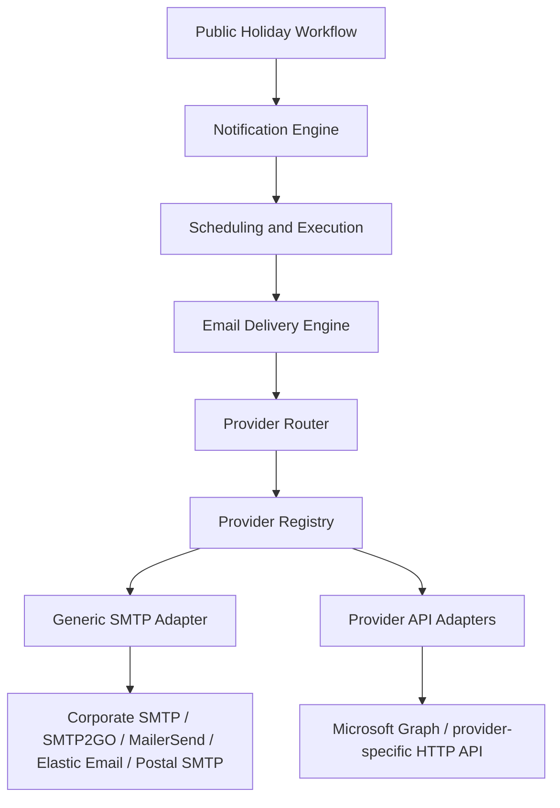

# Email Delivery Engine and Platform Candidate

| Metadata | Value |
| --- | --- |
| Status | Proposed Phase 3 capability and reusable platform candidate |
| Version | 0.1.0 |
| Date | 2026-08-17 |
| First consumer | Public Holiday Notification Workflow |
| Current implementation | Not yet implemented |
| Initial adapter strategy | Generic SMTP first |
| Provider selection | Runtime configuration |
| Mandatory paid provider | None |

## 1. Purpose

Define the provider-neutral email delivery capability required by Public Holiday Notification without coupling the workflow to Microsoft Graph, SMTP2GO, Brevo, MailerSend, Elastic Email, Postal, or any other single provider

The capability starts as a reusable module inside the `ati-ph` modular monolith

It becomes a formal shared platform only after a second real production consumer proves that the contract is stable and shared ownership is justified

## 2. Boundary

Public Holiday owns:

- Holiday eligibility
- Client and service-team subscription matching
- Notification policy selection
- Holiday-specific recipient routing
- Notification-run approval policy
- Business snapshot and correlation to source holiday data

Notification owns:

- Email template versioning
- Placeholder validation
- Rendered subject and body
- Frozen recipient snapshot
- Provider-neutral message envelope
- Preview behavior

Email Delivery owns:

- Provider registry
- Provider routing
- Transport adapter selection
- Provider capability metadata
- Provider attempt history
- Transport error classification
- Provider acceptance evidence
- Bounce or NDR correlation where supported
- Provider-level health evidence
- Safe provider fallback rules

Scheduling and Execution owns:

- Due-work claiming
- Worker lease recovery
- Retry timing
- Dead-letter handling
- Kill switch
- Idempotent execution mechanics

The Public Holiday domain must not read provider credentials or contain provider-specific send logic

## 3. Logical Architecture



Provider names in this document are examples of compatible targets, not procurement commitments

No paid provider is a mandatory architecture dependency

## 4. Adapter Model

Adapter implementation is trusted application code

Provider configuration is runtime data

The application must never load arbitrary adapter source code from the database

Conceptual contract:

```text
send(message, providerContext) -> deliveryResult
classifyError(providerError) -> deliveryClassification
checkHealth(providerContext) -> healthEvidence
consumeDeliveryEvent(providerEvent) -> correlatedDeliveryEvent
```

### 4.1 Generic SMTP adapter

The first transport adapter should be generic SMTP because it can work with many SMTP-compatible relays without changing business code

Provider changes within the SMTP adapter type are configuration changes rather than source-code changes

Examples of possible SMTP targets:

- Existing corporate SMTP relay
- SMTP2GO
- MailerSend
- Elastic Email
- Self-hosted Postal
- Another approved SMTP relay

The selected provider must still satisfy Operations, security, sender-domain, deliverability, and volume requirements

### 4.2 Provider-specific adapters

A provider-specific adapter is added only when required capability cannot be expressed safely through the generic SMTP contract

Examples:

- Microsoft Graph
- Provider HTTP API
- Provider-specific webhook or event API

Adding a provider-specific adapter must not change the Public Holiday business contract

## 5. Dynamic Provider Registry

Provider records are configuration, not hardcoded business logic

Conceptual provider configuration:

```text
email_provider
--------------
id
code
display_name
adapter_type
status
priority
secret_ref
configuration
capabilities
created_at
updated_at
```

`secret_ref` points to an approved secret store

Credentials are never stored directly in provider configuration JSON, source code, logs, audit metadata, or rendered artifacts

Example adapter types:

```text
SMTP
MICROSOFT_GRAPH
PROVIDER_HTTP_API
```

Example capabilities:

```text
SEND
HTML
PLAIN_TEXT
ATTACHMENT
PROVIDER_MESSAGE_ID
DELIVERY_EVENT
BOUNCE_EVENT
NDR_CORRELATION
```

The capability matrix prevents the router from selecting a provider that cannot satisfy the requested message contract

## 6. Dynamic Routing

Routing policy is also runtime configuration

Conceptual model:

```text
email_route
-----------
id
consumer_code
notification_type
provider_id
priority
status
effective_from
effective_to
```

Example:

```text
PUBLIC_HOLIDAY + HOLIDAY_NOTICE
→ SMTP_PRIMARY
→ SMTP_SECONDARY
```

The first implementation does not require sophisticated routing dimensions

Routing becomes more advanced only when an actual use case requires additional dimensions such as consumer, message class, region, sender identity, or provider capability

## 7. Provider Switching

Provider switching is allowed without redeploy when:

- The replacement provider uses an already implemented adapter type
- Required capabilities are satisfied
- Required sender and domain configuration is approved
- Secret references are valid
- The route is active
- Operational validation has passed

Example:

```text
SMTP2GO_PRIMARY
adapter_type = SMTP

MAILERSEND_PRIMARY
adapter_type = SMTP
```

Switching between these records can be a configuration change because both use the same trusted SMTP adapter

Switching to an adapter type that does not yet exist still requires code, tests, review, and deployment

## 8. Safe Fallback

Provider fallback must not be treated as a simple retry against another vendor

A timeout does not prove that a provider failed to accept the message

Automatic fallback is permitted only when the platform has evidence that the previous provider did not accept the logical message

Required outcome classes:

```text
FAILED_BEFORE_ACCEPTANCE
DEFINITIVE_PROVIDER_REJECTION
RECIPIENT_PERMANENT_FAILURE
ACCEPTED
UNKNOWN_OUTCOME
```

Rules:

- `FAILED_BEFORE_ACCEPTANCE` may use an approved fallback route
- `DEFINITIVE_PROVIDER_REJECTION` may use a fallback only when the rejection is provider-specific rather than recipient-specific
- `RECIPIENT_PERMANENT_FAILURE` does not switch provider automatically
- `ACCEPTED` never switches provider
- `UNKNOWN_OUTCOME` never switches provider automatically

An `UNKNOWN_OUTCOME` requires reconciliation or a provider-specific idempotency mechanism before another transport attempt is permitted

## 9. Platform-Owned Idempotency

The logical message identity belongs to the Email Delivery Engine, not to a provider

The same platform idempotency key is retained across delivery attempts and provider changes

Conceptual identity includes the frozen notification job and message snapshot

Provider attempt identity is separate:

```text
logical message
    ├── attempt 1 → provider A
    └── attempt 2 → provider B
```

Only one logical successful delivery may exist for the same idempotency key

Provider failover must therefore reuse the existing notification job and frozen snapshot rather than create a second logical notification

## 10. Delivery Evidence

Provider acceptance and final delivery are separate concepts

The platform records:

- Provider selected
- Adapter type
- Attempt number
- Attempt start and finish
- Provider request identifier when available
- Provider message identifier when available
- Acceptance or rejection
- Sanitized error classification
- Retry eligibility
- Bounce or NDR evidence where available
- Final platform interpretation

The platform must not label an SMTP or HTTP acceptance response as confirmed recipient delivery

## 11. Proposed Persistence

The following tables are Phase 3 target design and are not part of the current Phase 1 schema:

```text
email_providers
email_routes
notification_jobs
delivery_attempts
delivery_events
```

The complete physical schema is finalized during Phase 3 detailed design

All tables remain in the physical PostgreSQL `public` schema while module ownership remains explicit in application code

## 12. Security

- Provider credentials are referenced through an approved secret store
- Secrets are resolved only inside the Email Delivery boundary
- Public Holiday business code never receives raw provider credentials
- Provider configuration changes require authorization and audit
- Sender identity changes require authorization and audit
- Provider route changes require authorization and audit
- Sensitive provider responses are sanitized before logging or audit persistence
- TLS is required for external transport
- SMTP authentication and TLS mode are explicit configuration
- Provider-specific webhooks require authenticity validation where supported

## 13. Operational Controls

Phase 3 must include:

- Provider enable and disable control
- Kill switch for new sends
- Health evidence
- Delivery attempt history
- Transient retry
- Permanent failure handling
- Dead-letter handling
- Manual retry with reason
- Provider-route audit history
- Alerting for provider outage or abnormal failure rate

Health checks may influence routing before a send starts

A health check must never be used as proof that a send with an unknown outcome was not accepted

## 14. Initial Provider Strategy

The recommended order is:

```text
1. Implement Generic SMTP Adapter
2. Use an approved no-additional-license SMTP route when available
3. Otherwise configure an approved SMTP-compatible provider for pilot
4. Add Provider Registry and Route configuration
5. Add safe fallback only after outcome classification is proven
6. Add provider-specific API adapters only for required capabilities
```

SMTP2GO is a valid example of an initial SMTP-compatible provider

Existing corporate SMTP, MailerSend, Elastic Email, or Postal may also satisfy the same generic SMTP adapter contract if approved

Microsoft Graph remains optional and is not a required dependency

No provider is selected solely because it currently offers a free plan

Operational suitability, sender-domain control, deliverability, security, rate limits, and support requirements still apply

## 15. Platform Evolution

### Stage 1 — Reusable module

- Lives inside `ati-ph`
- First consumer is Public Holiday Notification
- Provider-neutral interface is explicit
- Provider configuration is dynamic
- No independent service contract

### Stage 2 — Shared internal capability

Triggered only after a second real application consumes the same delivery contract

Required:

- Named platform owner
- Versioned consumer contract
- Independent authorization model
- Shared provider registry
- Shared observability
- Consumer isolation
- Migration plan from in-process calls to shared API or events where required

### Stage 3 — Email Delivery Platform

Independent deployment is justified only when scale, reliability, security, or release independence requires it

At that point applications may consume:

```text
Public Holiday
HRIS
Finance
Fare Filing
SLA Monitoring
        ↓
Email Delivery Platform
        ↓
Dynamic Provider Router
```

Platform extraction is an evidence-based evolution, not a prerequisite for Phase 3

## 16. Acceptance Criteria

The Email Delivery Engine is ready for controlled production use when:

- Public Holiday can submit a provider-neutral frozen email message
- Generic SMTP adapter passes contract tests
- Provider selection is loaded from runtime configuration
- Provider credentials are resolved through secret references
- Switching between two providers using the same adapter type does not require business-code changes
- Provider attempts remain traceable to one logical message
- Repeated execution cannot create duplicate logical sends
- Accepted messages are never automatically resent through another provider
- Unknown outcomes are never automatically failed over
- Permanent recipient failures are not retried through another provider
- Transient pre-acceptance provider failures follow the approved route policy
- Kill switch blocks new sends
- Route changes and manual retries are audit-recorded
- Provider acceptance is not presented as confirmed recipient delivery
- Controlled pilot is accepted by Operations and IT

## 17. Related Documents

- `PROPOSAL.md`
- `architecture.md`
- `plan.md`
- `docs/ACCESS-CONTROL.md`
