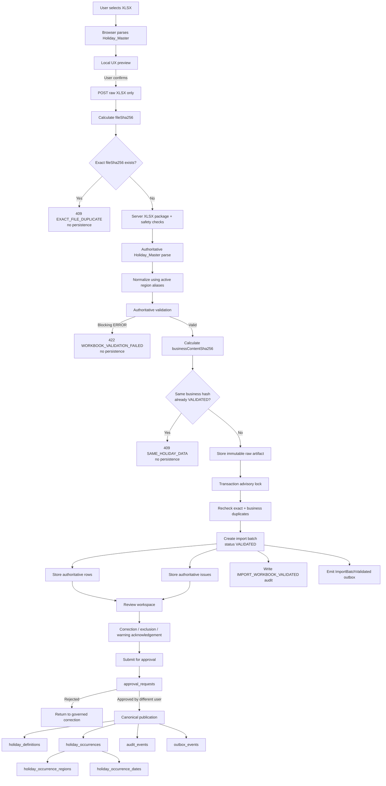

# Governed Public-Holiday Import Contract

| Metadata | Value |
| --- | --- |
| Status | Implemented ingestion baseline |
| Version | 1.9.0-draft |
| Date | 2026-08-18 |
| Schema name | `ati-public-holiday-import` |
| Legacy schema version | `legacy-1.0` |
| Required legacy sheet | `Holiday_Master` |

## Purpose

This contract defines the safe boundary between an uploaded workbook and ATI PH staging. PostgreSQL is canonical; Excel is input evidence. Upload never publishes holiday data, schedules notifications, or sends email.

The supplied `ModifByRF-FCTG-Master Data Template - PH Notifications.xlsx` workbook was audited structurally and visually. It contains seven sheets, but only `Holiday_Master` is ingested by this slice. `Client_Master`, templates, error evidence, glossary, and backup data will use separate migration or domain contracts.

## Accepted file envelope

- File extension must be `.xlsx`
- MIME type must be the standard XLSX type or `application/octet-stream`
- Size must not exceed `IMPORT_MAX_FILE_SIZE_BYTES`
- Package must have a valid ZIP signature and CRC
- Encrypted, corrupt, macro-enabled, and VBA-containing packages are rejected
- Byte-identical XLSX evidence hard-blocks with `EXACT_FILE_DUPLICATE`; normal imports have no confirmation override
- Different XLSX bytes with the same canonical authoritative `Holiday_Master` business content hard-block with `SAME_HOLIDAY_DATA` when an existing batch is `VALIDATED`
- Duplicate preflight completes before raw artifact or import-batch persistence, so a blocked duplicate creates no new evidence record or batch
- Accepted original bytes are stored under a new immutable artifact key

## Legacy header mapping

Column order is ignored. Header comparison is case-insensitive and punctuation-insensitive.

| Canonical field | Accepted legacy headers | Required |
| --- | --- | --- |
| `regionCode` | `Region`, `Region Code`, `Calendar Region` | Yes |
| `holidayName` | `PH Name`, `Holiday Name`, `Public Holiday` | Yes |
| `startDate` | `PH Start Date`, `Start Date` | Yes |
| `endDate` | `PH End Date`, `End Date` | Yes |
| `sourceRowId` | `Source Row ID` | No |
| `sourceReference` | `Source Reference` | No |
| `notes` | `Remarks`, `Notes` | No |

Unknown columns remain in `rawData`. `Source Row ID` is no longer canonical workbook input; if an older workbook still contains that column it is retained only in immutable raw evidence and is ignored by normalization. More than one source column mapping to the same canonical field is an error. Missing required headers make the batch invalid.

## Normalization rules

- Whitespace is trimmed without changing immutable raw evidence
- Comma, semicolon, and newline-separated legacy regions are split
- Region aliases resolve through the database-managed calendar-region registry; only active aliases owned by active regions are accepted
- The bootstrap registry contains canonical codes `AU`, `ID`, `GB`, `ZA`, `NA`, `NZ`, and `SG`; administrators can govern aliases without redeploying the application
- Duplicate region codes within one source row are collapsed
- Holiday names retain display text and also receive a normalized duplicate-matching value
- Typed Excel dates and ISO `YYYY-MM-DD` text are accepted
- Formula cells are preserved in raw JSON but cannot supply region, name, or date authority
- `Day` and `Tag` are preserved only in raw JSON; canonical publication will derive them per calendar date
- `Remarks` is informational and never controls workflow state

## Validation result

Issues use stable severity and code values:

- `ERROR` blocks validation/publication
- `WARNING` requires review and later acknowledgement
- `INFO` records deterministic normalization

Implemented codes include:

- `MISSING_REQUIRED_HEADER`
- `AMBIGUOUS_HEADER`
- `REQUIRED_VALUE_MISSING`
- `UNKNOWN_REGION`
- `INVALID_DATE`
- `END_DATE_BEFORE_START_DATE`
- `DATE_PERIOD_TOO_LONG`
- `CROSS_YEAR_PERIOD`
- `FORMULA_NOT_ALLOWED`
- `SAMPLE_ROW_DETECTED`
- `DUPLICATE_HOLIDAY_OCCURRENCE`
- `OVERLAPPING_HOLIDAY_OCCURRENCE`
- `MULTI_REGION_NORMALIZED`
- `LEGACY_SCHEMA_ASSUMED`
- `DERIVED_COLUMNS_IGNORED`

Sample/test rows produce warnings in development and errors in production. Unknown regions always produce errors.

## Persistence and transaction boundary

The browser preview is UX-only. Submit sends the untouched raw XLSX and no browser-derived rows, issues, or integrity hash.

The API is the authoritative import boundary. It validates the XLSX package, resolves active calendar-region aliases, parses `Holiday_Master` exactly once, normalizes and validates the workbook, computes `businessContentSha256`, and applies exact plus semantic duplicate hard-blocks before persistence.

A workbook with blocking authoritative `ERROR` results is rejected with `422 WORKBOOK_VALIDATION_FAILED`; it creates no artifact and no import batch.

For an accepted workbook, the raw artifact is written first. The database transaction then acquires a PostgreSQL advisory lock derived from `businessContentSha256` when available, otherwise `fileSha256`, rechecks exact and business duplicate identity, and atomically creates:

- `file_artifacts`
- `import_batches` with status `VALIDATED`
- authoritative `import_rows`
- authoritative `import_validation_issues`
- the `IMPORT_WORKBOOK_VALIDATED` audit event
- the `ImportBatchValidated` outbox event

`validatedAt` records the authoritative server-validation completion time. There is no browser preview hash and no deferred import-verification job.

If the transaction fails or a concurrent duplicate wins the lock, only the not-yet-registered file is removed. Registered artifacts are never overwritten.

## Evidence retrieval

Users with the ATI PH `import.read` permission can retrieve evidence for an existing batch:

- The validation report is generated deterministically from persisted batch metadata and the complete `import_validation_issues` set as UTF-8 CSV
- The original workbook download reads only the registered raw artifact storage key
- Raw bytes are SHA-256 verified against `file_artifacts.sha256` before release
- A storage-provider mismatch, missing file, or hash mismatch fails closed
- Validation-report and raw-workbook downloads each write an audit event before release
- Responses are private, non-cacheable attachments and are served with `X-Content-Type-Options: nosniff`

## Controlled staging correction

- Raw workbook bytes and `rawData` remain immutable evidence
- Operator/Administrator correction writes only `normalizedData`, editor identity, and edit timestamp
- Governed editable fields are Revision ID, canonical region codes, holiday name, start date, end date, source reference, and notes
- Revision ID is application-owned staging state, never workbook authority
- The operator-facing Revision ID field is empty by default for a new holiday
- Internally, a new staging row uses `revisionId = import_rows.id` as a sentinel so existing publication and idempotency invariants remain unchanged; that sentinel is not prefilled or shown as a revision target in the UI
- To revise a published row, the operator copies the target `holiday_occurrences.id` from Published lineage and enters it as Revision ID
- Revision targets must exist, must not already be superseded, and must not have crossed the notification cancellation boundary
- Region correction accepts active canonical region codes only; free-form aliases are not persisted as normalized authority
- Exclusion requires an explicit reason and changes the row to `EXCLUDED`
- Restoration removes the exclusion reason and re-enters deterministic validation
- Every correction, exclusion, or restoration revalidates the complete non-excluded batch so duplicate and overlap rules cannot become stale
- Existing warning acknowledgements survive revalidation only when the regenerated warning has the same stable issue identity; changed warnings require acknowledgement again
- Row status, batch counts/status, regenerated row issues, audit event, and validation-state outbox transition commit transactionally
- Submitted or published batches are frozen against staging mutation

## Client preprocessing and authoritative server validation

- File selection does not upload immediately
- The browser dynamically loads SheetJS and parses `Holiday_Master` locally for fast preview UX
- The user sees normalized rows, canonical region resolution, dates, row status, warnings, and errors before submission
- Browser preprocessing is advisory only and is never persisted as authority
- On confirmation the browser submits only the untouched XLSX
- The API validates package safety and workbook contract, resolves active region aliases, parses `Holiday_Master` once, normalizes, validates, and computes `businessContentSha256`
- The API rejects blocking authoritative errors before persistence
- The API hard-blocks byte-identical and business-content duplicates before persistence and rechecks both identities under the transaction advisory lock
- Accepted rows and issues are written only from the authoritative server parse
- Accepted batches are created directly as `VALIDATED` with `validatedAt`
- `ImportBatchValidated` is emitted transactionally with the authoritative staging data
- There is no `clientPreviewSha256`, `VERIFYING` worker claim, preview-fingerprint comparison, or worker reparse in the active import flow
- The worker process remains available for maintenance and later durable background capabilities; it is not the authority for governed import parsing

## Maker-checker approval

- Submission is allowed only for a `VALIDATED` batch with at least one valid row, zero invalid rows, zero `ERROR` issues, and every `WARNING` acknowledged
- Submission creates a reusable `approval_requests` record and stores a deterministic SHA-256 hash over normalized row content, row status/exclusion state, validation evidence, and warning acknowledgement state
- `import_batches.submittedAt` freezes normalized staging and warning acknowledgement while the request is pending or approved
- A user with `import.approve` must be different from the requester
- Decision recomputes the frozen content hash and fails closed on mismatch
- Approval remains frozen for canonical publication
- Rejection requires a reason, clears `submittedAt`, and returns the batch to controlled correction/resubmission
- Request and decision audit events plus outbox events commit in the same transaction as approval state

## Canonical holiday publication

- Publication requires a frozen batch with an `APPROVED` maker-checker request whose SHA-256 content hash still matches current staging and validation evidence
- Only `VALID` rows publish; `EXCLUDED` rows remain source evidence but never create canonical holiday data
- Each valid source row creates one new `holiday_occurrences` record linked by immutable `sourceImportRowId` and `sourceImportBatchId`
- First publication uses `holiday_occurrences.id = import_rows.id`; Published lineage exposes that occurrence ID with an explicit copy action for future governed revision
- When Revision ID points to another current published occurrence, publication creates a new occurrence, sets `supersedesOccurrenceId`, and marks the old occurrence `supersededAt`
- A superseded occurrence remains historical and is never overwritten
- Publication rechecks revision eligibility inside the serializable transaction before changing canonical state
- `notificationCommittedAt` is the fail-closed cancellation boundary for future delivery integration; once populated, normal revision is blocked and a separate correction-after-send workflow is required
- The normalized holiday identity upserts a `holiday_definitions` record without mutating existing canonical history
- Every normalized canonical region creates one `holiday_occurrence_regions` relation; inactive or missing canonical regions fail publication closed
- Start/end periods expand inclusively into `holiday_occurrence_dates`
- `dayOfWeek` and `dayType` (`WEEKDAY` or `WEEKEND`) are derived from each canonical date; legacy Excel `Day` and `Tag` are never publication authority
- The publication transaction is serializable and atomically writes canonical rows, `import_batches.publishedAt`, audit evidence, and the `HolidayCalendarPublished` outbox event
- A second publish call for an already-published batch returns the existing publication summary without duplicating canonical records
- `sourceImportRowId` is unique in canonical occurrences, providing an additional database idempotency barrier
- The batch review UI exposes source-row to canonical-occurrence, region, and expanded-date lineage

## Warning acknowledgement

- Only persisted `WARNING` issues can be acknowledged
- `ERROR` remains blocking and cannot be acknowledged away
- Operator/Administrator access uses the existing `import.create` permission; read-only roles can inspect acknowledgement state
- Acknowledgement stores the acting ATI PH user and timestamp
- Reversal is explicit and audited
- Acknowledgement and its audit event commit in the same PostgreSQL transaction

## Source-workbook verification

The current workbook produced this deterministic result:

| Metric | Result |
| --- | ---: |
| Holiday rows | 25 |
| Valid production-like rows | 22 |
| Invalid rows | 3 |
| Multi-region rows normalized | 16 |
| Invalid-row reason | `(SAMPLE)` rows using unapproved `xxx` region values |

This is an ingestion result, not business-owner sign-off on the holidays themselves.

## Remaining Phase 1 work

- End-to-end authoritative import smoke, including exact-byte and metadata-independent `Holiday_Master` duplicate cases
- Business-owner acceptance of the canonical publication result and mounted ATI One smoke verification

## Remaining Phase 1 acceptance

- One `EXACT_FILE_DUPLICATE` smoke case and one byte-different `SAME_HOLIDAY_DATA` smoke case through the authoritative submit path
- Mounted ATI One smoke verification and business-owner acceptance of the canonical publication result

<!-- ATI_PH_IMPORT_FLOW_START -->
## Governed import processing flow

This section defines what happens from local workbook preview through authoritative server validation, evidence, review, approval, and canonical publication.



### Persistence by stage

| Stage | Table / storage | What is stored |
| --- | --- | --- |
| Local preview | None | Browser-only UX preview; never submitted as authority |
| Authoritative preflight | None | `fileSha256`, server-parsed normalized `Holiday_Master`, validation result, and `businessContentSha256`; blocked files stop before persistence |
| Raw evidence | Artifact storage + `file_artifacts` | Original accepted XLSX bytes and immutable evidence metadata |
| Import root | `import_batches` | Batch number, source/schema, raw artifact reference, `fileSha256`, `businessContentSha256`, `VALIDATED` status, row aggregates, uploader, `validatedAt`, publication state |
| Staging | `import_rows` | Authoritative server-parsed raw and normalized row data plus governed correction state |
| Validation | `import_validation_issues` | Authoritative ERROR/WARNING/INFO evidence and acknowledgement state |
| Reference resolution | `calendar_regions`, `calendar_region_aliases` | Canonical region registry used during normalization and validation |
| Approval | `approval_requests` | Frozen approval content hash, requester, approver, decision status, timestamps, reason |
| Publication | `holiday_definitions`, `holiday_occurrences`, `holiday_occurrence_regions`, `holiday_occurrence_dates` | Canonical holiday definitions, occurrences, region links, and expanded calendar dates |
| Traceability | `audit_events`, `outbox_events` | User/system actions and integration events |

### Import batch boundary

One accepted unique workbook creates one `import_batches` row. A workbook blocked as `EXACT_FILE_DUPLICATE`, `SAME_HOLIDAY_DATA`, or authoritative validation failure creates no new artifact and no new import batch.

```text
1 accepted unique XLSX
  -> 1 file_artifacts record for raw evidence
  -> 1 import_batches root record
  -> N authoritative import_rows
  -> N authoritative import_validation_issues
  -> 1 ImportBatchValidated outbox event
  -> 0..1 active approval lifecycle
  -> N published holiday occurrences

blocked / invalid XLSX
  -> 0 new file_artifacts
  -> 0 new import_batches
```

The original XLSX is evidence. The import batch is the governed authoritative processing snapshot for an accepted unique submission.

### Hash responsibilities

| Hash | Scope | Purpose |
| --- | --- | --- |
| `fileSha256` | Entire raw XLSX byte stream | Detect exact binary re-upload, identify immutable file evidence, and hard-block `EXACT_FILE_DUPLICATE` |
| `businessContentSha256` | Canonical normalized authoritative `Holiday_Master` business content | Hard-block semantically identical holiday datasets across byte-different workbooks |
| approval `contentHash` | Frozen reviewed staging state | Ensure the content approved is the content later published |

`businessContentSha256` is computed once from the authoritative server parse during submit and persisted on an accepted batch. It is nullable only when complete business identity cannot be formed. It does not replace `fileSha256` or approval `contentHash`.

The business hash contains only canonical region codes, normalized holiday name, start date, and end date. Region codes and rows are deterministically deduplicated/sorted before hashing. It intentionally excludes workbook metadata, filename, formatting, row position, source row ID, source reference, remarks/notes, legacy `Day`/`Tag`, and every sheet other than `Holiday_Master`.

### Duplicate semantics

```text
same fileSha256
  -> 409 EXACT_FILE_DUPLICATE
  -> no new artifact or batch

different fileSha256
same businessContentSha256 as an existing VALIDATED batch
  -> 409 SAME_HOLIDAY_DATA
  -> no new artifact or batch

different businessContentSha256
  -> materially different business import
  -> may proceed subject to authoritative validation
```

Removing `_ATI_PH_META`, renaming the workbook, changing Excel formatting, reordering rows, or adding/removing unrelated sheets does not create a new holiday dataset when canonical authoritative `Holiday_Master` content is unchanged. The normal import flow has no `confirmDuplicate` or semantic-duplicate override; any future reprocessing capability must be a separate governed/admin recovery flow.

### Review and publication invariant

Review operates on the same governed import aggregate; it does not create a second copy of the dataset.

```text
import_batches
  + import_rows
  + import_validation_issues
        |
        v
      review
        |
        v
approval_requests
        |
        v
canonical publication
```

Published occurrences retain source import references so canonical holiday data remains traceable back to the import batch and source row.
<!-- ATI_PH_IMPORT_FLOW_END -->


### Governed workbook metadata

Official ATI-PH templates include a worksheet named `_ATI_PH_META`.

| Key | Required value |
| --- | --- |
| `schema_name` | `ati-public-holiday-import` |
| `schema_version` | `1.0` |
| `template_type` | `PUBLIC_HOLIDAY_IMPORT` |
| `data_sheet` | `Holiday_Master` |

The metadata worksheet identifies the workbook contract and schema version. It is not an authenticity or security boundary; the server still independently reparses and validates the raw workbook. `_ATI_PH_META` is excluded from `businessContentSha256`, so adding or removing the metadata sheet cannot by itself create a distinct holiday business dataset.

Legacy workbooks without `_ATI_PH_META` remain supported. The parser records this as informational compatibility evidence (`LEGACY_SCHEMA_ASSUMED`) rather than a warning. If the metadata worksheet is present but contains an unsupported or contradictory contract value, parsing fails closed. A governed workbook and a supported legacy workbook with the same canonical authoritative `Holiday_Master` content therefore resolve to the same business duplicate identity.

Official files:

- `docs/ATI-PH-Import-Template-Governed.xlsx`
- `docs/ATI-PH-Example-Import-Governed.xlsx`
