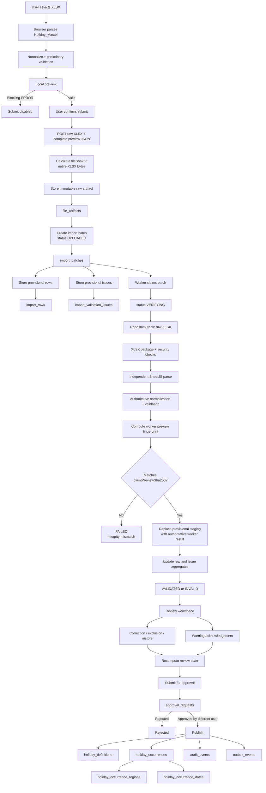

# Governed Public-Holiday Import Contract

| Metadata | Value |
| --- | --- |
| Status | Implemented ingestion baseline |
| Version | 1.6-draft |
| Date | 2026-08-15 |
| Schema name | `ati-public-holiday-import` |
| Legacy schema version | `legacy-1.0` |
| Required legacy sheet | `Holiday_Master` |

## Purpose

This contract defines the safe boundary between an uploaded workbook and ATI PH staging. PostgreSQL is canonical; Excel is input evidence. Upload never publishes holiday data, schedules notifications, or sends email.

The supplied `ModifByRF-FCTG-Master Data Template - PH Notifications.xlsx` workbook was audited structurally and visually. It contains seven sheets, but only `Holiday_Master` is ingested by this slice. `Client_Master`, templates, error evidence, glossary, and backup data will use separate migration or domain contracts.

## Accepted file envelope

- File extension must be `.xlsx`
- MIME type must be the standard XLSX type or `application/octet-stream`
- Size must not exceed `IMPORT_MAX_FILE_SIZE_BYTES`
- Package must have a valid ZIP signature and CRC
- Encrypted, corrupt, macro-enabled, and VBA-containing packages are rejected
- Exact SHA-256 duplicates require explicit operator confirmation
- Original bytes are stored under a new immutable artifact key

## Legacy header mapping

Column order is ignored. Header comparison is case-insensitive and punctuation-insensitive.

| Canonical field | Accepted legacy headers | Required |
| --- | --- | --- |
| `regionCode` | `Region`, `Region Code`, `Calendar Region` | Yes |
| `holidayName` | `PH Name`, `Holiday Name`, `Public Holiday` | Yes |
| `startDate` | `PH Start Date`, `Start Date` | Yes |
| `endDate` | `PH End Date`, `End Date` | Yes |
| `sourceRowId` | `Source Row ID` | No |
| `sourceReference` | `Source Reference` | No |
| `notes` | `Remarks`, `Notes` | No |

Unknown columns remain in `rawData`. More than one source column mapping to the same canonical field is an error. Missing required headers make the batch invalid.

## Normalization rules

- Whitespace is trimmed without changing immutable raw evidence
- Comma, semicolon, and newline-separated legacy regions are split
- Region aliases resolve through the database-managed calendar-region registry; only active aliases owned by active regions are accepted
- The bootstrap registry contains canonical codes `AU`, `ID`, `GB`, `ZA`, `NA`, `NZ`, and `SG`; administrators can govern aliases without redeploying the application
- Duplicate region codes within one source row are collapsed
- Holiday names retain display text and also receive a normalized duplicate-matching value
- Typed Excel dates and ISO `YYYY-MM-DD` text are accepted
- Formula cells are preserved in raw JSON but cannot supply region, name, or date authority
- `Day` and `Tag` are preserved only in raw JSON; canonical publication will derive them per calendar date
- `Remarks` is informational and never controls workflow state

## Validation result

Issues use stable severity and code values:

- `ERROR` blocks validation/publication
- `WARNING` requires review and later acknowledgement
- `INFO` records deterministic normalization

Implemented codes include:

- `MISSING_REQUIRED_HEADER`
- `AMBIGUOUS_HEADER`
- `REQUIRED_VALUE_MISSING`
- `UNKNOWN_REGION`
- `INVALID_DATE`
- `END_DATE_BEFORE_START_DATE`
- `DATE_PERIOD_TOO_LONG`
- `CROSS_YEAR_PERIOD`
- `FORMULA_NOT_ALLOWED`
- `SAMPLE_ROW_DETECTED`
- `DUPLICATE_HOLIDAY_OCCURRENCE`
- `OVERLAPPING_HOLIDAY_OCCURRENCE`
- `MULTI_REGION_NORMALIZED`
- `LEGACY_SCHEMA_ASSUMED`
- `DERIVED_COLUMNS_IGNORED`

Sample/test rows produce warnings in development and errors in production. Unknown regions always produce errors.

## Persistence and transaction boundary

The raw artifact is written with create-only filesystem semantics. One database transaction then creates:

- `file_artifacts`
- `import_batches`
- `import_rows`
- `import_validation_issues`
- `audit_events`
- `outbox_events` with `ImportBatchValidated` only for a valid batch

If the transaction fails, only the not-yet-registered file is removed. Registered artifacts are never overwritten.

## Evidence retrieval

Users with the ATI PH `import.read` permission can retrieve evidence for an existing batch:

- The validation report is generated deterministically from persisted batch metadata and the complete `import_validation_issues` set as UTF-8 CSV
- The original workbook download reads only the registered raw artifact storage key
- Raw bytes are SHA-256 verified against `file_artifacts.sha256` before release
- A storage-provider mismatch, missing file, or hash mismatch fails closed
- Validation-report and raw-workbook downloads each write an audit event before release
- Responses are private, non-cacheable attachments and are served with `X-Content-Type-Options: nosniff`

## Controlled staging correction

- Raw workbook bytes and `rawData` remain immutable evidence
- Operator/Administrator correction writes only `normalizedData`, editor identity, and edit timestamp
- Governed editable fields are canonical region codes, holiday name, start date, end date, source reference, and notes
- Region correction accepts active canonical region codes only; free-form aliases are not persisted as normalized authority
- Exclusion requires an explicit reason and changes the row to `EXCLUDED`
- Restoration removes the exclusion reason and re-enters deterministic validation
- Every correction, exclusion, or restoration revalidates the complete non-excluded batch so duplicate and overlap rules cannot become stale
- Existing warning acknowledgements survive revalidation only when the regenerated warning has the same stable issue identity; changed warnings require acknowledgement again
- Row status, batch counts/status, regenerated row issues, audit event, and validation-state outbox transition commit transactionally
- Submitted or published batches are frozen against staging mutation

## Client preprocessing and authoritative verification

- File selection does not upload immediately
- The browser dynamically loads SheetJS and parses `Holiday_Master` locally using the governed mapping and normalization rules
- The user sees normalized rows, canonical region resolution, dates, row status, warnings, and errors before submission
- Browser preprocessing is advisory and cannot authorize approval or publication
- On confirmation the browser submits the untouched XLSX plus the complete preview JSON
- The API stores raw XLSX evidence immutably, stores preview rows and issues as provisional staging, records `clientPreviewSha256`, and returns `UPLOADED` without synchronous workbook parsing
- `UPLOADED` and `VERIFYING` batches cannot be corrected, acknowledged, submitted for approval, approved, or published
- The worker claims pending batches as `VERIFYING`; stale verification claims are retryable
- The worker verifies ZIP integrity and rejects macro-enabled packages before parsing
- The worker independently reparses the stored XLSX with SheetJS and recomputes the deterministic preview fingerprint
- Fingerprint mismatch fails the batch closed as `FAILED`
- A matching server parse replaces provisional row and issue values with the authoritative result and transitions the batch to `VALIDATED` or `INVALID`
- Only server-verified staging participates in maker-checker approval and canonical publication

## Maker-checker approval

- Submission is allowed only for a `VALIDATED` batch with at least one valid row, zero invalid rows, zero `ERROR` issues, and every `WARNING` acknowledged
- Submission creates a reusable `approval_requests` record and stores a deterministic SHA-256 hash over normalized row content, row status/exclusion state, validation evidence, and warning acknowledgement state
- `import_batches.submittedAt` freezes normalized staging and warning acknowledgement while the request is pending or approved
- A user with `import.approve` must be different from the requester
- Decision recomputes the frozen content hash and fails closed on mismatch
- Approval remains frozen for canonical publication
- Rejection requires a reason, clears `submittedAt`, and returns the batch to controlled correction/resubmission
- Request and decision audit events plus outbox events commit in the same transaction as approval state

## Canonical holiday publication

- Publication requires a frozen batch with an `APPROVED` maker-checker request whose SHA-256 content hash still matches current staging and validation evidence
- Only `VALID` rows publish; `EXCLUDED` rows remain source evidence but never create canonical holiday data
- Each valid source row creates one `holiday_occurrences` record linked by immutable `sourceImportRowId` and `sourceImportBatchId`
- The normalized holiday identity upserts a `holiday_definitions` record without mutating existing canonical history
- Every normalized canonical region creates one `holiday_occurrence_regions` relation; inactive or missing canonical regions fail publication closed
- Start/end periods expand inclusively into `holiday_occurrence_dates`
- `dayOfWeek` and `dayType` (`WEEKDAY` or `WEEKEND`) are derived from each canonical date; legacy Excel `Day` and `Tag` are never publication authority
- The publication transaction is serializable and atomically writes canonical rows, `import_batches.publishedAt`, audit evidence, and the `HolidayCalendarPublished` outbox event
- A second publish call for an already-published batch returns the existing publication summary without duplicating canonical records
- `sourceImportRowId` is unique in canonical occurrences, providing an additional database idempotency barrier
- The batch review UI exposes source-row to canonical-occurrence, region, and expanded-date lineage

## Warning acknowledgement

- Only persisted `WARNING` issues can be acknowledged
- `ERROR` remains blocking and cannot be acknowledged away
- Operator/Administrator access uses the existing `import.create` permission; read-only roles can inspect acknowledgement state
- Acknowledgement stores the acting ATI PH user and timestamp
- Reversal is explicit and audited
- Acknowledgement and its audit event commit in the same PostgreSQL transaction

## Source-workbook verification

The current workbook produced this deterministic result:

| Metric | Result |
| --- | ---: |
| Holiday rows | 25 |
| Valid production-like rows | 22 |
| Invalid rows | 3 |
| Multi-region rows normalized | 16 |
| Invalid-row reason | `(SAMPLE)` rows using unapproved `xxx` region values |

This is an ingestion result, not business-owner sign-off on the holidays themselves.

## Remaining Phase 1 work

- Governed metadata sheet/named-range detection for schema name, version, year, source, and generation time
- Business-owner acceptance of the canonical publication result and mounted ATI One smoke verification


## Remaining Phase 1 acceptance

- End-to-end worker verification smoke
- Mounted ATI One smoke verification and business-owner acceptance of the canonical publication result

<!-- ATI_PH_IMPORT_FLOW_START -->
## Governed import processing flow

This section defines what happens from local workbook preview through evidence, worker verification, review, approval, and canonical publication.



### Persistence by stage

| Stage | Table / storage | What is stored |
| --- | --- | --- |
| Local preview | None | Parsed rows, normalized values, and preliminary issues remain in browser memory only |
| Raw evidence | Artifact storage + `file_artifacts` | Original XLSX bytes in artifact storage; filename, MIME type, size, SHA-256, storage key, retention class, creator, timestamp in DB |
| Import root | `import_batches` | One row per submission: batch number, source/schema, raw artifact reference, file hash, preview hash, status, row aggregates, uploader, verification/publication timestamps, failure reason |
| Staging | `import_rows` | One row per source row: raw data, normalized data, row status, exclusion state, edit actor and timestamps |
| Validation | `import_validation_issues` | ERROR/WARNING/INFO, code, field, rejected value, message, acknowledgement actor and timestamp |
| Reference resolution | `calendar_regions`, `calendar_region_aliases` | Canonical region registry used during normalization and validation |
| Approval | `approval_requests` | Frozen approval content hash, requester, approver, decision status, timestamps, reason |
| Publication | `holiday_definitions`, `holiday_occurrences`, `holiday_occurrence_regions`, `holiday_occurrence_dates` | Canonical holiday definitions, occurrences, region links, and expanded calendar dates |
| Traceability | `audit_events`, `outbox_events` | User/system actions and integration events |

### Import batch boundary

One submitted workbook creates one `import_batches` row.

```text
1 submitted XLSX
  -> 1 file_artifacts record for the raw evidence
  -> 1 import_batches root record
  -> N import_rows
  -> N import_validation_issues
  -> 0..1 active approval lifecycle
  -> N published holiday occurrences
```

The original XLSX is evidence. The import batch is the governed processing snapshot for that submission.

### Hash responsibilities

| Hash | Scope | Purpose |
| --- | --- | --- |
| `fileSha256` | Entire raw XLSX byte stream | Detect exact binary re-upload and identify immutable file evidence |
| `clientPreviewSha256` | Deterministic complete browser preview payload | Verify browser preview against the worker's independent parse |
| `approval contentHash` | Frozen reviewed staging state | Ensure the content approved is the content later published |
| `businessContentSha256` | Canonical normalized authoritative `Holiday_Master` business content | Worker-authoritative fingerprint for semantic duplicate lookup when XLSX bytes differ but holiday business data is equivalent |

`businessContentSha256` is persisted on `import_batches` and is computed only by the verification worker from its independent parse of the immutable raw XLSX. It is nullable when the worker cannot form complete publishable business content. It does not replace `fileSha256` or `clientPreviewSha256`.

This slice persists the worker-authoritative fingerprint. Automatic `SAME_HOLIDAY_DATA` issue generation is a separate duplicate-policy step.

### Duplicate semantics

```text
same fileSha256
  -> EXACT_FILE_DUPLICATE

different fileSha256
same businessContentSha256
  -> SAME_HOLIDAY_DATA

different businessContentSha256
  -> materially different business import
```

Semantic business hashing must be based on deterministic normalized authoritative values, not workbook formatting, metadata, filename, row position, Day, or Tag.

### Review and publication invariant

Review operates on the same governed import aggregate; it does not create a second copy of the dataset.

```text
import_batches
  + import_rows
  + import_validation_issues
        |
        v
      review
        |
        v
approval_requests
        |
        v
canonical publication
```

Published occurrences retain source import references so canonical holiday data remains traceable back to the import batch and source row.
<!-- ATI_PH_IMPORT_FLOW_END -->

### Governed workbook metadata

Official ATI-PH templates include a worksheet named `_ATI_PH_META`.

| Key | Required value |
| --- | --- |
| `schema_name` | `ati-public-holiday-import` |
| `schema_version` | `1.0` |
| `template_type` | `PUBLIC_HOLIDAY_IMPORT` |
| `data_sheet` | `Holiday_Master` |

The metadata worksheet identifies the workbook contract and schema version. It is not an authenticity or security boundary; the server still independently reparses and validates the raw workbook.

Legacy workbooks without `_ATI_PH_META` remain supported. The parser records this as informational compatibility evidence (`LEGACY_SCHEMA_ASSUMED`) rather than a warning. If the metadata worksheet is present but contains an unsupported or contradictory contract value, parsing fails closed.

Official files:

- `docs/ATI-PH-Import-Template-Governed.xlsx`
- `docs/ATI-PH-Example-Import-Governed.xlsx`
