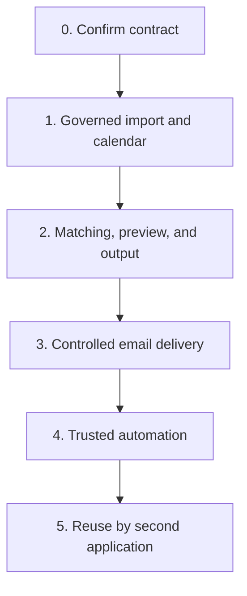

# Delivery Plan: Public Holiday Workflow and Reusable Operational Engines

| Metadata | Value |
| --- | --- |
| Status | Phase 0 auth foundation and Phase 1 governed import + calendar-region administration implemented; remaining gates stay open |
| Version | 0.3.8 |
| Date | 2026-08-15 |
| Planning model | Outcome and gate based, not calendar-estimate based |
| First product | Public Holiday Notification Workflow |
| Repository | `D:\ATI-Projects\ati-ph` |
| Initial web stack | Next.js 16.3.1 App Router, React 19, TypeScript |
| Canonical production browser URL | `https://one.atibusinessgroup.com/apps/ph-notification/app` |
| Identity baseline | Keycloak realm `ati-one`, temporarily reusing the ATI One client ID |
| Reuse strategy | Prove modules in one vertical slice before platform extraction |

## 1. Delivery Principle

Build one complete, controlled Public Holiday workflow first

Do not begin by building a generic platform, generic workflow engine, or microservices estate. Reusable modules are implemented only to the degree required by the first workflow, with explicit internal boundaries that permit later reuse

The `ati-ph` codebase, database, worker, domain logic, roles, and audit trail are independently owned. Initial browser delivery is through ATI One's internal same-origin iframe and proxy path. Work in this repository must not modify the ATI One project

The initial authentication configuration temporarily reuses the ATI One Keycloak client ID and credential. This is an explicit exception, not a general shared-auth pattern: `ati-ph` still creates its own namespaced server-side session and performs its own authorization

## 2. Delivery Sequence



Foundation work inside Phase 0 establishes the Next.js application, PostgreSQL schema, dedicated worker entry point, ATI One internal-app mount compatibility, and application-owned authentication/session boundary. It must not implement unresolved holiday or notification policy as guessed behavior

## 3. Phase 0 — Contract and Decision Baseline

### Objective

Remove ambiguity before implementation starts

### Required inputs

- One raw public holiday source file for the real operating process
- One signed-off successful output workbook
- One approved final notification email example
- One provider failure or NDR example
- Confirmed email platform and sender mailbox owner
- Confirmed H-X rule as calendar day or business day
- Confirmed owner for client master, recipient master, policy, template, and approval
- Confirmed ATI One public mount URL and private `ati-ph` upstream address for development, staging, and production
- Approved Keycloak administrator or owner able to add the mounted `ati-ph` callback and logout URIs to the shared ATI One client
- Confirmed initial user-role assignment model for Administrator, Operator, Approver, and Auditor

### Decisions to lock

| Decision | Owner required |
| --- | --- |
| Governed `Holiday_Import` workbook schema | Operations owner and technical owner |
| One region per input row | Operations owner |
| Start-date display behavior for legacy Day and Tag columns | Operations owner |
| Business-day calculation semantics | Operations owner |
| Approval threshold and approver group | Process owner |
| Email sender mailbox and reply handling | IT and process owner |
| Artifact retention policy | Compliance and IT |
| ATI One internal-app mount, upstream address, and TLS termination | ATI One owner, IT, and technical owner |
| Mounted callback/logout URIs on the shared ATI One Keycloak client | SSO administrator and technical owner |
| Acceptance and review date for the temporary shared-client exception | Security, ATI One owner, and technical owner |
| Session maximum age and global logout behavior | Security and technical owner |
| Application role ownership and group-to-role mapping, if any | Process owner and security |
| Deployment topology for Next.js web and worker processes | Technical owner and IT |

### Deliverables

- Approved input schema v1
- Approved output template v1
- Template placeholder catalog
- Data ownership matrix
- Acceptance fixture set
- Initial ADR covering modular-monolith and module boundaries
- Next.js 16.3.1 application scaffold with strict TypeScript, linting, tests, and standalone output
- Worker process scaffold sharing domain and persistence packages without running durable jobs inside web requests
- PostgreSQL and Prisma migration baseline
- Shared ATI One Keycloak client registration change set containing only the exact mounted callback, logout, and web-origin allow-lists required by `ati-ph`
- ADR documenting the temporary shared-client exception, accepted risks, owner, and separation triggers
- Authentication threat model covering state, PKCE, session storage, refresh, logout, and audit events
- Role and permission matrix for Administrator, Operator, Approver, and Auditor

### Exit gate

No unresolved field, timing, approval, sender, identity, authorization, session, deployment, or output ambiguity remains

The application must demonstrate a complete mounted login round trip through the ATI One iframe path while creating an `ati-ph`-owned session. No ATI One cookie or application token may be copied into the Public Holiday session

## 4. Phase 1 — Governed Import and Canonical Holiday Calendar

### Objective

Replace spreadsheet processing with controlled ingestion and canonical holiday data

### Implementation status — 2026-08-15

Completed in the first Phase 1 vertical slice:

- Authenticated Operator/Administrator XLSX upload UI and Route Handler
- Immutable local raw-artifact adapter with SHA-256 evidence
- Duplicate-file confirmation gate
- Legacy `Holiday_Master` schema mapping and approved header aliases
- Row-level raw and normalized staging persistence
- Required-field, region, date range, sample-row, formula, duplicate, overlap, macro, and corruption validation
- Multi-region normalization with `Day` and `Tag` explicitly ignored as authoritative input
- Validation summary in the ATI One-aligned dashboard
- Audit event and transactional `ImportBatchValidated` outbox event
- Single Prisma baseline migration `20260815180000_initial_foundation` with explicit module schema namespaces
- Database-managed calendar-region registry used by runtime import resolution
- Administrator-only region and alias create, rename, activate, and deactivate controls with transactional audit events

Still pending before the Phase 1 exit gate is complete:

- Full validation-report download and authorized raw-artifact download
- Controlled staging corrections and warning acknowledgement
- Maker-checker approval request and decision
- Canonical holiday definition/occurrence publication and multi-day occurrence-date expansion
- Publication idempotency and source-to-canonical lineage UI

### Scope

#### Governed Import module

- File upload
- Immutable raw artifact registration
- Schema version detection
- Header mapping and approved aliases
- Row staging
- Normalization
- Validation report
- Staging correction limited to controlled exceptions

#### Public Holiday module

- Calendar region master and alias management
- Holiday definition and occurrence publication
- Multi-day occurrence expansion
- Day and weekday or weekend derivation
- Import approval and publication

#### Shared controls

- ATI One PH Notification dashboard structure and ATI design-system visual tokens mirrored locally so `ati-ph` remains independently deployable
- Keycloak OIDC Authorization Code Flow with PKCE S256 through the temporarily shared ATI One client ID
- Opaque `ati_ph_session` cookie and encrypted server-side session records
- ATI One internal-app proxy proof validation and `/apps/ph-notification/app` base-path handling
- Application-owned RBAC for Administrator, Operator, Approver, and Auditor
- Keycloak remains the identity and authentication authority; ATI PH stores only the local user projection plus application role assignments
- Internal application entity primary/foreign keys use native PostgreSQL UUID; the verified Keycloak `sub` is stored as `users.externalSubject` and is never used as an ATI PH primary key
- Role, permission, user-role, role-permission, and menu visibility records are physically stored in PostgreSQL `public` and logically owned by the Authorization module
- Backend authorization is permission-based; menu visibility consumes permissions and never acts as an authorization boundary
- Secure server-side authorization checks on every protected read and mutation
- Audit events
- Transactional outbox baseline
- Artifact download authorization

### Tables introduced

```text
artifact.file_artifact
ingestion.import_batch
ingestion.import_row
ingestion.import_validation_issue
approval.approval_request
holiday.calendar_region
holiday.calendar_region_alias
holiday.calendar_exception
holiday.holiday_definition
holiday.holiday_occurrence
holiday.holiday_occurrence_region
holiday.holiday_occurrence_date
audit.audit_event
execution.outbox_event
identity.user
identity.user_role
identity.auth_session
```

### Explicitly excluded

- Email sending
- Automatic scheduling
- Generic workflow builder
- Direct update of source Excel

### Exit gate

- Valid import can be published only after approval
- Invalid import cannot create canonical holiday data
- Multi-day holiday is expanded correctly
- One input region row produces one canonical region relation
- Source file and published occurrence lineage are traceable
- Repeated identical planner or publisher action is idempotent

## 5. Phase 2 — Client Routing, Preview, and Governed Output

### Objective

Prove that the application selects exactly the intended client teams and produces the approved output before email is enabled

### Scope

#### Public Holiday module

- Client and service-team configuration
- Contact and recipient assignment
- Client subscription by calendar region
- Notification policy versioning
- Holiday-to-subscription matching
- Notification run planning

#### Notification module

- Email template versioning
- Template precedence
- Placeholder validation
- Rendered email preview
- Recipient snapshot
- Test-send restricted to internal allow-list only

#### Artifact module

- Output workbook template versioning
- Workbook generation from approved template
- Immutable generated output artifact

### Tables introduced

```text
holiday.client
holiday.service_team
holiday.contact
holiday.client_subscription
holiday.subscription_recipient
holiday.notification_policy
holiday.notification_policy_version
holiday.notification_run
communication.email_template
communication.email_template_version
communication.template_assignment
communication.notification_snapshot
communication.notification_recipient
artifact.export_template
artifact.export_template_version
artifact.notification_run_artifact
```

### Shadow-mode procedure

1. Publish a representative holiday batch
2. Plan notifications without external delivery
3. Compare application-selected recipients with the approved manual result
4. Compare rendered subject and body with approved manual email
5. Compare generated workbook with approved output template
6. Resolve every mismatch as a rule, data, or template defect
7. Repeat until the result is fully explainable and accepted

### Exit gate

- Every planned recipient is explainable by an active subscription and policy
- Every output workbook matches the approved template contract
- Template fallback is deterministic
- Any conflicting configuration fails visibly
- Historical preview remains unchanged after master data or template changes

## 6. Phase 3 — Controlled Email Delivery

### Objective

Enable production email through a controlled sender with traceable delivery attempts

### Scope

#### Notification module

- Provider adapter
- Sender mailbox configuration
- Delivery attempt recording
- Transient and permanent error classification
- NDR or bounce ingestion where provider supports it
- Error summary report

#### Scheduling and Execution module

- Due-job claiming
- Worker lease recovery
- Exponential retry with jitter
- Dead-letter handling
- Manual retry with reason

#### Approval module

- Notification-run approval
- Approval invalidation when frozen snapshot changes

### Tables introduced

```text
communication.notification_job
communication.delivery_attempt
communication.delivery_event
execution.dead_letter_job or equivalent state
```

### Pilot rules

- Start with limited clients or an internal recipient group
- Require explicit run approval
- Require test-send completion
- Enable a kill switch that stops new sends
- Do not label provider acceptance as confirmed delivery
- Review all failures daily during pilot

### Exit gate

- No duplicate sends under retry and worker restart tests
- Provider authorization is scoped to the sender mailbox
- Permanent recipient failure does not retry automatically
- Operational team can cancel unsent jobs
- Delivery attempt and source batch are traceable from every sent email

## 7. Phase 4 — Trusted Automation

### Objective

Move from operator-triggered runs to policy-controlled scheduling

### Scope

- Scheduled planning for published holiday occurrences
- Policy-controlled automatic sending
- Approval only for exception, threshold, or high-risk runs
- Alerting for scheduler lag, delivery failure, and unexpected zero-recipient result
- Correction workflow for updated holidays
- Operational dashboards
- Retention jobs

### Release gates

- Shadow-mode evidence is retained for representative holiday cycles
- Controlled delivery pilot is accepted by operations and IT
- Runbook is tested
- Kill switch and recovery procedure are tested
- Monitoring and alert ownership are assigned

## 8. Phase 5 — Reuse Validation with a Second Application

### Objective

Prove which modules are genuinely platform capabilities

### Candidate second consumers

| Candidate | Reusable modules exercised |
| --- | --- |
| Fare filing exception notification | Import, Approval, Notification, Artifact, Audit |
| SLA breach reminder | Notification, Scheduling, Artifact, Audit |
| Contract expiry workflow | Notification, Scheduling, Approval, Audit |
| Finance reconciliation exception | Import, Approval, Notification, Artifact, Audit |

### Required before adoption

- Second application has a real product owner and production use case
- Shared contract is reviewed by both owners
- Module-specific authorization is defined
- Data ownership remains clear
- Existing Public Holiday behavior remains regression-tested

### Decision gate

Choose one:

- Keep module shared inside modular monolith
- Promote selected module to formal platform capability
- Extract service only if independent deployment is justified

## 9. Workstream Order

| Order | Workstream | Why this order |
| --- | --- | --- |
| 1 | Input and output contract | Prevents building against ambiguous Excel behavior |
| 2 | Next.js, worker, database, and internal-app deployment foundation | Establishes one buildable product mounted safely through ATI One |
| 3 | Identity, roles, audit, artifact baseline | Makes later operational actions controlled and traceable |
| 4 | Import and canonical holiday model | Establishes trustworthy source data |
| 5 | Client routing and policy | Determines who should be notified |
| 6 | Template and output generation | Validates business outcome before send risk |
| 7 | Approval and shadow mode | Proves correctness with low external risk |
| 8 | Provider delivery and retry | Adds external side effect only after result is trusted |
| 9 | Automation and alerts | Removes manual operation only after controls work |
| 10 | Shared-client separation review | Decides whether the temporary Keycloak client exception remains acceptable |
| 11 | Second-consumer reuse | Prevents speculative platform extraction |

## 10. Backlog by Module

### Application Foundation

- Next.js 16.3.1 App Router scaffold with strict TypeScript
- Server and client component boundaries
- Route Handler and Server Action conventions
- Standalone self-hosted output mounted behind the ATI One internal-app proxy
- Next.js base path `/apps/ph-notification/app` for pages, assets, callbacks, and logout endpoints
- Framing policy restricted to the approved same-origin ATI One parent
- ATI One proxy-proof validation on every non-health upstream request when required by network topology
- Prisma migration workflow and schema namespaces
- Dedicated worker entry point and graceful shutdown
- Shared domain, application, and infrastructure package boundaries
- Environment validation with no secrets exposed through `NEXT_PUBLIC_*`

### Identity and Access

- Keycloak OIDC discovery through realm `ati-one`
- Shared ATI One Keycloak client ID and credential as a documented temporary exception
- Separation-ready environment boundary so a future dedicated client requires configuration and registered URI changes, not domain rewrites
- Authorization Code Flow with state, nonce, and PKCE S256
- Access-token RS256 signature, issuer, expiry, `typ=Bearer`, and `azp=KEYCLOAK_CLIENT_ID` validation before any user or session write
- Exact callback and post-logout redirect allow-lists
- Opaque host-only session cookie
- Encrypted server-side token and session storage
- Local access-token expiry check with a configurable 30-second refresh skew
- Per-session refresh coalescing, short grace cache, optimistic database update, and encrypted token replacement without extending the absolute session ceiling
- Fail-closed database-session revocation when refresh is missing, refused, or returns an invalid access token
- RP-initiated logout and Keycloak front-channel or back-channel logout
- User synchronization keyed by Keycloak `sub`
- Application role and permission matrix
- Central `requireUser` and `requirePermission` server-side checks
- Authentication and authorization audit events

### Governed Import

- Schema registry
- XLSX parser
- Header alias map
- Row staging
- Validation framework
- Validation report export
- Controlled alias resolution
- Duplicate import detection

### Public Holiday

- Region and alias master
- Holiday occurrence publication
- Multi-day date expansion
- Client team and subscription master
- Policy resolution
- Matching explanation report
- Correction workflow

### Approval

- Maker-checker policy
- Approval queue
- Snapshot hash validation
- Decision log
- Approval delegation policy if required

### Notification

- Template editor and versioning
- Placeholder allow-list
- Rendered preview
- Recipient snapshot
- Email provider adapter
- NDR processing

### Scheduling and Execution

- Outbox relay
- Scheduler
- Worker lease
- Idempotency guard
- Retry policy
- Dead-letter queue
- Kill switch

### Artifact and Audit

- Object storage adapter
- Immutable checksum
- Controlled download
- Retention policy
- Resource timeline
- Audit search

## 11. Test Gates

### Authentication and authorization gate

- A user with an existing Keycloak realm session signs in to `ati-ph` without entering credentials again
- A user without a realm session is redirected to the approved Keycloak login flow
- Callback rejects missing or incorrect state, verifier, nonce, issuer, and ID-token audience
- Callback rejects an access token with an invalid signature, expired lifetime, wrong issuer, missing or non-`Bearer` type, missing `azp`, or `azp` different from `KEYCLOAK_CLIENT_ID`
- Session cookie is `Secure`, `HttpOnly`, `SameSite=Lax`, host-only, and named for `ati-ph`
- Browser-visible payloads contain no access token, refresh token, ID token, client secret, or encrypted token payload
- Expired, revoked, or refresh-refused sessions cannot access protected data
- A valid access token outside the refresh skew causes no Keycloak request
- Concurrent requests for one expiring session produce one refresh exchange per process and converge on one persisted result
- A stale cross-process refresh cannot overwrite or revoke a newer session version
- Successful refresh does not extend the absolute session maximum age and does not create a permanent audit event
- Every domain action is authorized by `ati-ph`; ATI One tile visibility and iframe access are never treated as sufficient authorization
- Operator cannot perform Administrator or Approver actions without the required permission
- Maker-checker prevents a submitter from approving the same resource when enabled
- Logout removes the local session and the configured Keycloak logout mode behaves as documented
- The implementation uses the configured shared ATI One client ID only for OIDC and records this as a temporary exception
- The mounted callback uses the ATI One public path, never the private upstream address
- No ATI One application cookie, access token, or refresh token is reused as the `ati-ph` session

### Import gate

- Bad date is rejected
- Unknown region is rejected or explicitly resolved
- Multi-region legacy input is normalized predictably
- Canonical governed input uses one region per row
- Raw source remains unchanged

### Routing gate

- Inactive subscription produces no job
- Effective date range is honored
- Weekday or weekend filtering is calculated per occurrence date
- Conflicting templates fail visibly
- Zero recipient result is reported

### Delivery gate

- Repeated worker execution does not create duplicate sends
- Retry reuses frozen content
- Permanent recipient error stops automatic retry
- NDR updates recipient and job evidence
- Kill switch blocks new sends

### Audit gate

- Every mutation has actor, timestamp, action, and resource identity
- Approval refers to a frozen snapshot hash
- Generated workbook is traceable to run and source batch

## 12. Required Runbooks

- Import failure and validation correction
- Unknown region resolution
- Wrong recipient correction
- Notification run cancellation
- Provider authorization failure
- Provider throttling or outage
- Bounce remediation
- Holiday correction before send
- Holiday correction after send
- Worker lease recovery
- Emergency kill switch
- Artifact retrieval for audit
- Keycloak discovery or authentication outage
- Compromised or rotated `ati-ph` client secret
- Session revocation and forced logout
- Incorrect role assignment or emergency access removal

## 13. Roles by Phase

| Role | Phase 0 | Phase 1 | Phase 2 | Phase 3 and 4 |
| --- | --- | --- | --- | --- |
| Process owner | Confirms rule and output | Accepts calendar behavior | Accepts routing and preview | Owns operational outcome |
| Operator | Supplies source examples | Uploads and corrects source | Reviews preview | Monitors exceptions |
| Approver | Confirms approval policy | Approves publication | Approves notification run | Approves exceptions |
| IT or security | Registers `ati-ph` client; confirms session, URL, TLS, role, and mailbox controls | Reviews file controls and authentication evidence | Approves template and artifact controls | Approves sender permissions and monitoring |
| Engineering | Designs contract and scaffolds the internal-app mount, application, worker, database, and auth/session boundary without modifying ATI One source | Builds core workflow | Builds matching and output | Builds delivery and automation |

## 14. Scope Guardrails

Do not add these before their need is proven:

- Visual workflow designer
- Generic BPMN runtime
- Generic rule authoring language
- Multi-provider email routing
- Microservices
- Kubernetes
- AI holiday extraction
- Self-service external client portal
- Reply classification automation
- ATI One cookie or application-token reuse
- Changes to the ATI One source repository as part of `ati-ph` implementation
- Browser access that bypasses the approved ATI One internal-app entry path
- Expansion of the shared Keycloak client exception beyond OIDC client identity and credentials
- Durable scheduler, retry, email send, or workbook generation executed as unawaited work inside a Next.js request

## 15. Definition of Done for the First Production Release

The first release is done only when:

- Holiday input follows an approved governed contract
- Every import is staged and approved before publication
- Authentication uses the Keycloak realm `ati-one` and the temporarily shared ATI One client ID through the mounted callback path
- `ati-ph` creates and owns a distinct namespaced server-side session even though the OIDC client registration is shared
- Every protected read and mutation is authorized by `ati-ph` server-side permissions
- Browser cookies and responses expose no Keycloak token or application secret
- Client routing is deterministic and explainable
- Output workbook matches the signed-off template
- Every send uses a frozen snapshot and idempotency key
- Email delivery has approval, retry, cancellation, and error controls
- Operations can explain any generated email from source file through delivery attempt
- Runbooks and kill switch are tested
- Product, operations, IT, and security owners accept the release

## 16. Next Decision

Start Phase 0 in `D:\ATI-Projects\ati-ph` with two parallel foundation activities:

1. Obtain the raw holiday source, signed-off output workbook, approved email example, and email-provider ownership confirmation
2. Scaffold Next.js 16.3.1, PostgreSQL, Prisma, the worker entry point, `/apps/ph-notification/app` mount, proxy-proof validation, and the application-owned session boundary using the temporarily shared ATI One Keycloak client ID

Domain implementation does not start until the input, output, timing, approval, identity, and sender contracts are explicit. Foundation scaffolding and mounted authentication verification may proceed because their boundaries are now defined in `architecture.md`. No change to the ATI One source project is included
