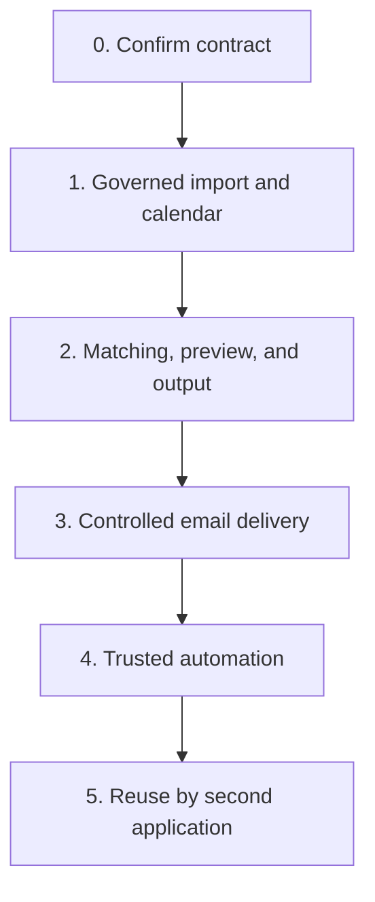

# Delivery Plan: Public Holiday Workflow and Reusable Operational Engines

| Metadata | Value |
| --- | --- |
| Status | Controlled SMTP connectivity and frozen-NotificationJob business-content pilot proven; automatic production SMTP and trusted automation gates remain open |
| Version | 0.5.0 |
| Date | 2026-08-20 |
| Planning model | Outcome and gate based, not calendar-estimate based |
| First product | Public Holiday Notification Workflow |
| Repository | `D:\ATI-Projects\ati-ph` |
| Initial web stack | Next.js 16.3.1 App Router, React 19, TypeScript |
| Canonical production browser URL | `https://one.atibusinessgroup.com/apps/ph-notification/app` |
| Identity baseline | Keycloak realm `ati-one`, temporarily reusing the ATI One client ID |
| Reuse strategy | Prove modules in one vertical slice before platform extraction |

## 1. Delivery Principle

Build one complete, controlled Public Holiday workflow first

Do not begin by building a generic platform, generic workflow engine, or microservices estate. Reusable modules are implemented only to the degree required by the first workflow, with explicit internal boundaries that permit later reuse

The `ati-ph` codebase, database, worker, domain logic, roles, and audit trail are independently owned. Initial browser delivery is through ATI One's internal same-origin iframe and proxy path. Work in this repository must not modify the ATI One project

The initial authentication configuration temporarily reuses the ATI One Keycloak client ID and credential. This is an explicit exception, not a general shared-auth pattern: `ati-ph` still creates its own namespaced server-side session and performs its own authorization

## 2. Delivery Sequence



Foundation work inside Phase 0 establishes the Next.js application, PostgreSQL schema, dedicated worker entry point, ATI One internal-app mount compatibility, and application-owned authentication/session boundary. It must not implement unresolved holiday or notification policy as guessed behavior

## 2.1 Current progress — 2026-08-20

Completed delivery slices:

```text
Phase 0 foundation
→ implemented

Governed import/calendar
→ implemented

Client routing
→ implemented

Notification policy + global/client schedule
→ implemented

Plan preview + durable commit
→ implemented

Notification maker-checker
→ implemented

Due scheduler + worker
→ implemented

Delivery attempt contract
→ implemented

Retry + lease recovery
→ implemented

Provider-neutral Email Delivery Engine
→ implemented

Governed workbook-derived email content snapshot
→ implemented

STREAM delivery proof
→ implemented

Gated manual SMTP connectivity test
→ implemented and provider/inbox verified

Controlled same-domain NotificationJob SMTP business-content pilot
→ implemented and provider/inbox verified
```

The controlled business-content pilot used an existing frozen `PLANNED` NotificationJob, verified its content SHA-256, preserved its subject/body, replaced its frozen client recipients with one same-domain internal ATI recipient, and sent through the real SMTP adapter without claiming or mutating the durable job.

Open production gates:

- ATI IT-approved production SMTP relay/credential path
- controlled production/client-recipient SMTP pilot scope and authorization
- automatic SMTP NotificationJob execution by the worker
- partial SMTP acceptance handling review
- unknown-outcome operational remediation
- bounce/NDR ingestion where required
- production monitoring/runbook
- kill switch and rollback validation
- governed output attachment only if Operations confirms one is required

The following are deliberately not equivalent:

```text
manual SMTP connectivity
controlled internal NotificationJob SMTP pilot
automatic production SMTP
```

Phase 4 trusted automation has not started.

## 3. Phase 0 — Contract and Decision Baseline

### Objective

Remove ambiguity before implementation starts

### Required inputs

- One raw public holiday source file for the real operating process
- One signed-off successful output workbook
- One approved final notification email example
- One provider failure or NDR example
- Confirmed initial outbound email route or relay, approved sender identity, and owning team
- Confirmed H-X rule as calendar day or business day
- Confirmed owner for client master, recipient master, policy, template, and approval
- Confirmed ATI One public mount URL and private `ati-ph` upstream address for development, staging, and production
- Approved Keycloak administrator or owner able to add the mounted `ati-ph` callback and logout URIs to the shared ATI One client
- Confirmed initial user-role assignment model for Administrator, Operator, Approver, and Auditor

### Decisions to lock

| Decision | Owner required |
| --- | --- |
| Governed `Holiday_Import` workbook schema | Operations owner and technical owner |
| One region per input row | Operations owner |
| Start-date display behavior for legacy Day and Tag columns | Operations owner |
| Business-day calculation semantics | Operations owner |
| Approval threshold and approver group | Process owner |
| Initial outbound email route, sender identity, and reply handling | IT and process owner |
| Artifact retention policy | Compliance and IT |
| ATI One internal-app mount, upstream address, and TLS termination | ATI One owner, IT, and technical owner |
| Mounted callback/logout URIs on the shared ATI One Keycloak client | SSO administrator and technical owner |
| Acceptance and review date for the temporary shared-client exception | Security, ATI One owner, and technical owner |
| Session maximum age and global logout behavior | Security and technical owner |
| Application role ownership and group-to-role mapping, if any | Process owner and security |
| Deployment topology for Next.js web and worker processes | Technical owner and IT |

### Deliverables

- Approved input schema v1
- Approved output template v1
- Template placeholder catalog
- Data ownership matrix
- Acceptance fixture set
- Initial ADR covering modular-monolith and module boundaries
- Next.js 16.3.1 application scaffold with strict TypeScript, linting, tests, and standalone output
- Worker process scaffold sharing domain and persistence packages without running durable jobs inside web requests
- PostgreSQL and Prisma migration baseline
- Shared ATI One Keycloak client registration change set containing only the exact mounted callback, logout, and web-origin allow-lists required by `ati-ph`
- ADR documenting the temporary shared-client exception, accepted risks, owner, and separation triggers
- Authentication threat model covering state, PKCE, session storage, refresh, logout, and audit events
- Role and permission matrix for Administrator, Operator, Approver, and Auditor

### Exit gate

No unresolved field, timing, approval, sender, identity, authorization, session, deployment, or output ambiguity remains

The application must demonstrate a complete mounted login round trip through the ATI One iframe path while creating an `ati-ph`-owned session. No ATI One cookie or application token may be copied into the Public Holiday session

## 4. Phase 1 — Governed Import and Canonical Holiday Calendar

### Objective

Replace spreadsheet processing with controlled ingestion and canonical holiday data

### Implementation status — 2026-08-17

Completed in the first Phase 1 vertical slice:

- Authenticated Operator/Administrator XLSX upload UI and Route Handler
- Immutable local raw-artifact adapter with SHA-256 evidence
- Dual duplicate hard-block: `fileSha256` for byte-identical XLSX evidence and `businessContentSha256` for canonical authoritative `Holiday_Master` content; normal imports have no duplicate-confirmation override
- Server duplicate preflight ignores workbook metadata, filename, formatting, row order, unrelated sheets, source row ID, source reference, remarks, and legacy `Day`/`Tag` when determining holiday business identity
- Concurrent exact or business-identical submissions are rechecked under a transaction-scoped PostgreSQL advisory lock before persistence
- Legacy `Holiday_Master` schema mapping and approved header aliases
- Row-level raw and normalized staging persistence
- Required-field, region, date range, sample-row, formula, duplicate, overlap, macro, and corruption validation
- Multi-region normalization with `Day` and `Tag` explicitly ignored as authoritative input
- Validation summary in the ATI One-aligned dashboard
- Audit event and transactional `ImportBatchValidated` outbox event
- Prisma migration history now materializes bounded-context PostgreSQL schemas `access`, `approval`, `governance`, `holiday`, `import`, `notification`, and `routing`, with native UUID entity identifiers where applicable
- Database-managed calendar-region registry used by runtime import resolution
- Administrator-only region and alias create, rename, activate, and deactivate controls with transactional audit events
- Database-backed in-app navigation strip for the ATI One internal-app frame; ATI One retains global portal chrome while ATI PH menu visibility is permission-filtered and route/API authorization remains independently enforced
- Permission-gated recent-import evidence view with complete CSV validation-report download and SHA-256-verified immutable raw-workbook download; every release is audit-recorded
- Per-batch validation review page with Operator/Administrator warning acknowledgement and reversal, persisted with actor/time and transactional audit history
- Controlled normalized-staging correction, exclusion, and restoration with immutable raw evidence, full-batch revalidation, audit history, and validation-state outbox transition
- Reusable maker-checker approval request with frozen SHA-256 content hash, requester/approver separation, approve/reject decision history, transactional audit/outbox events, and rejection unfreeze for correction/resubmission
- Idempotent canonical holiday publication from approved staging with holiday definition/occurrence/region/date persistence, inclusive multi-day expansion, derived weekday/weekend classification, immutable source-row lineage, and publication audit/outbox event
- Browser-side SheetJS preprocessing and preview before upload, bounded server-side XLSX plus `Holiday_Master` duplicate preflight before persistence, followed by asynchronous authoritative raw-workbook verification in the worker using deterministic preview and business-content fingerprints

Still pending before the Phase 1 exit gate is complete:

- End-to-end smoke with the worker running

- Phase 1 mounted-portal acceptance and business-owner verification of canonical publication evidence

### Scope

#### Governed Import module

- File upload
- Immutable raw artifact registration
- Schema version detection
- Header mapping and approved aliases
- Row staging
- Normalization
- Validation report
- Staging correction limited to controlled exceptions

#### Public Holiday module

- Calendar region master and alias management
- Holiday definition and occurrence publication
- Multi-day occurrence expansion
- Day and weekday or weekend derivation
- Import approval and publication

#### Shared controls

- ATI One PH Notification dashboard structure and ATI design-system visual tokens mirrored locally so `ati-ph` remains independently deployable
- Keycloak OIDC Authorization Code Flow with PKCE S256 through the temporarily shared ATI One client ID
- Opaque `ati_ph_session` cookie and encrypted server-side session records
- ATI One internal-app proxy proof validation and `/apps/ph-notification/app` base-path handling
- Application-owned RBAC for Administrator, Operator, Approver, and Auditor
- Keycloak remains the identity and authentication authority; ATI PH stores only the local user projection plus application role assignments
- Internal application entity primary/foreign keys use native PostgreSQL UUID; the verified Keycloak `sub` is stored as `users.externalSubject` and is never used as an ATI PH primary key
- Role, permission, user-role, role-permission, user, session, and menu records are physically stored in PostgreSQL `access` and owned by the Authorization module
- Backend authorization is permission-based; menu visibility consumes permissions and never acts as an authorization boundary
- Secure server-side authorization checks on every protected read and mutation
- Audit events
- Transactional outbox baseline
- Artifact download authorization

### Current bounded persistence

Current physical ownership is no longer a single `public` schema.

```text
access
→ users, auth_sessions, roles, permissions, user_roles, role_permissions, menus

approval
→ approval_requests

governance
→ file_artifacts, audit_events, outbox_events

import
→ import_batches, import_rows, import_validation_issues

holiday
→ holiday definitions, occurrences, occurrence regions/dates, calendar regions/aliases

routing
→ clients, service teams, contacts, client subscriptions, subscription recipients

notification
→ notification schedule policy/version, notification policy/version, NotificationJob, NotificationDeliveryAttempt
```

`public` is retained only for Prisma migration bookkeeping.

The persistence model now spans the implemented workflow rather than only the historical Phase 1 baseline.

### Explicitly excluded

- Email sending
- Automatic scheduling
- Generic workflow builder
- Direct update of source Excel

### Exit gate

- Valid import can be published only after approval
- Invalid import cannot create canonical holiday data
- Multi-day holiday is expanded correctly
- One input region row produces one canonical region relation
- Source file and published occurrence lineage are traceable
- Byte-identical XLSX evidence and semantically identical authoritative `Holiday_Master` business content cannot create a second normal import batch
- Repeated identical planner or publisher action is idempotent

## 5. Phase 2 — Client Routing, Preview, and Governed Output

### Objective

Prove exactly who should receive each notification, when the notification should be scheduled, and what frozen business content is approved before external production sending is enabled.

### Current status

Implemented:

- client and service-team configuration
- contact and TO/CC recipient assignment
- client subscription by canonical calendar region
- versioned notification policy
- global schedule policy with per-client override
- weekday/weekend filtering
- deterministic holiday-to-subscription matching
- explainable notification plan preview
- durable NotificationJob commit
- frozen recipient snapshot
- frozen rule/schedule snapshot
- governed workbook-derived email subject/body
- frozen email content SHA-256
- maker-checker notification approval
- historical content preservation after commit

The active default email template is grounded in the supplied workbook `Email Template` sheet.

Output workbook generation remains gated because the current active business email contract does not define a production attachment/output artifact requirement. The application does not invent one.

### Current physical ownership

```text
routing
→ client
→ service_team
→ contact
→ client_subscription
→ subscription_recipient

notification
→ notification_schedule_policy
→ notification_schedule_policy_version
→ notification_policy
→ notification_policy_version
→ notification_job
```

### Exit evidence

Current planning can produce an explainable durable job where:

- client/subscription selection is traceable
- TO/CC recipients are frozen
- schedule source/version is frozen
- governed subject/body is frozen
- content SHA-256 is frozen
- approval applies to the exact frozen content
- later template/master-data changes cannot silently rewrite committed history

## 6. Phase 3 — Controlled Email Delivery

### Objective

Prove external email delivery safely through the provider-neutral Email Delivery Engine before automatic client-recipient SMTP execution is allowed.

### Implemented delivery foundation

- provider-neutral `EmailMessage`
- sender identity separated from transport
- configured route resolver
- generic SMTP adapter
- STREAM adapter
- deterministic Message-ID
- idempotency header
- delivery attempt persistence
- `PLANNED -> DUE -> PROCESSING -> SENT/RETRY_WAIT/FAILED` execution contract
- worker lease claim and recovery
- retry ceiling
- exponential retry backoff
- RETRYABLE / TERMINAL / OUTCOME_UNKNOWN classification
- fail-closed unknown outcome
- frozen content checksum validation
- worker automatic execution only for STREAM
- automatic SMTP worker gate

### Controlled SMTP validation completed — 2026-08-20

#### Gate A — SMTP connectivity

```cmd
npm run email:smtp:test -- --send
```

Proven:

- current Google direct-SMTP credentials accepted
- TLS/host/port accepted
- sender identity accepted
- same-domain internal ATI recipient accepted
- message arrived in inbox

#### Gate B — frozen NotificationJob business-content pilot

```cmd
npm run notification:smtp:pilot -- --job <notification-job-uuid> --send
```

Proven:

- a real frozen `PLANNED` NotificationJob can be read
- content SHA-256 can be validated
- exact frozen governed subject/body can traverse the SMTP adapter
- client recipients can be safely replaced with one same-domain internal pilot recipient
- CC/BCC can be cleared
- provider acceptance can be observed
- inbox rendering can be reviewed
- pilot execution does not claim or mutate the durable job
- worker SMTP remains gated

A downstream corporate confidentiality footer was observed after the governed ATI PH body. It is not present in the application template and is not part of the frozen ATI PH content hash.

### Current SMTP safety boundary

```text
EMAIL_DELIVERY_MODE=SMTP
+
manual connectivity command
→ allowed only with EMAIL_SMTP_TEST_ENABLED=true

EMAIL_DELIVERY_MODE=SMTP
+
controlled NotificationJob pilot command
→ allowed only with EMAIL_SMTP_PILOT_ENABLED=true

EMAIL_DELIVERY_MODE=SMTP
+
worker
→ does not claim NotificationJobs
```

### Remaining Phase 3 gates

- approve the actual production SMTP relay/route with ATI IT
- approve production secret-management path
- define controlled production/client-recipient pilot scope
- review partial SMTP acceptance semantics
- define unknown-outcome remediation
- add bounce/NDR reconciliation where required
- add monitoring and production runbook
- add kill-switch and rollback procedure
- confirm whether Operations requires a governed output attachment
- implement and review the explicit worker SMTP execution release slice

### Exit gate

Phase 3 is complete only when:

- production route and credentials are approved
- controlled production/client-recipient delivery is accepted
- duplicate-send behavior under retry/restart is proven
- partial acceptance behavior is explicit
- unknown outcomes cannot trigger unsafe resend
- production worker SMTP can be disabled immediately
- delivery evidence is traceable
- monitoring/runbook is operational

Until then, a successful internal SMTP pilot is pre-production evidence, not production activation.

## 7. Phase 4 — Trusted Automation

### Objective

Move from operator-triggered runs to policy-controlled scheduling

### Scope

- Scheduled planning for published holiday occurrences
- Policy-controlled automatic sending
- Approval only for exception, threshold, or high-risk runs
- Alerting for scheduler lag, delivery failure, and unexpected zero-recipient result
- Correction workflow for updated holidays
- Operational dashboards
- Retention jobs

### Release gates

- Shadow-mode evidence is retained for representative holiday cycles
- Controlled delivery pilot is accepted by operations and IT
- Runbook is tested
- Kill switch and recovery procedure are tested
- Monitoring and alert ownership are assigned

## 8. Phase 5 — Reuse Validation with a Second Application

### Objective

Prove which modules are genuinely platform capabilities

The Email Delivery Engine is an explicit platform candidate because its provider registry, routing, adapters, delivery evidence, and idempotency contract are intentionally business-domain neutral

It still remains a module until a second production consumer validates the contract

### Candidate second consumers

| Candidate | Reusable modules exercised |
| --- | --- |
| Fare filing exception notification | Import, Approval, Notification, Email Delivery, Artifact, Audit |
| SLA breach reminder | Notification, Email Delivery, Scheduling, Artifact, Audit |
| Contract expiry workflow | Notification, Email Delivery, Scheduling, Approval, Audit |
| Finance reconciliation exception | Import, Approval, Notification, Email Delivery, Artifact, Audit |

### Required before adoption

- Second application has a real product owner and production use case
- Shared contract is reviewed by both owners
- Provider-neutral message contract is stable
- Module-specific authorization is defined
- Provider and sender ownership are defined
- Consumer isolation is defined
- Data ownership remains clear
- Existing Public Holiday behavior remains regression-tested

### Decision gate

Choose one:

- Keep Email Delivery as a shared module inside the existing modular boundary
- Promote Email Delivery to a formal shared internal capability
- Extract an Email Delivery Platform service only if independent deployment is justified

## 9. Workstream Order

| Order | Workstream | Why this order |
| --- | --- | --- |
| 1 | Input and output contract | Prevents building against ambiguous Excel behavior |
| 2 | Next.js, worker, database, and internal-app deployment foundation | Establishes one buildable product mounted safely through ATI One |
| 3 | Identity, roles, audit, artifact baseline | Makes later operational actions controlled and traceable |
| 4 | Import and canonical holiday model | Establishes trustworthy source data |
| 5 | Client routing and policy | Determines who should be notified |
| 6 | Template and output generation | Validates business outcome before send risk |
| 7 | Approval and shadow mode | Proves correctness with low external risk |
| 8 | Email Delivery Engine, provider routing, and retry | Adds external side effect only after result is trusted while avoiding provider lock-in |
| 9 | Automation and alerts | Removes manual operation only after controls work |
| 10 | Shared-client separation review | Decides whether the temporary Keycloak client exception remains acceptable |
| 11 | Second-consumer reuse | Prevents speculative platform extraction |

## 10. Backlog by Module

### Application Foundation

- Next.js 16.3.1 App Router scaffold with strict TypeScript
- Server and client component boundaries
- Route Handler and Server Action conventions
- Standalone self-hosted output mounted behind the ATI One internal-app proxy
- Next.js base path `/apps/ph-notification/app` for pages, assets, callbacks, and logout endpoints
- Framing policy restricted to the approved same-origin ATI One parent
- ATI One proxy-proof validation on every non-health upstream request when required by network topology
- Prisma migration workflow and schema namespaces
- Dedicated worker entry point and graceful shutdown
- Shared domain, application, and infrastructure package boundaries
- Environment validation with no secrets exposed through `NEXT_PUBLIC_*`

### Identity and Access

- Keycloak OIDC discovery through realm `ati-one`
- Shared ATI One Keycloak client ID and credential as a documented temporary exception
- Separation-ready environment boundary so a future dedicated client requires configuration and registered URI changes, not domain rewrites
- Authorization Code Flow with state, nonce, and PKCE S256
- Access-token RS256 signature, issuer, expiry, `typ=Bearer`, and `azp=KEYCLOAK_CLIENT_ID` validation before any user or session write
- Exact callback and post-logout redirect allow-lists
- Opaque host-only session cookie
- Encrypted server-side token and session storage
- Local access-token expiry check with a configurable 30-second refresh skew
- Per-session refresh coalescing, short grace cache, optimistic database update, and encrypted token replacement without extending the absolute session ceiling
- Fail-closed database-session revocation when refresh is missing, refused, or returns an invalid access token
- RP-initiated logout and Keycloak front-channel or back-channel logout
- User synchronization keyed by Keycloak `sub`
- Application role and permission matrix
- Central `requireUser` and `requirePermission` server-side checks
- Authentication and authorization audit events

### Governed Import

- Schema registry
- XLSX parser
- Header alias map
- Row staging
- Validation framework
- Validation report export
- Controlled alias resolution
- Duplicate import detection

### Public Holiday

- Region and alias master
- Holiday occurrence publication
- Multi-day date expansion
- Client team and subscription master
- Policy resolution
- Matching explanation report
- Correction workflow

### Approval

- Maker-checker policy
- Approval queue
- Snapshot hash validation
- Decision log
- Approval delegation policy if required

### Notification

- Template editor and versioning
- Placeholder allow-list
- Rendered preview
- Recipient snapshot
- Email provider adapter
- NDR processing

### Scheduling and Execution

- Outbox relay
- Scheduler
- Worker lease
- Idempotency guard
- Retry policy
- Dead-letter queue
- Kill switch

### Artifact and Audit

- Object storage adapter
- Immutable checksum
- Controlled download
- Retention policy
- Resource timeline
- Audit search

## 11. Test Gates

### Authentication and authorization gate

- A user with an existing Keycloak realm session signs in to `ati-ph` without entering credentials again
- A user without a realm session is redirected to the approved Keycloak login flow
- Callback rejects missing or incorrect state, verifier, nonce, issuer, and ID-token audience
- Callback rejects an access token with an invalid signature, expired lifetime, wrong issuer, missing or non-`Bearer` type, missing `azp`, or `azp` different from `KEYCLOAK_CLIENT_ID`
- Session cookie is `Secure`, `HttpOnly`, `SameSite=Lax`, host-only, and named for `ati-ph`
- Browser-visible payloads contain no access token, refresh token, ID token, client secret, or encrypted token payload
- Expired, revoked, or refresh-refused sessions cannot access protected data
- A valid access token outside the refresh skew causes no Keycloak request
- Concurrent requests for one expiring session produce one refresh exchange per process and converge on one persisted result
- A stale cross-process refresh cannot overwrite or revoke a newer session version
- Successful refresh does not extend the absolute session maximum age and does not create a permanent audit event
- Every domain action is authorized by `ati-ph`; ATI One tile visibility and iframe access are never treated as sufficient authorization
- Operator cannot perform Administrator or Approver actions without the required permission
- Maker-checker prevents a submitter from approving the same resource when enabled
- Logout removes the local session and the configured Keycloak logout mode behaves as documented
- The implementation uses the configured shared ATI One client ID only for OIDC and records this as a temporary exception
- The mounted callback uses the ATI One public path, never the private upstream address
- No ATI One application cookie, access token, or refresh token is reused as the `ati-ph` session

### Import gate

- Bad date is rejected
- Unknown region is rejected or explicitly resolved
- Multi-region legacy input is normalized predictably
- Canonical governed input uses one region per row
- Raw source remains unchanged

### Routing gate

- Inactive subscription produces no job
- Effective date range is honored
- Weekday or weekend filtering is calculated per occurrence date
- Conflicting templates fail visibly
- Zero recipient result is reported

### Delivery gate

- Repeated worker execution does not create duplicate sends
- Retry reuses frozen content
- Permanent recipient error stops automatic retry
- NDR updates recipient and job evidence
- Kill switch blocks new sends
- Provider selection is loaded from runtime configuration
- Switching providers that use the same trusted adapter type requires no Public Holiday business-code change
- Accepted messages never automatically fall back to another provider
- Unknown outcomes never automatically fall back to another provider

### Audit gate

- Every mutation has actor, timestamp, action, and resource identity
- Approval refers to a frozen snapshot hash
- Generated workbook is traceable to run and source batch

## 12. Required Runbooks

- Import failure and validation correction
- Unknown region resolution
- Wrong recipient correction
- Notification run cancellation
- Provider authorization failure
- Provider throttling or outage
- Provider route change and rollback
- Unknown delivery outcome reconciliation
- Bounce remediation
- Holiday correction before send
- Holiday correction after send
- Worker lease recovery
- Emergency kill switch
- Artifact retrieval for audit
- Keycloak discovery or authentication outage
- Compromised or rotated `ati-ph` client secret
- Session revocation and forced logout
- Incorrect role assignment or emergency access removal

## 13. Roles by Phase

| Role | Phase 0 | Phase 1 | Phase 2 | Phase 3 and 4 |
| --- | --- | --- | --- | --- |
| Process owner | Confirms rule and output | Accepts calendar behavior | Accepts routing and preview | Owns operational outcome |
| Operator | Supplies source examples | Uploads and corrects source | Reviews preview | Monitors exceptions |
| Approver | Confirms approval policy | Approves publication | Approves notification run | Approves exceptions |
| IT or security | Registers `ati-ph` client; confirms session, URL, TLS, role, and mailbox controls | Reviews file controls and authentication evidence | Approves template and artifact controls | Approves sender permissions and monitoring |
| Engineering | Designs contract and scaffolds the internal-app mount, application, worker, database, and auth/session boundary without modifying ATI One source | Builds core workflow | Builds matching and output | Builds delivery and automation |

## 14. Scope Guardrails

Do not add these before their need is proven:

- Visual workflow designer
- Generic BPMN runtime
- Generic rule authoring language
- Arbitrary provider adapter code loaded dynamically from the database
- Provider-specific business logic inside the Public Holiday domain
- Complex multi-dimensional email routing beyond a demonstrated consumer requirement
- Microservices
- Kubernetes
- AI holiday extraction
- Self-service external client portal
- Reply classification automation
- ATI One cookie or application-token reuse
- Changes to the ATI One source repository as part of `ati-ph` implementation
- Browser access that bypasses the approved ATI One internal-app entry path
- Expansion of the shared Keycloak client exception beyond OIDC client identity and credentials
- Durable scheduler, retry, email send, or workbook generation executed as unawaited work inside a Next.js request

Dynamic provider configuration and ordered provider routing are allowed because they are now an explicit Phase 3 requirement

Adapter implementations remain trusted code and are not arbitrary runtime plugins

## 15. Definition of Done for the First Production Release

The first release is done only when:

- Holiday input follows an approved governed contract
- Every import is staged and approved before publication
- Authentication uses the Keycloak realm `ati-one` and the temporarily shared ATI One client ID through the mounted callback path
- `ati-ph` creates and owns a distinct namespaced server-side session even though the OIDC client registration is shared
- Every protected read and mutation is authorized by `ati-ph` server-side permissions
- Browser cookies and responses expose no Keycloak token or application secret
- Client routing is deterministic and explainable
- Output workbook matches the signed-off template
- Every send uses a frozen snapshot and idempotency key
- Email delivery has approval, retry, cancellation, and error controls
- Email delivery is provider-neutral and Generic SMTP is the initial adapter
- Provider selection and ordered routing are runtime configuration
- Provider failover cannot resend an accepted or unknown-outcome logical message
- Operations can explain any generated email from source file through delivery attempt
- Runbooks and kill switch are tested
- Product, operations, IT, and security owners accept the release

## 16. Next Decision

Complete the remaining Phase 1 acceptance gates first:

1. Run the agreed end-to-end smoke with the worker active
2. Complete mounted ATI One acceptance
3. Obtain Operations business-owner verification of canonical publication evidence

Then begin Phase 2 Client Routing, Preview, and Governed Output

Phase 3 Email Delivery detailed design may continue in parallel at the contract level, using `docs/EMAIL-DELIVERY-PLATFORM.md` as the provider-neutral baseline, but external email delivery must not be enabled before the Phase 2 shadow-mode result is accepted

No specific paid provider is a prerequisite for Phase 2

The first Phase 3 transport adapter is Generic SMTP, while the concrete provider remains runtime configuration subject to Operations, IT, security, sender-domain, and deliverability approval
